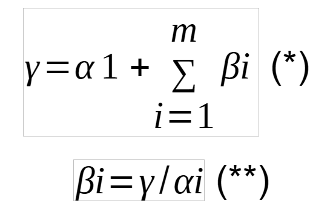

# Introduction

The scientific research follows the model shown in the figured cross-referenced here (@fig-pesquisa).

# Material and Methods

Data and methods are discussed in @sec-data-col. This citation will appear in the bibliography section (@gouveia2017; @medeiros2008).

## Study Area and Sampling Design

A Reserva Biológica Guaribas (REBIO) está localizada na Mesorregião da Mata Paraibana e na Microrregião do Litoral Norte, sendo uma unidade de conservação desde 1990 [@leal2025] (Leal *et al.*, 2025; MMA, 2003). São incluídas três áreas descontínuas, sendo elas SEMA 01 e SEMA 02 localizadas no município de Mamanguape, PB, e SEMA 03 localizada no município de Rio Tinto, PB. De acordo com a classificação de Köppen, o clima é quente e úmido, com estação seca no verão e chuvosa no inverno e temperaturas que variam entre 24°C e 26°C (MMA, 2003) .

	Por se tratar de uma unidade de conservação e por compor um dos últimos remanescentes de Floresta Atlântica do Estado da Paraíba, a reserva tornou-se essencial no que diz respeito à conservação de espécies raras, endêmicas e ameaçadas de extinção, além de proteger nascentes de importantes riachos (MMA, 2003). Entretanto, ainda é possível observar atividades antrópicas na região, como o plantio de cana-de-açúcar, o cultivo de frutas e hortaliças e a formação de áreas de pastagens.

	A área selecionada para o presente estudo, SEMA 02, abriga os riachos Caiana e Barro Branco que drenam no sentido sul-norte e cujos cursos não se estendem por mais de 10 km antes de desaguarem no Rio Camaratuba, o qual, por sua vez, deságua no oceano Atlântico. Ambos os riachos nascem dentro da reserva, entretanto, o Caiana flui sobre uma área de floresta modificada para pastoreio e plantios, enquanto o Barro Branco flui parcialmente por uma área de Floresta Atlântica no interior da unidade (Figura 1)

## Data Collection {#sec-data-col}

As coletas ocorreram entre novembro de 2023 a fevereiro de 2024 durante o período seco e de junho a agosto de 2024 no período chuvoso. Foram selecionados 15 pontos de coleta (denominados Unidades Amostrais ou UAs) (Figura 1), localizados dentro e no entorno da Reserva Biológica. Para cada unidade amostral, foram coletadas três subamostras, uma em cada habitat, a fim de realizar uma análise estatística mais rigorosa (Martinelli; Krusche, 2004).

	Dados físicos, químicos e ambientais foram coletados com a finalidade de caracterizar as condições do habitat em que as espécies foram encontradas. Neste contexto, foram avaliados os seguintes dados: **(1) morfometria**, como profundidade (m), largura (l) e velocidade da corrente de água (m/s); **(2) qualidade da água**, incluindooxigênio dissolvido (mg/L) e temperatura (°C); e **(3) estrutura do habitat,** por meio da avaliação dos tipos de substrato e estruturas subaquáticas e marginais (Medeiros; Silva; Ramos, 2008).

	Para a coleta de zooplâncton, foram filtrados 50 litros de água utilizando rede de plâncton com diâmetro de abertura de 30 cm e comprimento de 70 cm, com malha de 68 μm. Os espécimes foram armazenados em frascos plásticos de 80 mL, denominados como Volume de Trabalho (Vt), fixados em solução de formaldeído a 4% e narcotizados por saturação de CO~2~ (adição de água com gás). Posteriormente foi adicionada uma pequena quantidade de sacarose para evitar o desprendimento de ovos, a contração dos indivíduos ou que possam expelir seu conteúdo intestinal, já que após a coleta, é normal que ocorra a rápida degradação estrutural e metabólica (Bicudo; Bicudo, 2004).

	Todas as amostras foram transportadas até o Laboratório de Ecologia (LABECO), localizado no Centro de Ciências Biológicas e Sociais Aplicadas, Campus V – João Pessoa, da Universidade Estadual da Paraíba, para a realização da análise até o menor nível taxonômico possível, utilizando câmara de Sedgewick-Rafter com capacidade para 1 mL, microscópio (OLYMPUS CX31) e chaves de identificação como Koste e Shiel (1987), Shiel (1995) e Elmoor-Loureiro (1997). Além disso, todos os espécimes passaram por confirmação das espécies por uma especialista.

	Para que as análises estatísticas fossem realizadas, foi efetuado o cálculo de densidade, considerando o número de indivíduos de espécie por m³, através da fórmula:

em que,

A densidade em número de indivíduos por m³ de uma espécie (Dsp) para um determinado habitat será o número de indivíduos da espécie (Nsp), dividido pelo volume total filtrado (Vf) (Bowen, 2017).

	Além disso, as fórmulas de partição aditiva e multiplicativa também foram aplicadas:

	Na **partição aditiva (\*)** (Oksanen *et al.*, 2020), γ é expressa como a soma da diversidade alfa do nível amostral (α₁) e das contribuições da diversidade beta (βᵢ) associadas a cada unidade amostral, conforme a equação γ = α₁ + Σβᵢ @fig-formula. A diversidade (βᵢ) foi calculada a partir da razão entre a diversidade total (γ) e a diversidade alfa observada em cada unidade amostral (αᵢ), permitindo avaliar o grau de diferenciação entre as unidades amostrais em relação ao conjunto total de amostras. Valores mais elevados de βᵢ indicam maior heterogeneidade entre as unidades amostrais, enquanto valores menores sugerem maior similaridade entre elas. Em resumo, a diversidade total (**γ**) é resultado da diversidade média local (**α₁**) e da soma das diferenças entre as unidades amostrais (**βᵢ**). A **partição multiplicativa (\*\*)** tem como função encontrar o valor da diversidade beta (β), tendo em vista que a diversidade de espécies muda ao longo de escalas espaciais (Jost, 2007; Lande, 1996; Melo *et al*., 2012; Melo; Rangel; Diniz‐Filho, 2009; Oksanen *et al*., 2025; Whittaker, 1972).

{#fig-formula alt="Fórmula da densidade." fig-align="center" width="151"}

## Statistical Analyses

Todos os dados foram organizados em tabelas, gráficos e figuras, e analisados por meio de testes estatísticos utilizando pacotes que permitem avaliar a estrutura do habitat e da comunidade, no ambiente de programação integrado R e RStudio [@rstudioteam; @rcoreteam2017].

Para a aplicação da partição da diversidade em componentes alfa (α), beta (β) e gama (γ), foram utilizados os pacotes *vegan*, *eulerr* e *VennDiagram*, e a função *adipart*. Essa abordagem permite decompor a diversidade em diferentes escalas espaciais, que contribuem para a compreensão da distribuição da riqueza de espécies entre os diferentes componentes da diversidade [@chen2011; @oksanen2015; @jost2007; @medeiros2021].

```{r, CHUNK-TITLE}
#| eval: false
#| message: false
#| warning: false
#| results: false
#| echo: true
#| purl: false
#| code-fold: true
#| code-overflow: wrap
#| code-summary: "Code: Summary"

#REBIO23 - ORGANIZANDO DADOS----
#####....----

dev.off() #apaga os graficos, se houver algum
rm(list=ls(all=TRUE)) #limpa a memória
cat("\014") #limpa o console
#shell.exec(getwd())
getwd()
setwd("C:/Users/ellen/Downloads")
library(openxlsx)

##CARREGANDO MATRIZES BRUTAS----

habitat <- read.xlsx("C:/Users/ellen/Dropbox/Universidade/Estágio/Planilhas REBIO23/rebio23-habitat.xlsx",
                    rowNames = T,
                    colNames = T,
                    sheet = "ambiente")
grupos <- read.xlsx("C:/Users/ellen/Dropbox/Universidade/Estágio/Planilhas REBIO23/rebio23-habitat.xlsx",
                   rowNames = T,
                   colNames = T,
                   sheet = "grupos")

###REMOVENDO LINHAS ZERADAS DE HABITAT----
rownames(habitat)
del_rows <- c("S-C-P11-H1", "S-C-P11-H2", "S-C-P11-H3", "C-C-P11-H1","C-C-P11-H2","C-C-P11-H3")
del_rows
m_hab <- habitat[!(row.names(habitat) %in% c(del_rows)),]
m_hab

###REMOVENDO LINHAS ZERADAS DE GRUPOS----
rownames(grupos)
del_rows <- c("S-C-P11-H1", "S-C-P11-H2", "S-C-P11-H3", "C-C-P11-H1","C-C-P11-H2","C-C-P11-H3")
del_rows
grupos <- grupos[!(row.names(grupos) %in% c(del_rows)),]
grupos

###PARTICIONANDO TABELA DE GRUPOS----
t_grps <- grupos[!(row.names(grupos) %in% del_rows),]


##SALVANDO MATRIZES FINAIS REMOVIDAS AS LINHAS/COLUNAS ZERADAS----

write.table(t_grps, "t_grps.csv",
            sep = ";", dec = ".", #"\t",
            row.names = TRUE,
            quote = TRUE,
            append = FALSE)
write.table(m_hab, "m_hab.csv",
            sep = ";", dec = ".", #"\t",
            row.names = TRUE,
            quote = TRUE,
            append = FALSE)
t_grps <- read.csv("t_grps.csv",
                   sep = ";", dec = ".",
                   row.names = 1,
                   header = TRUE,
                   na.strings = NA)
m_hab <- read.csv("m_hab.csv",
                   sep = ";", dec = ".",
                   row.names = 1,
                   header = TRUE,
                   na.strings = NA)

#REBIO23 - MATRIZ DE CONTAGEM----
#####....----

library(openxlsx)
zoo <- read.xlsx("C:/Users/ellen/Dropbox/Universidade/Estágio/Planilhas REBIO23/rebio23-zoopl.xlsx",
                       rowNames = T,
                       colNames = T,
                       sheet = "rebio23_80ml")
zoo [1:5,1:5] #[1:5,1:5] mostra apenas as linhas e colunas de 1 a 5.

str(zoo)
#View(zoo)
zoo[1:5,1:5] #[1:5,1:5] mostra apenas as linhas e colunas de 1 a 5.
#View(zoo)
print(zoo[1:8,1:8])
str(zoo)
mode(zoo)
class(zoo)

###REMOVENDO LINHAS ZERADAS
rownames(zoo)
del_rows <- c("S-C-P11-H1", "S-C-P11-H2", "S-C-P11-H3", "C-C-P11-H1","C-C-P11-H2","C-C-P11-H3")
del_rows
zoo <- zoo[!(row.names(zoo) %in% c(del_rows)),]
zoo
colnames(zoo)
m_trab <- zoo
colnames(m_trab) <- as.character(unlist(m_trab[1, ]))
m_trab <- m_trab[-1, ]

#Criando a matriz de cada período
zoo_seco <- m_trab[grepl("^S", rownames(m_trab)), ]
zoo_chuvoso <- m_trab[grepl("^C", rownames(m_trab)), ]

##SALVANDO MATRIZ FINAL
#PERÍODO SECO
write.table(zoo_seco, "zoo_seco.csv",
            sep = ";", dec = ".", #"\t",
            row.names = TRUE,
            quote = TRUE,
            append = FALSE)
zoo_seco <- read.csv("zoo_seco.csv",
                   sep = ";", dec = ".",
                   row.names = 1,
                   header = TRUE,
                   na.strings = NA)
zoo_seco

#PERÍODO CHUVOSO
write.table(zoo_chuvoso, "zoo_chuvoso.csv",
            sep = ";", dec = ".", #"\t",
            row.names = TRUE,
            quote = TRUE,
            append = FALSE)
zoo_chuvoso <- read.csv("zoo_chuvoso.csv",
                     sep = ";", dec = ".",
                     row.names = 1,
                     header = TRUE,
                     na.strings = NA)
zoo_chuvoso

```

# Results

The results section should follow the model in <https://elviomedeiros.github.io/Bentos2006_Q/>.

## Environmental variables

## Community structure

```{r}
#| eval: false
#| message: false
#| warning: false
#| results: false
#| echo: true
#| purl: false
#| code-fold: true
#| code-overflow: wrap
#| code-summary: "Code: Summary"

####PERÍODO SECO
#Transpondo a matriz zoo_seco
zoo_seco
zoo_seco <- t(zoo_seco)
zoo_seco <- as.data.frame(zoo_seco)
zoo_seco[] <- lapply(zoo_seco, function(x) as.numeric(as.character(x)))
str(zoo_seco)
#View(zoo_seco)
zoo_seco
print(zoo_seco[1:5,1:5])
zoo_seco[1:5,1:5]
str(zoo_seco)
mode(zoo_seco)
class(zoo_seco)

#Informações básicas
range(zoo_seco) #menor e maior valores
length(zoo_seco) #no. de colunas
ncol(zoo_seco) #no. de N colunas
nrow(zoo_seco) #no. de M linhas
sum(lengths(zoo_seco)) #soma os nos. de colunas
length(as.matrix(zoo_seco)) #tamanho da matriz m x n
sum(zoo_seco == 0) #número de observações igual a zero
sum(zoo_seco > 0) #número de observações maiores que zero
#calculando a proporção de zeros na matriz
zeros <- (sum(zoo_seco == 0)/length(as.matrix(zoo_seco)))*100
zeros

#Descritores da diversidade
#?apply
Sum <- rowSums(zoo_seco)
#ou
Sum <- apply(zoo_seco,1,sum)
Sum
## Abundância relativa (%)
RA <- (Sum / sum(Sum)) * 100 # percentage
## Media
Mean <- rowMeans(zoo_seco)
Mean
## Ou
Mean <- apply(zoo_seco,1,mean)
Mean
## Desvio padrão
DP <- apply(zoo_seco,1,sd)
DP
## Máximo
Max <- apply(zoo_seco,1,max)
Max 
## Mínimo
Min <- apply(zoo_seco,1,min)
Min
## Mínimo não-zero
MinZ <- apply(zoo_seco, 1, function(row) {
  non_zero_values <- row[row > 0]  # Filter out zero values
  if (length(non_zero_values) == 0) {
    return(0)  # If all values are zero, return 0
  } else {
    return(min(non_zero_values))  # Return the minimum of non-zero values
  }
})
MinZ

#Riqueza
m_pa <- zoo_seco
m_pa[m_pa != 0] <- 1
rowSums(m_pa)
library(vegan)
bin <- decostand(zoo_seco,"pa")
bin[1:10, 1:10]
S <- apply(bin,1,sum)
S
#OU
Riqueza <- specnumber(zoo_seco)
Riqueza
Riqueza_total <- specnumber(colSums(zoo_seco))
Riqueza_total
#OU
FO <- rowSums(zoo_seco > 0) / ncol(zoo_seco) * 100
FO

#Índices de Diversidade
#Shannon
H <- diversity(zoo_seco, index = "shannon")
H

#Simpson
D <- diversity(zoo_seco, "simpson")
D
D[is.na(D)] <- 0 #substitui NA ou NaN por 0
D

#Equitabilidade de Pielou
E <- H/log(specnumber(zoo_seco))
E
E[is.na(E)] <- 0 #substitui NA ou NaN por 0
E

#Assimetria e curtose
library(moments)
Assimetria <- apply(zoo_seco,1,skewness)
Assimetria
Curtose <- apply(zoo_seco,1,kurtosis)
Curtose

#Tabela de Descritores
Descritores1 <- cbind(Sum, RA, Mean, DP, Max, Min, MinZ, FO, S, E, H, D)
Descritores1 <- as.data.frame(Descritores1)
Descritores1
#Descritores1 <- Descritores1 %>% rownames_to_column(var="Espécies") #da nome a primeira coluna
SomaTotalD <- apply(Descritores1,2,sum)
SomaTotalD
MediaTotalD <- apply(Descritores1,2,mean)
MediaTotalD
DPTotalD <- apply(Descritores1,2,sd)
DPTotalD
Descritores2 <- cbind(SomaTotalD, MediaTotalD, DPTotalD)
Descritores2 <- as.data.frame(Descritores2)
Descritores2 <- t(Descritores2)
Descritores2
DescritoresFinal <- rbind(Descritores1, Descritores2)
DescritoresFinal
DescritoresFinal <- round (DescritoresFinal, 2)
DescritoresFinal
#Fazendo uma tabela
library(gt)
df_seco <- DescritoresFinal
ncol(df_seco); nrow(df_seco) #no. de N colunas x M linhas
df_seco <- cbind("Espécies" = rownames(df_seco), df_seco)
gt(df_seco, rowname_col = "Espécies", caption = "Descritores da diversidade por espécie (colunas). Sum, soma; RA, abundância relativa (%); mean, média; DP, desvio padrão da média; Max, maior valor; Min, menor valor; MinZ, menor valor não zero; FO, frequência de ocorrência (%); S, riqueza (ou no. de ocorrências, da matriz transposta); E, índice de equitabilidade de Pielou; H, índice de diversidade de Shannon; D, índice de diversidade de Simpson.")

#ARREDONDAR CASA DÉCIMAL
ncol(df_seco)
nrow(df_seco)
# Adicionar a coluna 'Pontos' com os nomes das linhas
#df <- cbind(SPP = rownames(df), df)
# Arredondar os valores para duas casas decimais
df_seco_arredondado <- df_seco %>%
  mutate(across(where(is.numeric), ~ round(., 1)))
# Exibir a tabela arredondada com gt
gt(df_seco_arredondado, rowname_col = "Espécies", caption = "Descritores da diversidade por espécie (colunas). Sum, soma; mean, média; DP, desvio padrão da média; Max, maior valor; Min, menor valor; MinZ, menor valor não zero; S, riqueza (ou frequência de ocorrência na matriz transposta); E, índice de equitabilidade de Pielou; H, índice de diversidade de Shannon; D, índice de diversidade de Simpson.")

```

```{r}
#| eval: false
#| message: false
#| warning: false
#| results: false
#| echo: true
#| purl: false
#| code-fold: true
#| code-overflow: wrap
#| code-summary: "Code: Summary"

####PERÍODO CHUVOSO
#Transpondo a matriz zoo_chuvoso
zoo_chuvoso <- t(zoo_chuvoso)
zoo_chuvoso <- as.data.frame(zoo_chuvoso)
zoo_chuvoso[] <- lapply(zoo_chuvoso, function(x) as.numeric(as.character(x)))
str(zoo_chuvoso)
#View(zoo_chuvoso)
zoo_chuvoso
print(zoo_chuvoso[1:5,1:5])
zoo_chuvoso[1:5,1:5]
str(zoo_chuvoso)
mode(zoo_chuvoso)
class(zoo_chuvoso)

#Informações básicas
range(zoo_chuvoso) #menor e maior valores
length(zoo_chuvoso) #no. de colunas
ncol(zoo_chuvoso) #no. de N colunas
nrow(zoo_chuvoso) #no. de M linhas
sum(lengths(zoo_chuvoso)) #soma os nos. de colunas
length(as.matrix(zoo_chuvoso)) #tamanho da matriz m x n
sum(zoo_chuvoso == 0) #número de observações igual a zero
sum(zoo_chuvoso > 0) #número de observações maiores que zero
#calculando a proporção de zeros na matriz
zeros <- (sum(zoo_chuvoso == 0)/length(as.matrix(zoo_chuvoso)))*100
zeros

####Descritores da diversidade
#?apply
Sum <- rowSums(zoo_chuvoso)
#ou
Sum <- apply(zoo_chuvoso,1,sum)
Sum
## Abundância relativa (%)
RA <- (Sum / sum(Sum)) * 100 # percentage
## Media
Mean <- rowMeans(zoo_chuvoso)
Mean
## Ou
Mean <- apply(zoo_chuvoso,1,mean)
Mean
## Desvio padrão
DP <- apply(zoo_chuvoso,1,sd)
DP
## Máximo
Max <- apply(zoo_chuvoso,1,max)
Max 
## Mínimo
Min <- apply(zoo_chuvoso,1,min)
Min
## Mínimo não-zero
MinZ <- apply(zoo_chuvoso, 1, function(row) {
  non_zero_values <- row[row > 0]  # Filter out zero values
  if (length(non_zero_values) == 0) {
    return(0)  # If all values are zero, return 0
  } else {
    return(min(non_zero_values))  # Return the minimum of non-zero values
  }
})
MinZ

#Riqueza
m_pa <- zoo_chuvoso
m_pa[m_pa != 0] <- 1
rowSums(m_pa)
library(vegan)
bin <- decostand(zoo_chuvoso,"pa")
bin[1:10, 1:10]
S <- apply(bin,1,sum)
S
#OU
Riqueza <- specnumber(zoo_chuvoso)
Riqueza
Riqueza_total <- specnumber(colSums(zoo_chuvoso))
Riqueza_total
#OU
FO <- rowSums(zoo_chuvoso > 0) / ncol(zoo_chuvoso) * 100
FO

#Índices de Diversidade
#Shannon
H <- diversity(zoo_chuvoso, index = "shannon")
H

#Simpson
D <- diversity(zoo_chuvoso, "simpson")
D
D[is.na(D)] <- 0 #substitui NA ou NaN por 0
D

#Equitabilidade de Pielou
E <- H/log(specnumber(zoo_chuvoso))
E
E[is.na(E)] <- 0 #substitui NA ou NaN por 0
E

#Assimetria e curtose
library(moments)
Assimetria <- apply(zoo_chuvoso,1,skewness)
Assimetria
Curtose <- apply(zoo_chuvoso,1,kurtosis)
Curtose

#Tabela de Descritores
Descritores1 <- cbind(Sum, RA, Mean, DP, Max, Min, MinZ, FO, S, E, H, D)
Descritores1 <- as.data.frame(Descritores1)
Descritores1
#Descritores1 <- Descritores1 %>% rownames_to_column(var="Espécies") #da nome a primeira coluna
SomaTotalD <- apply(Descritores1,2,sum)
SomaTotalD
MediaTotalD <- apply(Descritores1,2,mean)
MediaTotalD
DPTotalD <- apply(Descritores1,2,sd)
DPTotalD
Descritores2 <- cbind(SomaTotalD, MediaTotalD, DPTotalD)
Descritores2 <- as.data.frame(Descritores2)
Descritores2 <- t(Descritores2)
Descritores2
DescritoresFinal <- rbind(Descritores1, Descritores2)
DescritoresFinal
DescritoresFinal <- round (DescritoresFinal, 2)
DescritoresFinal

####Fazendo uma tabela
library(gt)
df_chuvoso <- DescritoresFinal
ncol(df_chuvoso); nrow(df_chuvoso) #no. de N colunas x M linhas
df_chuvoso <- cbind("Espécies" = rownames(df_chuvoso), df_chuvoso)
gt(df_chuvoso, rowname_col = "Espécies", caption = "Descritores da diversidade por espécie (colunas). Sum, soma; RA, abundância relativa (%); mean, média; DP, desvio padrão da média; Max, maior valor; Min, menor valor; MinZ, menor valor não zero; FO, frequência de ocorrência (%); S, riqueza (ou no. de ocorrências, da matriz transposta); E, índice de equitabilidade de Pielou; H, índice de diversidade de Shannon; D, índice de diversidade de Simpson.")

#ARREDONDAR CASA DÉCIMAL
ncol(df_chuvoso)
nrow(df_chuvoso)
#Adicionar a coluna 'Pontos' com os nomes das linhas
#df <- cbind(SPP = rownames(df), df)
#Arredondar os valores para duas casas decimais
df_chuvoso_arredondado <- df_chuvoso %>%
  mutate(across(where(is.numeric), ~ round(., 1)))
#Exibir a tabela arredondada com gt
gt(df_chuvoso_arredondado, rowname_col = "Espécies", caption = "Descritores da diversidade por espécie (colunas). Sum, soma; mean, média; DP, desvio padrão da média; Max, maior valor; Min, menor valor; MinZ, menor valor não zero; S, riqueza (ou frequência de ocorrência na matriz transposta); E, índice de equitabilidade de Pielou; H, índice de diversidade de Shannon; D, índice de diversidade de Simpson.")

```

## Additive partitioning of diversity

Os diagramas de Venn evidenciaram a distribuição da riqueza de espécies entre os riachos Barro Branco e Caiana nos períodos seco e chuvoso, permitindo identificar como diferentes espécies são compartilhadas ou exclusivas entre os ambientes. No período seco (Figura 3), foram registradas 27 espécies compartilhadas entre os riachos. O riacho Caiana apresentou α-diversidade de 46 espécies, das quais 19 eram exclusivas, enquanto o Barro Branco apresentou 39 espécies, com 12 exclusivas. Considerando ambos os riachos, a γ-diversidade totalizou 58 espécies. No período chuvoso (Figura 4), o número de espécies compartilhadas permaneceu inalterada, com 27 espécies. Contudo, houve redução da diversidade local (α), no número de espécies exclusivas e da diversidade regional (γ). No Caiana, a α-diversidade foi de 34 espécies, com 7 espécies exclusivas, enquanto no riacho Barro Branco, foram registradas 33 espécies compartilhadas, com 6 exclusivas. Porém, a γ-diversidade totalizou 40 espécies. De modo geral, os resultados indicam variação no número de espécies exclusivas dos riachos nos dois períodos hidrológicos, embora a maior parte da riqueza tenha sido compartilhada entre os riachos.

```{r}
#| eval: false
#| message: false
#| warning: false
#| results: false
#| echo: true
#| purl: false
#| code-fold: true
#| code-overflow: wrap
#| code-summary: "Code: Summary"

#REBIO23 - DIAGRAMA DE VENN, PERÍODO SECO ----
#####....----

m_bruta_seco <- m_trab

#Inserindo coluna para agrupamentos
ncol(m_bruta_seco); nrow(m_bruta_seco) #no. de N colunas x M linhas
m_bruta_seco_g <- cbind(Grupos = rownames(m_bruta_seco), m_bruta_seco)
# Mantém a tabela completa
m_bruta_seco_g <- cbind(Grupos = rownames(m_bruta_seco), m_bruta_seco)
m_bruta_seco_g <- as.data.frame(m_bruta_seco_g)

# Vetor de agrupamento
agrup1 <- substr(m_bruta_seco_g$Grupos, 1, 3)
agrup1

# Filtra apenas os grupos que começam com "S"
m_bruta_seco_g_s <- m_bruta_seco_g[startsWith(agrup1, "S"), ]
m_bruta_seco_g_s$Grupos <- agrup1[startsWith(agrup1, "S")]  # ajusta a coluna Grupos
m_bruta_seco_g_s

# Agora pode calcular médias
library(dplyr)
m_avg_s <- m_bruta_seco_g_s %>%
  group_by(Grupos) %>%
  summarise(across(.cols = everything(), ~ mean(as.numeric(.x), na.rm = TRUE)))

m_avg_s <- as.data.frame(m_avg_s)
rownames(m_avg_s) <- m_avg_s$Grupos
m_avg_s$Grupos <- NULL
m_avg_s
#Salvando a matriz
write.table(m_avg_s,
            "m_avgcsv.csv",
            append = F,
            quote = TRUE,
            sep = ";", dec = ",",
            row.names = T)
m_avg1_csv <- read.csv("m_avgcsv.csv",
                       sep = ";", dec = ",",
                       header = T,
                       row.names = 1,
                       na.strings = NA)
library("gt")
m_venn <- as.data.frame(t(m_avg_s))
m_venn
gt(round(m_venn, 2), rownames_to_stub = TRUE)
m_venn[m_venn !=0] <- 1 #matriz binária
m_venn
library("eulerr")
#set.seed() #this seed changes the orientation of the sets        
plot(euler(m_venn), counts = TRUE, fontface = 1)
# Load required libraries
library(VennDiagram)
library(ggvenn)
SB <- rownames(m_venn)[which(m_venn$`S-B` == 1)]
SC <- rownames(m_venn)[which(m_venn$`S-C` == 1)]

overlap_SB_SC <- intersect(SB, SC)

#######Visualizar número de espécies em cada grupo e sobreposição
cat("Número de espécies S-B:", length(SB), "\n")
cat("Número de espécies S-C:", length(SC), "\n")
cat("Número de espécies em ambos (S-B ∩ S-C):", length(overlap_SB_SC), "\n")

#########Plotar
grid.newpage()
draw.pairwise.venn(
  area1 = length(SB),
  area2 = length(SC),
  cross.area = length(overlap_SB_SC),
  category = c("S-B", "S-C"),
  lty = rep("blank", 2),
  fill = c("grey40", "grey70"),
  alpha = rep(0.5, 2),
  cat.pos = c(0, 0),
  cat.dist = rep(0.025, 2)
)

##############Salvar em PNG
venn.diagram(
  x = list(SB, SC),
  category.names = c("S-B", "S-C"),
  filename = "fig-venn_SB_SC_seco.png",
  height = 2000,
  width = 2000,
  resolution = 300,
  lty = "blank",
  fill = c("grey40", "grey70"),
  alpha = 0.5
)


#REBIO23 - DIAGRAMA DE VENN, PERÍODO CHUVOSO ----
#####....----

m_bruta_chuvoso <- m_trab

#Inserindo coluna para agrupamentos
ncol(m_bruta_chuvoso); nrow(m_bruta_chuvoso) #no. de N colunas x M linhas
m_bruta_chuvoso_g <- cbind(Grupos = rownames(m_bruta_chuvoso), m_bruta_chuvoso)
# Mantém a tabela completa
m_bruta_chuvoso_g <- cbind(Grupos = rownames(m_bruta_chuvoso), m_bruta_chuvoso)
m_bruta_chuvoso_g <- as.data.frame(m_bruta_chuvoso_g)

#Vetor de agrupamento
agrup1 <- substr(m_bruta_chuvoso_g$Grupos, 1, 3)
agrup1

#Filtra apenas os grupos que começam com "C"
m_bruta_chuvoso_g_c <- m_bruta_chuvoso_g[startsWith(agrup1, "C"), ]
m_bruta_chuvoso_g_c$Grupos <- agrup1[startsWith(agrup1, "C")]  # ajusta a coluna Grupos
m_bruta_chuvoso_g_c

#Médias
library(dplyr)
m_avg_c <- m_bruta_chuvoso_g_c %>%
  group_by(Grupos) %>%
  summarise(across(.cols = everything(), ~ mean(as.numeric(.x), na.rm = TRUE)))

m_avg_c <- as.data.frame(m_avg_c)
rownames(m_avg_c) <- m_avg_c$Grupos
m_avg_c$Grupos <- NULL
m_avg_c

##Salvando a matriz
write.table(m_avg_c,
            "m_avgcsv.csv",
            append = F,
            quote = TRUE,
            sep = ";", dec = ",",
            row.names = T)
m_avg1_csv <- read.csv("m_avgcsv.csv",
                       sep = ";", dec = ",",
                       header = T,
                       row.names = 1,
                       na.strings = NA)
library("gt")
m_venn <- as.data.frame(t(m_avg_c))
m_venn
gt(round(m_venn, 2), rownames_to_stub = TRUE)
m_venn[m_venn !=0] <- 1 #matriz binária
m_venn
library("eulerr")
#set.seed() #this seed changes the orientation of the sets        
plot(euler(m_venn), counts = TRUE, fontface = 1)
# Load required libraries
library(VennDiagram)
library(ggvenn)
CB <- rownames(m_venn)[which(m_venn$`C-B` == 1)]
CC <- rownames(m_venn)[which(m_venn$`C-C` == 1)]

overlap_CB_CC <- intersect(CB, CC)

####Visualizar número de espécies em cada grupo e sobreposição
cat("Número de espécies C-B:", length(CB), "\n")
cat("Número de espécies C-C:", length(CC), "\n")
cat("Número de espécies em ambos (C-B ∩ C-C):", length(overlap_CB_CC), "\n")

#Plotar
grid.newpage()
draw.pairwise.venn(
  area1 = length(CB),
  area2 = length(CC),
  cross.area = length(overlap_CB_CC),
  category = c("C-B", "C-C"),
  lty = rep("blank", 2),
  fill = c("grey40", "grey70"),
  alpha = rep(0.5, 2),
  cat.pos = c(0, 0),
  cat.dist = rep(0.025, 2)
)

#Salvar em PNG
venn.diagram(
  x = list(CB, CC),
  category.names = c("C-B", "C-C"),
  filename = "fig-venn_CB_CC_chuvoso.png",
  height = 2000,
  width = 2000,
  resolution = 300,
  lty = "blank",
  fill = c("grey40", "grey70"),
  alpha = 0.5
)

```

# Discussion

# Conclusions {.unnumbered}

# Acknowledgements {.unnumbered}

# Authorship contribution statement {.unnumbered}

Authorship of this paper is based on @credit2026.

Ellen Gomes da Silva: Data curation, Formal analysis, Investigation, Software, Visualization, Writing – original draft, Writing – review & editing.

Mayara Mirelly da Silva Monteiro: Data curation, Formal analysis, Software.

Marcela Vitória Bernardo da Silva: Writing – original draft, Writing – review & editing.

Ludmilla Cavalcanti Antunes Lucena: Writing – review & editing.

Thais Xavier de Melo: Supervision.

Elvio Sergio Figueredo Medeiros: Conceptualization, Data curation, Formal analysis, Funding Acquisition, Methodology, Project Administration, Resources, Supervision, Validation.

# Ethical approval {.unnumbered}

This study did not require ethical approval as it did not involve human participants or sensitive data. Field surveys were conducted based on collection permit number (IEF-10327-6 and SISBIO-10.635-7).

# References {.unnumbered}

::: {#refs}
:::

\pagebreak
\newpage

# Figures and Tables {.unnumbered}

## Figures {.unnumbered}

{#fig-mapa}

{#fig-pesquisa}

## Tables {.unnumbered}

\pagebreak
\newpage

# Apendices {.unnumbered}

# Non-used figures and tables {.unnumbered}

::: callout-warning
# Non-used codes

```{r}
#| label: non-used code
#| eval: false
#| warning: false
#| message: false
#| results: false
#| code-fold: true
#| code-overflow: wrap
#| code-summary: "non-used code" 

table(1:10)
```
:::
