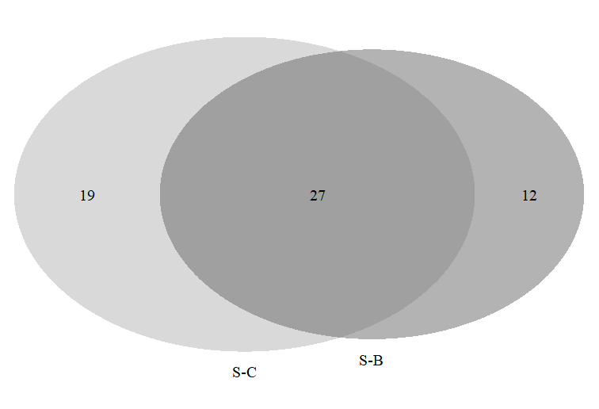
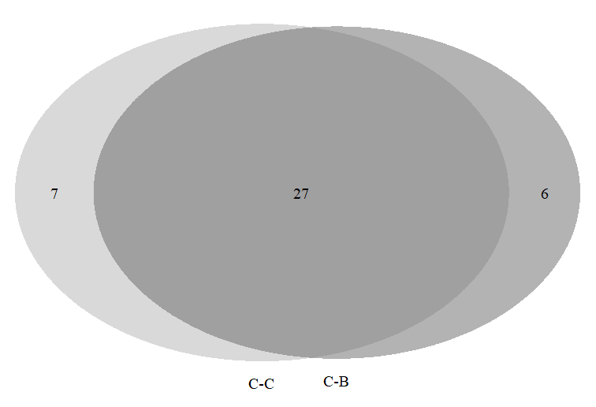
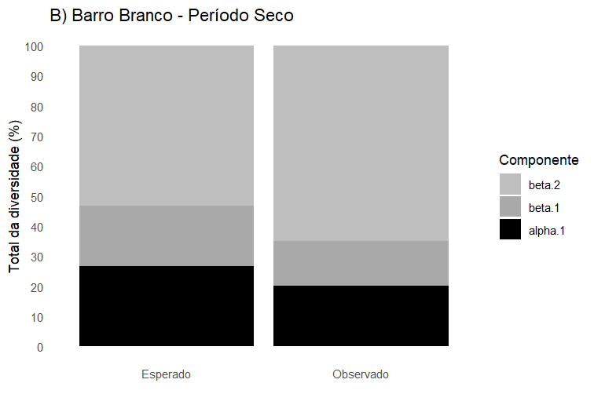
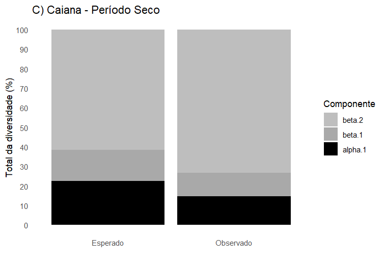
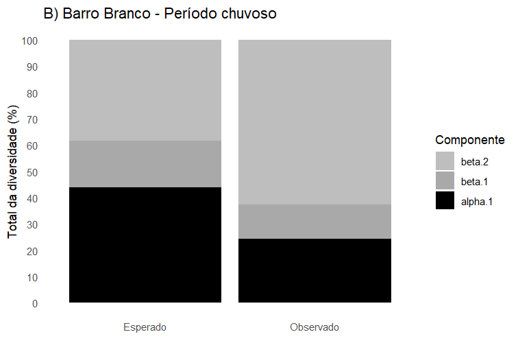
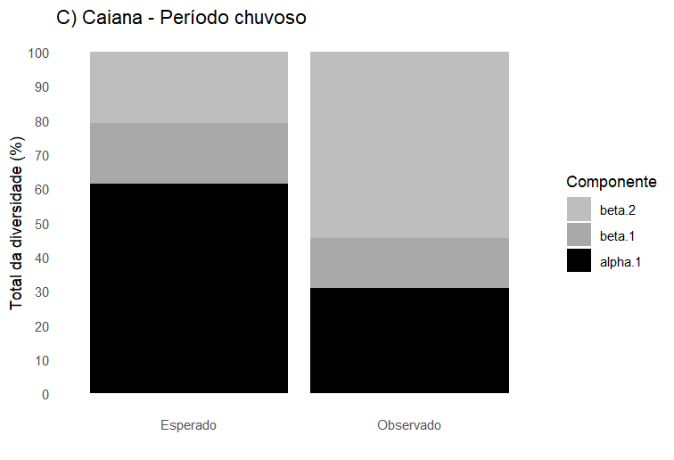
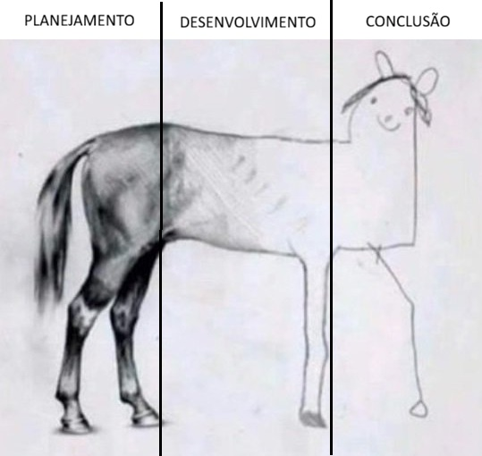

# Introduction

A Floresta Atlântica, reconhecida por sua alta riqueza de espécies e alto grau de endemismo [@branco2021; @lima2023; @tabarelli2012; @taboada2022], é uma das florestas tropicais mais ameaçadas mundialmente em decorrência de ações antrópicas, que impactam negativamente a biodiversidade [@myers2000; @safar2020; @vancine2024]. Embora ocupe cerca de 1,4% da superfície terrestre, este bioma abriga mais de 60% das espécies conhecidas, evidenciando sua relevância ecológica [@fonseca1985; @pôrto2005]. No entanto, estima-se que a Floresta Atlântica tenha perdido cerca de 70% de seu habitat original em decorrência do desmatamento e da expansão das atividades humanas [@branco2021; @maxwell1995; @myers2000; @tabarelli2012].

A perda de habitat decorrente do desmatamento está diretamente associada ao processo de fragmentação florestal, resultando na formação de remanescentes isolados e na limitação da dispersão de espécies presentes neste ecossistema [@tabarelli2010; @zaú1998], interferindo negativamente na manutenção da biodiversidade [@souza2025].

Neste contexto, a fragmentação e o manejo florestal têm um impacto significativo na fauna de riachos dentro da Floresta Atlântica, uma vez que os organismos aquáticos são extremamente sensíveis às mudanças nas condições naturais da água causadas por atividades antrópicas [@gouveia2017]. De acordo com @maltchik2006, processos em escala de paisagem, como perturbação, fragmentação, dispersão e estrutura de mosaicos, influenciam diretamente as populações locais nos riachos. Dessa forma, é necessário compreender e preservar os processos ecológicos que indiquem a saúde ecológica destes corpos d’água e como a diversidade se mantém em uma escala local e regional.

Neste sentido, as comunidades aquáticas têm sido amplamente utilizadas como ferramentas para avaliar o estado ecológico de riachos, uma vez que estes respondem rapidamente às alterações ambientais. Dentre esses organismos, o zooplâncton se destaca por seu papel fundamental na transferência de energia entre os níveis tróficos e na ciclagem de nutrientes [@bonecker2012; @cardoso2009; @esteves2011].

Segundo @keppeler2004, as diferentes formas de ocupação de nichos nos ecossistemas de águas continentais são influenciadas pela interação de parâmetros físicos, químicos e biológicos, como variações sazonais, os quais podem interferir na composição de espécies e nos grupos zooplanctônicos. O zooplâncton é constituído por organismos de tamanhos e formas variáveis, com ciclos de vida e papéis funcionais distintos. Diversos estudos demonstram que este organismo é sensível às variações ambientais, como características físicas e químicas do ambiente, que podem refletir na composição de espécies e na substituição de táxons [@freiry2020; @melo2013], tornando-os, portanto, importantes bioindicadores ecológicos.

Em ecossistemas lóticos, a sazonalidade climática exerce um papel fundamental na composição das comunidades aquáticas, especialmente devido aos períodos seco e chuvoso. Essas variações hidrológicas influenciam diretamente as condições físicas e químicas dos corpos d’água, impactando na disponibilidade de recursos e micro-habitats e, consequentemente, a composição e a dinâmica das comunidades [@esteves2011; @junk1989; @souza2025; @ward1998].

Durante o período seco, há maior incidência de luz solar e aumento da temperatura, contudo, há menor variação espacial, favorecendo a permanência de populações locais. Em contraste, o período chuvoso é caracterizado pelo aumento da vazão, intensificando processos de dístúrbios, dispersão e substituição de espécies [@allan2021; @souza2025].

Os principais grupos zooplanctônicos mais comumente utilizados como objetos de estudo são Rotifera e os microcrustáceos Cladocera e Copepoda. Além de sua ampla representatividade em ecossistemas áquaticos, constituem uma importante fonte de alimento para diferentes espécies, como peixes, aves aquáticas e mamíferos, permitindo a criação de um elo entre produtores e consumidores a partir da disponibilidade de energia para níveis tróficos superiores, uma vez que atuam como consumidores primários [@altindag2025; @balkic2022; @cardoso2009; @majeed2023; @marcelino2025; @souza2025].

De acordo com @flach2009 e @lopes2014, a partição da diversidade tem recebido crescente atenção de ecólogos por permitir fracionar a diversidade em múltiplas escalas, permitindo testar se a diversidade é maior ou menor que o esperado com base na distribuição dos indivíduos nas unidades amostrais. Esta abordagem fornece informações acerca da organização das comunidades e os processos ecológicos que as estruturam.

Na partição aditiva, a diversidade de espécies é decomposta em componentes alfa e beta, permitindo obter a proporção da diversidade gama em diferentes habitats, paisagens ou regiões [@crist2003]. Assim, a diversidade gama (γ) corresponde à soma da diversidade alfa média (α) e da diversidade beta (β), esta última representando o número de espécies que diferem entre os habitats.

Por sua vez, na partição multiplicativa, a diversidade gama é expressa como o produto das diversidades alfa média e beta, podendo ser interpretada como a diferenciação entre as comunidades [@jost2007; @whittaker1972]. A aplicação conjunta dessas abordagens permite uma maior compreensão dos padrões de diversidade, especialmente naqueles que estão sujeitos à atividade antrópica, como riachos de Floresta Atlântica. Portanto, torna-se crucial realizar estudos acerca do zooplâncton utilizando essas métricas para compreender sua dinâmica espacial, avaliar a influência de fatores ambientais e o estado ecológico de ecossistemas aquáticos.

## Objective

O presente estudo teve como objetivo determinar a riqueza de espécies na comunidade zooplanctônica e avaliar a partição da diversidade em diferentes escalas espaciais em ambientes aquáticos da Reserva Biológica Guaribas nos períodos seco e chuvoso.

**Objetivo específico**

Verificar se os métodos aditivos e multiplicativos para o cálculo da partição da diversidade podem indicar o estado ecológico de ambientes sob diferentes níveis de impactos antropogênicos e períodos.

## Material and Methods

**Study Area and Sampling Design**

A Reserva Biológica Guaribas (REBIO) está localizada na Mesorregião da Mata Paraibana e na Microrregião do Litoral Norte, sendo uma unidade de conservação desde 1990 [@leal2025; @mma2003]. São incluídas três áreas descontínuas, sendo elas SEMA 01 e SEMA 02 localizadas no município de Mamanguape, PB, e SEMA 03 localizada no município de Rio Tinto, PB. De acordo com a classificação de Köppen, o clima é quente e úmido, com estação seca no verão e chuvosa no inverno e temperaturas que variam entre 24°C e 26°C [@mma2003].

Por se tratar de uma unidade de conservação e por compor um dos últimos remanescentes de Floresta Atlântica do Estado da Paraíba, a reserva tornou-se essencial no que diz respeito à conservação de espécies raras, endêmicas e ameaçadas de extinção, além de proteger nascentes de importantes riachos [@mma2003]. Entretanto, ainda é possível observar atividades antrópicas na região, como o plantio de cana-de-açúcar, o cultivo de frutas e hortaliças e a formação de áreas de pastagens.

A área selecionada para o presente estudo, SEMA 02, abriga os riachos Caiana e Barro Branco que drenam no sentido sul-norte e cujos cursos não se estendem por mais de 10 km antes de desaguarem no Rio Camaratuba, o qual, por sua vez, deságua no oceano Atlântico. Ambos os riachos nascem dentro da reserva, entretanto, o Caiana flui sobre uma área de floresta modificada para pastoreio e plantios, enquanto o Barro Branco flui parcialmente por uma área de Floresta Atlântica no interior da unidade (Figura 1)

**Data Collection**

As coletas ocorreram entre novembro de 2023 a fevereiro de 2024 durante o período seco e de junho a agosto de 2024 no período chuvoso. Foram selecionados 15 pontos de coleta (denominados Unidades Amostrais ou UAs) (Figura 1), localizados dentro e no entorno da Reserva Biológica. Para cada unidade amostral, foram coletadas três subamostras, uma em cada habitat, a fim de realizar uma análise estatística mais rigorosa [@martinelli2004].

Dados físicos, químicos e ambientais foram coletados com a finalidade de caracterizar as condições do habitat em que as espécies foram encontradas. Neste contexto, foram avaliados os seguintes dados: **(1) morfometria**, como profundidade (m), largura (l) e velocidade da corrente de água (m/s); **(2) qualidade da água**, incluindooxigênio dissolvido (mg/L) e temperatura (°C); e **(3) estrutura do habitat,** por meio da avaliação dos tipos de substrato e estruturas subaquáticas e marginais [@medeiros2008].

Para a coleta de zooplâncton, foram filtrados 50 litros de água utilizando rede de plâncton com diâmetro de abertura de 30 cm e comprimento de 70 cm, com malha de 68 μm. Os espécimes foram armazenados em frascos plásticos de 80 mL, denominados como Volume de Trabalho (Vt), fixados em solução de formaldeído a 4% e narcotizados por saturação de CO~2~ (adição de água com gás). Posteriormente foi adicionada uma pequena quantidade de sacarose para evitar o desprendimento de ovos, a contração dos indivíduos ou que possam expelir seu conteúdo intestinal, já que após a coleta, é normal que ocorra a rápida degradação estrutural e metabólica [@bicudo2004].

Todas as amostras foram transportadas até o Laboratório de Ecologia (LABECO), localizado no Centro de Ciências Biológicas e Sociais Aplicadas, Campus V – João Pessoa, da Universidade Estadual da Paraíba, para a realização da análise até o menor nível taxonômico possível, utilizando câmara de Sedgewick-Rafter com capacidade para 1 mL, microscópio (OLYMPUS CX31) e chaves de identificação como @koste1987; @shiel1995 e @elmoor-loureiro1997. Além disso, todos os espécimes passaram por confirmação das espécies por uma especialista.

Para que as análises estatísticas fossem realizadas, foi efetuado o cálculo de densidade, considerando o número de indivíduos de espécie por m³, através da fórmula:

$$
Dsp = \frac{Nsp}{Vf}
$$ {#eq-densidade} onde a densidade em número de indivíduos por m³ de uma espécie (*Dsp*) para um determinado habitat será o número de indivíduos da espécie (*Nsp*), dividido pelo volume total filtrado (*Vf*) [@bowen2017].

Além disso, as fórmulas de partição aditiva e multiplicativa também foram aplicadas:

$$
\gamma=\alpha_1+\sum_{i=1}^{m} \beta_i \text{ (*)}
$$ {#eq-aditiva}\

$$
\beta_i=\gamma/\alpha_i \text{ (**)}
$$ {#eq-multiplicativa}

Na **partição aditiva (\*)** [@oksanen2020], γ é expressa como a soma da diversidade alfa do nível amostral (α₁) e das contribuições da diversidade beta (βᵢ) associadas a cada unidade amostral, conforme a equação (@eq-aditiva). A diversidade (βᵢ) foi calculada a partir da razão entre a diversidade total (γ) e a diversidade alfa observada em cada unidade amostral (αᵢ), permitindo avaliar o grau de diferenciação entre as unidades amostrais em relação ao conjunto total de amostras. Valores mais elevados de βᵢ indicam maior heterogeneidade entre as unidades amostrais, enquanto valores menores sugerem maior similaridade entre elas. Em resumo, a diversidade total (γ) é resultado da diversidade média local (α₁) e da soma das diferenças entre as unidades amostrais (βᵢ). A **partição multiplicativa (\*\*)** tem como função encontrar o valor da diversidade beta (β), tendo em vista que a diversidade de espécies muda ao longo de escalas espaciais [@jost2007; @lande1996; @melo2012; @melo2009; @oksanen2020; @whittaker1972].

**Environmental data**

Dentre as variáveis ambientais, realizou-se a medição das variáveis físicas e químicas, morfometria, qualidade da água e estrutura do habitat com o intuito de fornecer informações acerca do habitat em que as espécies foram encontradas. As variáveis químicas foram estimadas por meio de medidores de pH (TECNOPON MPA-210), condutividade (μS/cm) (TECNOPON MCS-150) e turbidez da água (NTU), utilizando equipamentos de bancada no Laboratório de Ecologia (LABECO) – Campus V. As variáveis temperatura (°C) e oxigênio dissolvido (mg/L) (Lutron DO-5510) e velocidade da água (m/s) foram medidas em campo, sendo está última medida utilizando o método da bóia de @maitland1990.

Para a avaliação morfométrica de cada habitat nas 15 unidades amostrais (UAs), foram estabelecidos transectos nos quais foram medidos a largura e o comprimento com o auxílio de uma trena métrica. A profundidade e largura foram medidas em três seções equidistantes ao longo de cada transecto, também utilizando a trena métrica. A altitude, a forma e a distância entre as unidades amostrais foram determinadas através de dados obtidos por GPS. Esses dados foram empregados para calcular a área superficial, o volume e a distância entre os pontos de coleta.

Com o objetivo de quantificar a estrutura do habitat e classificar os ambientes estudados quanto à disponibilidade de recursos, os seguintes aspectos foram quantificados em cada ambiente: presença de macrófitas, vegetação submersa, vegetação flutuante, algas, vegetação ripária, liteira, raízes e galhos de árvores próximas. Os ambientes também foram classificados quanto ao tipo de substrato, sendo estimadas as proporções de lama, areia, pedras, seixos, entre outros. De acordo com a metodologia proposta por @medeiros2008, estes dados, levantados por meio de análise visual, estimam a contribuição proporcional de cada componente. Considerando que a maioria desses elementos estão concentrados nas margens, as medições foram obtidas a partir de transectos paralelos à margem dos ambientes estudados. Estes dados representam a proporção média (%) de cobertura dos aspectos medidos para cada trecho [@medeiros2008].

**Data Analysis**

Após a coleta e o registro dos dados, as amostras foram organizadas em lotes e devidamente etiquetadas. Em seguida, realizou-se a confirmação de identificação das espécies por um especialista. Os dados de riqueza (R) e abundância total foram analisados com o objetivo de investigar os padrões de variação na estrutura das comunidades zooplanctônicas das áreas estudadas.

**Statistical Analyses**

Os dados foram organizados em formatos de tabelas, gráficos e figuras e analisados por meio de testes estatísticos compatíveis através de técnicas multivariadas utilizando o ambiente de programação R/RStudio [@hair2021; @rcoreteam2017; @rstudioteam2022; @zar1999].

Para a realização das análises estatísticas, foram utilizados pacotes que permitem avaliar a estrutura da comunidade com base na riqueza. A Análise de Componentes Principais (PCA) foi executada para avaliar as variáveis ambientais.

Foram empregados pacotes sobre partição da diversidade para que fosse possível decompor ou particionar a diversidade em componentes alfa (α), beta (β) e gama (γ). A diversidade alfa se refere à diversidade de espécies em uma escala local, ou seja, dentro de manchas homogêneas locais ou unidades amostrais únicas. Diversidade gama, ou diversidade regional, corresponde a escalas espaciais maiores, enquanto que a diversidade beta manifesta-se quando há variação na diversidade entre os ambientes ou escalas espaciais [@chao2012; @farias2020].

Os gráficos e figuras sobre as partições foram realizados no programa estatístico RStudio utilizando os pacotes: eulerr, vegan e VennDiagram que forneceram informações acerca da distribuição da riqueza de espécies com base na diversidade alfa e diversidade gama [@chen2011; @oksanen2020]. Funções como adipart e multipart também foram empregadas. A função adipart foi utilizada para a partição aditiva da diversidade, em que conterá os valores médios da diversidade alfa que serão comparados com a diversidade total em todo o conjunto de dados (γ-diversidade) e multipart para partição multiplicativa da diversidade, que conterá os valores médios da α-diversidade em níveis mais baixos de uma hierarquia e comparados com a diversidade total gama.

Esses pacotes permitiram uma análise detalhada e abrangente da distribuição e diversidade de espécies nos riachos estudados.

```{r}
#| eval: false
#| message: false
#| warning: false
#| results: false
#| echo: true
#| purl: false
#| code-fold: true
#| code-overflow: wrap
#| code-summary: "Code: Summary"

#REBIO23 - ORGANIZANDO DADOS----
#####....----

dev.off() #apaga os graficos, se houver algum
rm(list=ls(all=TRUE)) #limpa a memória
cat("\014") #limpa o console
#shell.exec(getwd())
getwd()
setwd("C:/Users/ellen/Downloads")
library(openxlsx)

##CARREGANDO MATRIZES BRUTAS----

habitat <- read.xlsx("C:/Users/ellen/Dropbox/Universidade/Estágio/Planilhas REBIO23/rebio23-habitat.xlsx",
                    rowNames = T,
                    colNames = T,
                    sheet = "ambiente")
grupos <- read.xlsx("C:/Users/ellen/Dropbox/Universidade/Estágio/Planilhas REBIO23/rebio23-habitat.xlsx",
                   rowNames = T,
                   colNames = T,
                   sheet = "grupos")

###REMOVENDO LINHAS ZERADAS DE HABITAT----
rownames(habitat)
del_rows <- c("S-C-P11-H1", "S-C-P11-H2", "S-C-P11-H3", "C-C-P11-H1","C-C-P11-H2","C-C-P11-H3")
del_rows
m_hab <- habitat[!(row.names(habitat) %in% c(del_rows)),]
m_hab

###REMOVENDO LINHAS ZERADAS DE GRUPOS----
rownames(grupos)
del_rows <- c("S-C-P11-H1", "S-C-P11-H2", "S-C-P11-H3", "C-C-P11-H1","C-C-P11-H2","C-C-P11-H3")
del_rows
grupos <- grupos[!(row.names(grupos) %in% c(del_rows)),]
grupos

###PARTICIONANDO TABELA DE GRUPOS----
t_grps <- grupos[!(row.names(grupos) %in% del_rows),]


##SALVANDO MATRIZES FINAIS REMOVIDAS AS LINHAS/COLUNAS ZERADAS----

write.table(t_grps, "t_grps.csv",
            sep = ";", dec = ".", #"\t",
            row.names = TRUE,
            quote = TRUE,
            append = FALSE)
write.table(m_hab, "m_hab.csv",
            sep = ";", dec = ".", #"\t",
            row.names = TRUE,
            quote = TRUE,
            append = FALSE)
t_grps <- read.csv("t_grps.csv",
                   sep = ";", dec = ".",
                   row.names = 1,
                   header = TRUE,
                   na.strings = NA)
m_hab <- read.csv("m_hab.csv",
                   sep = ";", dec = ".",
                   row.names = 1,
                   header = TRUE,
                   na.strings = NA)

#REBIO23 - MATRIZ DE CONTAGEM----
#####....----

library(openxlsx)
zoo <- read.xlsx("C:/Users/ellen/Dropbox/Universidade/Estágio/Planilhas REBIO23/rebio23-zoopl.xlsx",
                       rowNames = T,
                       colNames = T,
                       sheet = "rebio23_80ml")
zoo [1:5,1:5] #[1:5,1:5] mostra apenas as linhas e colunas de 1 a 5.

str(zoo)
#View(zoo)
zoo[1:5,1:5] #[1:5,1:5] mostra apenas as linhas e colunas de 1 a 5.
#View(zoo)
print(zoo[1:8,1:8])
str(zoo)
mode(zoo)
class(zoo)

###REMOVENDO LINHAS ZERADAS
rownames(zoo)
del_rows <- c("S-C-P11-H1", "S-C-P11-H2", "S-C-P11-H3", "C-C-P11-H1","C-C-P11-H2","C-C-P11-H3")
del_rows
zoo <- zoo[!(row.names(zoo) %in% c(del_rows)),]
zoo
colnames(zoo)
m_trab <- zoo
colnames(m_trab) <- as.character(unlist(m_trab[1, ]))
m_trab <- m_trab[-1, ]

#Criando a matriz de cada período
zoo_seco <- m_trab[grepl("^S", rownames(m_trab)), ]
zoo_chuvoso <- m_trab[grepl("^C", rownames(m_trab)), ]

##SALVANDO MATRIZ FINAL
#PERÍODO SECO
write.table(zoo_seco, "zoo_seco.csv",
            sep = ";", dec = ".", #"\t",
            row.names = TRUE,
            quote = TRUE,
            append = FALSE)
zoo_seco <- read.csv("zoo_seco.csv",
                   sep = ";", dec = ".",
                   row.names = 1,
                   header = TRUE,
                   na.strings = NA)
zoo_seco

#PERÍODO CHUVOSO
write.table(zoo_chuvoso, "zoo_chuvoso.csv",
            sep = ";", dec = ".", #"\t",
            row.names = TRUE,
            quote = TRUE,
            append = FALSE)
zoo_chuvoso <- read.csv("zoo_chuvoso.csv",
                     sep = ";", dec = ".",
                     row.names = 1,
                     header = TRUE,
                     na.strings = NA)
zoo_chuvoso

```

# Results

## Environmental variables

É importante destacar que as unidades amostrais (UAs) P05 a P10 correspondem ao riacho Barro Branco, sendo as UAs P5, P6 e P7 localizadas no interior da reserva, enquanto que os pontos P08, P09 e P10 estão situados fora da área de preservação. O riacho Caiana, por sua vez, é representado pelas UAs P12 a P20, todas localizadas fora da reserva (ver @fig-mapa).

Os resultados da Análise de Componentes Principais (PCA) evidenciaram uma clara diferenciação das unidades amostrais com base nas características físicas e estruturais do habitat. Ao longo dos riachos e períodos amostrais analisados.

No período seco (@fig-pcaseco), observou-se que as UAs P05, P07 e P08, pertencentes ao riacho Barro Branco, apresentaram maior associação a liteira, algas filamentosas e aderidas. Em contraste, a UA P06 do Barro Branco, juntamente com as UAs P16, P17 e P20, do Caiana, esteve associada principalmente às variáveis estruturais, como a presença de pedras, profundidade máxima, mínima e marginal, largura e vegetação submersa. Além disso, P10 do Barro Branco e P18 do Caiana apresentaram associação evidente ao pH, cujos valores variaram de ácido a levemente neutro.

No período chuvoso (@fig-pcachuvoso), a distribuição das unidades amostrais no espaço da biplot indicou alterações nos padrões de associação observados no período seco. As UAs P05 e P06 do Barro Branco, assim como a UA P18 do Caiana, estiveram associadas principalmente à presença de lama, macrófitas, vegetação submersa, folhiço e detritos. Por outro lado, as P08, P10 e P16 apresentaram maior associação com algas filamentosas e aderidas, vegetação marginal e largura média do canal.

De modo geral, os resultados indicaram que ambos os períodos contribuíram de formas distintas para a estruturação do habitat, evidenciando variações espaciais e sazonais nas características físicas e estruturais dos riachos estudados.

```{r}
#| eval: false
#| message: false
#| warning: false
#| results: false
#| echo: true
#| purl: false
#| code-fold: true
#| code-overflow: wrap
#| code-summary: "Code: Summary"

#REBIO23 - PCA - SECO----
#####....----

dev.off()
rm(list=ls(all=TRUE))
cat("\014")
library(openxlsx)
dados_bruto <- read.xlsx("C:/Users/ellen/Dropbox/Universidade/Estágio/Planilhas REBIO23/rebio-habitat.xlsx",
                         rowNames = T,
                         colNames = T,
                         sheet = "habitat_t",
                         na.strings = "n/a",
                         startRow = 2)

#deletar o ponto onze
row.names(dados_bruto)
del_rows <- c("S-C-P11-H1", "S-C-P11-H2", "S-C-P11-H3", "C-C-P11-H1", "C-C-P11-H2", "C-C-P11-H3")
m_cort <- dados_bruto[!(row.names(dados_bruto) %in% del_rows), ]

#SELECIONANDO VARIÁVEIS
m_cort <- m_cort [, c("Cond_uS.cm","Turb_ntu", "pH", "Vel_m.s", "Slope", "Depth_max_cm",
                      "Depth_avg_cm", "Depth_mar_cm", "Width_m", "Mud", "Sand", "Gravel_f", 
                      "Gravel_c", "Cobbles", "Rocks", "Bedrock", "Macrophytes", "Grass", 
                      "Subm_veg", "Overh_veg", "Leaf_l", "Algae_f", "Algae_a", "Root_masses",
                      "Debris_l", "Debris_s")]
str(m_cort)

# CRIANDO MATRIZ DE MÉDIAS
library("tidyverse")
#Inserindo coluna para agrupamentos
data <- m_cort
nrow(data); ncol(data) #no. de N colunas x M linhas
data_g <- cbind(Grupos = rownames(data), data)
data_g
grps <- substr(data_g[, 1], 1,7)
grps
data_g <- data_g %>% mutate(Grupos=c(grps))
#data_avg <- aggregate(data_g[, 9:9], list(data_g$Grupos), mean)
#data_avg
data_avg <- data_g %>% 
  group_by(Grupos) %>%
  summarise(across(.cols = everything(), ~ mean(.x, na.rm = TRUE)))
data_avg
data_dp <- data_g %>% 
  group_by(Grupos) %>%
  summarise(across(.cols = everything(), list(mean = mean, sd = sd)))
#?across
data_dp <- data_avg
#Primeira coluna para nomes das linhas 
data_dp <- as.data.frame(data_dp)
class(data_dp)
rownames(data_dp) <- data_dp[,1]
data_dp[,1] <- NULL
data_dp <- round(data_dp, 1)
data_dp
m_cort <- data_dp

#SELECIONANDO VARIÁVEIS
m_trans <- t(m_cort)
colnames(m_trans)
seco <- t(m_trans[, c("S-B-P05", "S-B-P06", "S-B-P07",
                      "S-B-P08", "S-B-P09", "S-B-P10", 
                      "S-C-P12", "S-C-P13", "S-C-P14",
                      "S-C-P15", "S-C-P16", "S-C-P17",
                      "S-C-P18", "S-C-P19", "S-C-P20")])

chuvoso <- t(m_trans[, c("C-B-P05", "C-B-P06", "C-B-P07", 
                         "C-B-P08", "C-B-P09", "C-B-P10",
                         "C-C-P12", "C-C-P13", "C-C-P14",
                         "C-C-P15", "C-C-P16", "C-C-P17",
                         "C-C-P18", "C-C-P19", "C-C-P20")])

###### seco
seco <- as.data.frame(seco)
seco[] <- lapply(seco, as.numeric)
###### chuvoso
chuvoso <- as.data.frame(chuvoso)
chuvoso[] <- lapply(chuvoso, as.numeric)

################################################################################
####SECO

# CRIANDO MATRIZ DE MÉDIAS
library("tidyverse")
#Inserindo coluna para agrupamentos
data <- seco
nrow(data); ncol(data) #no. de N colunas x M linhas
data_g <- cbind(Grupos = rownames(data), data)
data_g
grps <- substr(data_g[, 1], 5,7)
grps
data_g <- data_g %>% mutate(Grupos=c(grps))
#data_avg <- aggregate(data_g[, 9:9], list(data_g$Grupos), mean)
#data_avg
data_avg <- data_g %>% 
  group_by(Grupos) %>%
  summarise(across(.cols = everything(), ~ mean(.x, na.rm = TRUE)))
data_avg
data_dp <- data_g %>% 
  group_by(Grupos) %>%
  summarise(across(.cols = everything(), list(mean = mean, sd = sd)))
#?across
data_dp <- data_avg
#Primeira coluna para nomes das linhas 
data_dp <- as.data.frame(data_dp)
class(data_dp)
rownames(data_dp) <- data_dp[,1]
data_dp[,1] <- NULL
data_dp <- round(data_dp, 1)
data_dp
seco <- data_dp
############################
# Pacotes
############################
library(vegan)
library(gplots)
library(psych)
library(tidyverse)
library(ggplot2)

############################
# Pré-processamento da matriz
############################
m_trab <- seco
m_trns <- sqrt(m_trab) # transformação

# Remover linhas e colunas com todos os valores = 0
m_trns <- m_trns[rowSums(m_trns) > 0, ]
m_trns <- m_trns[, colSums(m_trns) > 0]

############################
# Distância e Cluster
############################
vegdist_mat <- vegdist(m_trns, method = "bray", diag = TRUE, upper = FALSE)
cluster_uas <- hclust(vegdist_mat, method = "average")

plot(cluster_uas, main = "Cluster Dendrogram - Bray-Curtis", hang = 0.1)
rect.hclust(cluster_uas, k = 2, h = NULL)

as.matrix(vegdist_mat)[1:6, 1:6]

############################
# Heatmap (UAs)
############################
col <- rev(heat.colors(999))

heatmap.2(as.matrix(vegdist_mat),
          Rowv = as.dendrogram(cluster_uas),
          Colv = as.dendrogram(cluster_uas),
          key = TRUE, tracecol = NA, revC = TRUE,
          col = col,
          density.info = "none",
          xlab = "UA´s", ylab = "UA´s",
          mar = c(6, 6) + 0.2)

############################
# Cluster das variaves
############################
cluster_spp <- hclust(vegdist(t(m_trns), method = "bray", diag = TRUE, upper = FALSE),
                      method = "average")
plot(cluster_spp, main = "Dendrograma dos atributos")

heatmap.2(t(as.matrix(m_trns)),
          Colv = as.dendrogram(cluster_uas),
          Rowv = as.dendrogram(cluster_spp),
          key = TRUE, tracecol = NA, revC = TRUE,
          col = col,
          density.info = "none",
          xlab = "Unidades amostrais", ylab = "Espécies",
          mar = c(6, 6) + 0.1)

############################
# PCA
############################
pca <- prcomp(m_trns)
plot(pca, type = "l")
summary(pca)

pairs.panels(m_trns[,1:min(26, ncol(m_trns))], 
             method = "pearson",
             scale = FALSE, lm = FALSE,
             hist.col = "#00AFBB", pch = 19,
             density = TRUE, ellipses = TRUE, alpha = 0.5)

############################
# PCA - diferentes escalas
############################
pca_ce <- prcomp(m_trns, center = TRUE, scale = FALSE)
pca_cs <- prcomp(m_trns, center = TRUE, scale = TRUE)
pca_sc <- prcomp(m_trns, scale = TRUE)

par(mfrow = c(3,1))
plot(pca_ce, type = "l")
plot(pca_cs, type = "l")
plot(pca_sc, type = "l")
par(mfrow = c(1,1))

summary(pca_sc)
plot(pca_sc, type = "l", main = "Scree Plot (scaled data - m_trns)")

############################
# Agrupamentos
############################
add.col <- rownames_to_column(as.data.frame(m_trns), var = "UAs")
agrup <- substr(add.col$UAs, 1, 1)
m_pca_agrup <- add.col %>%
  mutate(Agrupamentos = agrup, .before = UAs)

############################
# Biplot da PCA
############################
pca_seco <- biplot(pca_sc, choices = 1:2, scale = 1,
                      main = "Biplot da PCA - seco",
                      xlab = "PC1 UAs", ylab = "PC2 UAs", cex = 0.8)
ggsave(pca_seco, dpi = 500, filename = "pca_seco.png")

var_exp <- round((pca_sc$sdev^2 / sum(pca_sc$sdev^2)) * 100, 2)
var_exp

############################
# PCA Scores
############################
pca_scores <- cbind(Agrupamento = m_pca_agrup$Agrupamentos, 
                    m_trns, 
                    pca_sc$x[,1:2])

ggplot(pca_scores, aes(PC1, PC2, col = Agrupamento, fill = Agrupamento)) +
  stat_ellipse(geom = "polygon", col = "black", alpha = 0.5) +
  geom_point(shape = 21, col = "black")

############################
# Correlação entre matriz original e eixos da PCA
############################
cor(m_trns, pca_scores[, c("PC1", "PC2")])

################################################################################
#REBIO23 - PCA - CHUVOSO----
#####....----

# CRIANDO MATRIZ DE MÉDIAS
library("tidyverse")
#Inserindo coluna para agrupamentos
data <- chuvoso
nrow(data); ncol(data) #no. de N colunas x M linhas
data_g <- cbind(Grupos = rownames(data), data)
data_g
grps <- substr(data_g[, 1], 5,7)
grps
data_g <- data_g %>% mutate(Grupos=c(grps))
#data_avg <- aggregate(data_g[, 9:9], list(data_g$Grupos), mean)
#data_avg
data_avg <- data_g %>% 
  group_by(Grupos) %>%
  summarise(across(.cols = everything(), ~ mean(.x, na.rm = TRUE)))
data_avg
data_dp <- data_g %>% 
  group_by(Grupos) %>%
  summarise(across(.cols = everything(), list(mean = mean, sd = sd)))
#?across
data_dp <- data_avg
#Primeira coluna para nomes das linhas 
data_dp <- as.data.frame(data_dp)
class(data_dp)
rownames(data_dp) <- data_dp[,1]
data_dp[,1] <- NULL
data_dp <- round(data_dp, 1)
data_dp
chuvoso <- data_dp
############################
# Pacotes
############################
library(vegan)
library(gplots)
library(psych)
library(tidyverse)
library(ggplot2)

############################
# Pré-processamento da matriz
############################
m_trab <- chuvoso
m_trns <- sqrt(m_trab) # transformação

# Remover linhas e colunas com todos os valores = 0
m_trns <- m_trns[rowSums(m_trns) > 0, ]
m_trns <- m_trns[, colSums(m_trns) > 0]

############################
# Distância e Cluster
############################
vegdist_mat <- vegdist(m_trns, method = "bray", diag = TRUE, upper = FALSE)
cluster_uas <- hclust(vegdist_mat, method = "average")

plot(cluster_uas, main = "Cluster Dendrogram - Bray-Curtis", hang = 0.1)
rect.hclust(cluster_uas, k = 2, h = NULL)

as.matrix(vegdist_mat)[1:6, 1:6]

############################
# Heatmap (UAs)
############################
col <- rev(heat.colors(999))

heatmap.2(as.matrix(vegdist_mat),
          Rowv = as.dendrogram(cluster_uas),
          Colv = as.dendrogram(cluster_uas),
          key = TRUE, tracecol = NA, revC = TRUE,
          col = col,
          density.info = "none",
          xlab = "UA´s", ylab = "UA´s",
          mar = c(6, 6) + 0.2)

############################
# Cluster das variaves
############################
cluster_spp <- hclust(vegdist(t(m_trns), method = "bray", diag = TRUE, upper = FALSE),
                      method = "average")
plot(cluster_spp, main = "Dendrograma dos atributos")

heatmap.2(t(as.matrix(m_trns)),
          Colv = as.dendrogram(cluster_uas),
          Rowv = as.dendrogram(cluster_spp),
          key = TRUE, tracecol = NA, revC = TRUE,
          col = col,
          density.info = "none",
          xlab = "Unidades amostrais", ylab = "Espécies",
          mar = c(6, 6) + 0.1)

############################
# PCA
############################
pca <- prcomp(m_trns)
plot(pca, type = "l")
summary(pca)

pairs.panels(m_trns[,1:min(26, ncol(m_trns))], 
             method = "pearson",
             scale = FALSE, lm = FALSE,
             hist.col = "#00AFBB", pch = 19,
             density = TRUE, ellipses = TRUE, alpha = 0.5)

############################
# PCA - diferentes escalas
############################
pca_ce <- prcomp(m_trns, center = TRUE, scale = FALSE)
pca_cs <- prcomp(m_trns, center = TRUE, scale = TRUE)
pca_sc <- prcomp(m_trns, scale = TRUE)

par(mfrow = c(3,1))
plot(pca_ce, type = "l")
plot(pca_cs, type = "l")
plot(pca_sc, type = "l")
par(mfrow = c(1,1))

summary(pca_sc)
plot(pca_sc, type = "l", main = "Scree Plot (scaled data - m_trns)")

############################
# Agrupamentos
############################
add.col <- rownames_to_column(as.data.frame(m_trns), var = "UAs")
agrup <- substr(add.col$UAs, 1, 1)
m_pca_agrup <- add.col %>%
  mutate(Agrupamentos = agrup, .before = UAs)

############################
# Biplot da PCA
############################
pca_chuvoso <- biplot(pca_sc, choices = 1:2, scale = 1,
                      main = "Biplot da PCA - Chuvoso",
                      xlab = "PC1 UAs", ylab = "PC2 UAs", cex = 0.8)
ggsave(pca_chuvoso, dpi = 500, filename = "pca_chuvoso.png")

var_exp <- round((pca_sc$sdev^2 / sum(pca_sc$sdev^2)) * 100, 2)
var_exp

############################
# PCA Scores
############################
pca_scores <- cbind(Agrupamento = m_pca_agrup$Agrupamentos, 
                    m_trns, 
                    pca_sc$x[,1:2])

ggplot(pca_scores, aes(PC1, PC2, col = Agrupamento, fill = Agrupamento)) +
  stat_ellipse(geom = "polygon", col = "black", alpha = 0.5) +
  geom_point(shape = 21, col = "black")

############################
# Correlação entre matriz original e eixos da PCA
############################
cor(m_trns, pca_scores[, c("PC1", "PC2")])


```

## Community structure

Foram registrados táxons pertencentes aos grupos Rotifera, Cladocera e Copepoda, distribuídos entre os riachos Barro Branco e Caiana, durante os períodos seco e chuvoso (Tabela 1). No total, foram contabilizadas 15 espécies de Rotifera, 12 de Cladocera e 6 de Copepoda, incluindo estágios juvenis, como náuplios e copepoditos.

A comunidade zooplanctônica esteve distribuída em 15 famílias, sendo Lecanidae a mais representativa em ambos os períodos amostrais, com 15 espécies registradas, seguida por Lepadellidae (4 espécies) e Brachionidae (3 espécies).

No período seco, foram registrados 58 táxons, com predominância de Rotifera, seguidos por Cladocera e Copepoda. No período chuvoso, observou-se o mesmo padrão de composição, contudo, com redução no número total de táxons, sendo registrados 40 táxons.

Entre os Rotifera, a família Lecanidae foi a mais representativa em ambos os períodos, com espécies do gênero Lecane ocorrendo de forma recorrente nos dois riachos. Espécies como *Lecane bulla* (Gosse, 1851), *L. cornuta* (Müller, 1786), *L. crepida* (Harring, 1914), *L. curvicornis* (Murray, 1913), *L. leontina* (Turner, 1892), *L. lunaris* (Ehrenberg, 1832) e *L. luna* (Müller, 1776) ocorreram em ambos os períodos e foram compartilhadas entre os riachos Barro Branco e Caiana.

O Caiana apresentou maior número de táxons exclusivos, especialmente entre Rotifera e Cladocera, tanto no período seco quanto no chuvoso, enquanto no Barro Branco apresentou composição mais reduzida.

Quando se discute sobre espécies exclusivas, se refere a espécies que ocorrem unicamente no riacho amostrado, logo:

No período seco foram registradas 12 espécies de Rotifera exclusivas no riacho Caiana, incluindo *Dicranophoroides* sp., *Dissotrocha aculeata* (Ehrenberg, 1832), *Testudinella mucronata* (Gosse, 1886), *Lepadella patella* (Müller, 1773), *Lepadella* sp.1, *Lepadella* sp.2, *Euchlanis dilatata* (Ehrenberg, 1832), *Polyarthra bicerca* (Wulfert, 1956), *P. dolichoptera* (Idelson, 1925), *Mytilina crassipes* (Lucks, 1912), *M. bisulcata* (Lucks, 1912) e *Trichotria tetractis* (Ehrenberg, 1830). Ainda neste período, no Barro Branco foram registradas 9 espécies de Rotifera exclusivas, sendo elas *Lecane aculeata* (Jakubski, 1912), *L. furcata* (Murray, 1913), *L. quadridentata* (Ehrenberg, 1830), *Lecane* sp.3, *Brachionus patulus* (Müller, 1786), *Polyarthra dolichoptera* (Idelson, 1925), *Polyarthra* sp., *Mytilina bisulcata* (Lucks, 1912) e *Trichocerca* sp.

No período chuvoso, o riacho Caiana manteve o maior número de espécies exclusivas (5 espécies), sendo elas *Testudinella mucronata* (Gosse, 1886), *Filinia longiseta* (Ehrenberg, 1834), *Lecane aculeata* (Jakubski, 1912), *L. papuana* (Murray, 1913) e *Colurella* sp. No riacho Barro Branco, foram registradas 4 espécies exclusivas: *Cephalodella* sp., *Macrochaetus* sp., *Lepadella* *ovalis* (Müller, 1786) e *L. patella* (Müller, 1773).

Entre os Cladocera, foram registradas 5 famílias e 12 espécies. A família Chydoridae apresentou ampla distribuição, com *Alonella dadayi* (Birge, 1910) ocorrendo em ambos os riachos e períodos. No período seco, foram registradas sete espécies exclusivas no riacho Caiana, enquanto no riacho Barro Branco foi registrada apenas *Chydorus* sp. No período chuvoso, o número de espécies exclusivas reduziu-se para uma em cada riacho, sendo *Leydigia* sp. no Caiana e *Macrothrix* sp. no Barro Branco.

Os Copepoda estiveram representados pelas famílias Cyclopidae (*Macrocyclops* sp., *Mesocyclops* sp. e *Paracyclops* sp., com exceção da ocorrência da primeira espécie no Caiana durante o período chuvoso) e Diaptomidae (*Notodiaptomus* sp., ocorrendo apenas no Caiana no período seco e chuvoso). Estágios juvenis de náuplios e copepoditos ocorreram em ambos os riachos durante os dois períodos.

```{r}
#| eval: false
#| message: false
#| warning: false
#| results: false
#| echo: true
#| purl: false
#| code-fold: true
#| code-overflow: wrap
#| code-summary: "Code: Summary"

#REBIO23 - ESTRUTURA DA COMUNIDADE - PERÍODO SECO----
#####....----

#Transpondo a matriz zoo_seco
zoo_seco
zoo_seco <- t(zoo_seco)
zoo_seco <- as.data.frame(zoo_seco)
zoo_seco[] <- lapply(zoo_seco, function(x) as.numeric(as.character(x)))
str(zoo_seco)
#View(zoo_seco)
zoo_seco
print(zoo_seco[1:5,1:5])
zoo_seco[1:5,1:5]
str(zoo_seco)
mode(zoo_seco)
class(zoo_seco)

#Informações básicas
range(zoo_seco) #menor e maior valores
length(zoo_seco) #no. de colunas
ncol(zoo_seco) #no. de N colunas
nrow(zoo_seco) #no. de M linhas
sum(lengths(zoo_seco)) #soma os nos. de colunas
length(as.matrix(zoo_seco)) #tamanho da matriz m x n
sum(zoo_seco == 0) #número de observações igual a zero
sum(zoo_seco > 0) #número de observações maiores que zero
#calculando a proporção de zeros na matriz
zeros <- (sum(zoo_seco == 0)/length(as.matrix(zoo_seco)))*100
zeros

#Descritores da diversidade
#?apply
Sum <- rowSums(zoo_seco)
#ou
Sum <- apply(zoo_seco,1,sum)
Sum
## Abundância relativa (%)
RA <- (Sum / sum(Sum)) * 100 # percentage
## Media
Mean <- rowMeans(zoo_seco)
Mean
## Ou
Mean <- apply(zoo_seco,1,mean)
Mean
## Desvio padrão
DP <- apply(zoo_seco,1,sd)
DP
## Máximo
Max <- apply(zoo_seco,1,max)
Max 
## Mínimo
Min <- apply(zoo_seco,1,min)
Min
## Mínimo não-zero
MinZ <- apply(zoo_seco, 1, function(row) {
  non_zero_values <- row[row > 0]  # Filter out zero values
  if (length(non_zero_values) == 0) {
    return(0)  # If all values are zero, return 0
  } else {
    return(min(non_zero_values))  # Return the minimum of non-zero values
  }
})
MinZ

#Riqueza
m_pa <- zoo_seco
m_pa[m_pa != 0] <- 1
rowSums(m_pa)
library(vegan)
bin <- decostand(zoo_seco,"pa")
bin[1:10, 1:10]
S <- apply(bin,1,sum)
S
#OU
Riqueza <- specnumber(zoo_seco)
Riqueza
Riqueza_total <- specnumber(colSums(zoo_seco))
Riqueza_total
#OU
FO <- rowSums(zoo_seco > 0) / ncol(zoo_seco) * 100
FO

#Índices de Diversidade
#Shannon
H <- diversity(zoo_seco, index = "shannon")
H

#Simpson
D <- diversity(zoo_seco, "simpson")
D
D[is.na(D)] <- 0 #substitui NA ou NaN por 0
D

#Equitabilidade de Pielou
E <- H/log(specnumber(zoo_seco))
E
E[is.na(E)] <- 0 #substitui NA ou NaN por 0
E

#Assimetria e curtose
library(moments)
Assimetria <- apply(zoo_seco,1,skewness)
Assimetria
Curtose <- apply(zoo_seco,1,kurtosis)
Curtose

#Tabela de Descritores
Descritores1 <- cbind(Sum, RA, Mean, DP, Max, Min, MinZ, FO, S, E, H, D)
Descritores1 <- as.data.frame(Descritores1)
Descritores1
#Descritores1 <- Descritores1 %>% rownames_to_column(var="Espécies") #da nome a primeira coluna
SomaTotalD <- apply(Descritores1,2,sum)
SomaTotalD
MediaTotalD <- apply(Descritores1,2,mean)
MediaTotalD
DPTotalD <- apply(Descritores1,2,sd)
DPTotalD
Descritores2 <- cbind(SomaTotalD, MediaTotalD, DPTotalD)
Descritores2 <- as.data.frame(Descritores2)
Descritores2 <- t(Descritores2)
Descritores2
DescritoresFinal <- rbind(Descritores1, Descritores2)
DescritoresFinal
DescritoresFinal <- round (DescritoresFinal, 2)
DescritoresFinal
#Fazendo uma tabela
library(gt)
df_seco <- DescritoresFinal
ncol(df_seco); nrow(df_seco) #no. de N colunas x M linhas
df_seco <- cbind("Espécies" = rownames(df_seco), df_seco)
gt(df_seco, rowname_col = "Espécies", caption = "Descritores da diversidade por espécie (colunas). Sum, soma; RA, abundância relativa (%); mean, média; DP, desvio padrão da média; Max, maior valor; Min, menor valor; MinZ, menor valor não zero; FO, frequência de ocorrência (%); S, riqueza (ou no. de ocorrências, da matriz transposta); E, índice de equitabilidade de Pielou; H, índice de diversidade de Shannon; D, índice de diversidade de Simpson.")

#ARREDONDAR CASA DÉCIMAL
ncol(df_seco)
nrow(df_seco)
# Adicionar a coluna 'Pontos' com os nomes das linhas
#df <- cbind(SPP = rownames(df), df)
# Arredondar os valores para duas casas decimais
df_seco_arredondado <- df_seco %>%
  mutate(across(where(is.numeric), ~ round(., 1)))
# Exibir a tabela arredondada com gt
gt(df_seco_arredondado, rowname_col = "Espécies", caption = "Descritores da diversidade por espécie (colunas). Sum, soma; mean, média; DP, desvio padrão da média; Max, maior valor; Min, menor valor; MinZ, menor valor não zero; S, riqueza (ou frequência de ocorrência na matriz transposta); E, índice de equitabilidade de Pielou; H, índice de diversidade de Shannon; D, índice de diversidade de Simpson.")


#REBIO23 - ESTRUTURA DA COMUNIDADE - PERÍODO CHUVOSO----
#####....----

#Transpondo a matriz zoo_chuvoso
zoo_chuvoso <- t(zoo_chuvoso)
zoo_chuvoso <- as.data.frame(zoo_chuvoso)
zoo_chuvoso[] <- lapply(zoo_chuvoso, function(x) as.numeric(as.character(x)))
str(zoo_chuvoso)
#View(zoo_chuvoso)
zoo_chuvoso
print(zoo_chuvoso[1:5,1:5])
zoo_chuvoso[1:5,1:5]
str(zoo_chuvoso)
mode(zoo_chuvoso)
class(zoo_chuvoso)

#Informações básicas
range(zoo_chuvoso) #menor e maior valores
length(zoo_chuvoso) #no. de colunas
ncol(zoo_chuvoso) #no. de N colunas
nrow(zoo_chuvoso) #no. de M linhas
sum(lengths(zoo_chuvoso)) #soma os nos. de colunas
length(as.matrix(zoo_chuvoso)) #tamanho da matriz m x n
sum(zoo_chuvoso == 0) #número de observações igual a zero
sum(zoo_chuvoso > 0) #número de observações maiores que zero
#calculando a proporção de zeros na matriz
zeros <- (sum(zoo_chuvoso == 0)/length(as.matrix(zoo_chuvoso)))*100
zeros

####Descritores da diversidade
#?apply
Sum <- rowSums(zoo_chuvoso)
#ou
Sum <- apply(zoo_chuvoso,1,sum)
Sum
## Abundância relativa (%)
RA <- (Sum / sum(Sum)) * 100 # percentage
## Media
Mean <- rowMeans(zoo_chuvoso)
Mean
## Ou
Mean <- apply(zoo_chuvoso,1,mean)
Mean
## Desvio padrão
DP <- apply(zoo_chuvoso,1,sd)
DP
## Máximo
Max <- apply(zoo_chuvoso,1,max)
Max 
## Mínimo
Min <- apply(zoo_chuvoso,1,min)
Min
## Mínimo não-zero
MinZ <- apply(zoo_chuvoso, 1, function(row) {
  non_zero_values <- row[row > 0]  # Filter out zero values
  if (length(non_zero_values) == 0) {
    return(0)  # If all values are zero, return 0
  } else {
    return(min(non_zero_values))  # Return the minimum of non-zero values
  }
})
MinZ

#Riqueza
m_pa <- zoo_chuvoso
m_pa[m_pa != 0] <- 1
rowSums(m_pa)
library(vegan)
bin <- decostand(zoo_chuvoso,"pa")
bin[1:10, 1:10]
S <- apply(bin,1,sum)
S
#OU
Riqueza <- specnumber(zoo_chuvoso)
Riqueza
Riqueza_total <- specnumber(colSums(zoo_chuvoso))
Riqueza_total
#OU
FO <- rowSums(zoo_chuvoso > 0) / ncol(zoo_chuvoso) * 100
FO

#Índices de Diversidade
#Shannon
H <- diversity(zoo_chuvoso, index = "shannon")
H

#Simpson
D <- diversity(zoo_chuvoso, "simpson")
D
D[is.na(D)] <- 0 #substitui NA ou NaN por 0
D

#Equitabilidade de Pielou
E <- H/log(specnumber(zoo_chuvoso))
E
E[is.na(E)] <- 0 #substitui NA ou NaN por 0
E

#Assimetria e curtose
library(moments)
Assimetria <- apply(zoo_chuvoso,1,skewness)
Assimetria
Curtose <- apply(zoo_chuvoso,1,kurtosis)
Curtose

#Tabela de Descritores
Descritores1 <- cbind(Sum, RA, Mean, DP, Max, Min, MinZ, FO, S, E, H, D)
Descritores1 <- as.data.frame(Descritores1)
Descritores1
#Descritores1 <- Descritores1 %>% rownames_to_column(var="Espécies") #da nome a primeira coluna
SomaTotalD <- apply(Descritores1,2,sum)
SomaTotalD
MediaTotalD <- apply(Descritores1,2,mean)
MediaTotalD
DPTotalD <- apply(Descritores1,2,sd)
DPTotalD
Descritores2 <- cbind(SomaTotalD, MediaTotalD, DPTotalD)
Descritores2 <- as.data.frame(Descritores2)
Descritores2 <- t(Descritores2)
Descritores2
DescritoresFinal <- rbind(Descritores1, Descritores2)
DescritoresFinal
DescritoresFinal <- round (DescritoresFinal, 2)
DescritoresFinal

####Fazendo uma tabela
library(gt)
df_chuvoso <- DescritoresFinal
ncol(df_chuvoso); nrow(df_chuvoso) #no. de N colunas x M linhas
df_chuvoso <- cbind("Espécies" = rownames(df_chuvoso), df_chuvoso)
gt(df_chuvoso, rowname_col = "Espécies", caption = "Descritores da diversidade por espécie (colunas). Sum, soma; RA, abundância relativa (%); mean, média; DP, desvio padrão da média; Max, maior valor; Min, menor valor; MinZ, menor valor não zero; FO, frequência de ocorrência (%); S, riqueza (ou no. de ocorrências, da matriz transposta); E, índice de equitabilidade de Pielou; H, índice de diversidade de Shannon; D, índice de diversidade de Simpson.")

#ARREDONDAR CASA DÉCIMAL
ncol(df_chuvoso)
nrow(df_chuvoso)
#Adicionar a coluna 'Pontos' com os nomes das linhas
#df <- cbind(SPP = rownames(df), df)
#Arredondar os valores para duas casas decimais
df_chuvoso_arredondado <- df_chuvoso %>%
  mutate(across(where(is.numeric), ~ round(., 1)))
#Exibir a tabela arredondada com gt
gt(df_chuvoso_arredondado, rowname_col = "Espécies", caption = "Descritores da diversidade por espécie (colunas). Sum, soma; mean, média; DP, desvio padrão da média; Max, maior valor; Min, menor valor; MinZ, menor valor não zero; S, riqueza (ou frequência de ocorrência na matriz transposta); E, índice de equitabilidade de Pielou; H, índice de diversidade de Shannon; D, índice de diversidade de Simpson.")

```

## Partitioning of diversity

A análise dos dados, conduzida por meio de diagramas de Venn, revelou a distribuição da riqueza de espécies nos riachos Barro Branco e Caiana durante os períodos seco (@fig-venn-seco) e chuvoso (@fig-venn-chuvoso), destacando como diferentes espécies são compartilhadas e exclusivas entre estes ambientes.

No período seco (@fig-venn-seco), foram registradas 27 espécies compartilhadas entre os riachos. O Caiana apresentou alfa (α) diversidade de 46 espécies, destas, 19 eram espécies exclusivas, enquanto o Barro Branco apresentou α-diversidade de 39 espécies, com 12 espécies exclusivas. Considerando ambos os riachos, o patrimônio regional (γ) foi de 58 espécies.

No período chuvoso (@fig-venn-chuvoso), o número de espécies compartilhadas permaneceu inalterado, com 27 espécies. Entretanto, observou-se uma redução na α-diversidade e no número de espécies exclusivas, bem como na diversidade gama. No Caiana, a α-diversidade foi de 34 espécies, com 7 espécies ocorrendo apenas neste riacho. No Barro Branco, registrou-se α-diversidade de 33 espécies, com 6 espécies exclusivas. A γ-diversidade total foi de 40 espécies.

De modo geral, os resultados indicam que o número de espécies exclusivas variou entre os períodos hidrológicos, embora grande parte da riqueza tenha sido compartilhada entre os riachos.

```{r}
#| eval: false
#| message: false
#| warning: false
#| results: false
#| echo: true
#| purl: false
#| code-fold: true
#| code-overflow: wrap
#| code-summary: "Code: Summary"

#REBIO23 - DIAGRAMA DE VENN, PERÍODO SECO ----
#####....----

m_bruta_seco <- m_trab

#Inserindo coluna para agrupamentos
ncol(m_bruta_seco); nrow(m_bruta_seco) #no. de N colunas x M linhas
m_bruta_seco_g <- cbind(Grupos = rownames(m_bruta_seco), m_bruta_seco)
# Mantém a tabela completa
m_bruta_seco_g <- cbind(Grupos = rownames(m_bruta_seco), m_bruta_seco)
m_bruta_seco_g <- as.data.frame(m_bruta_seco_g)

# Vetor de agrupamento
agrup1 <- substr(m_bruta_seco_g$Grupos, 1, 3)
agrup1

# Filtra apenas os grupos que começam com "S"
m_bruta_seco_g_s <- m_bruta_seco_g[startsWith(agrup1, "S"), ]
m_bruta_seco_g_s$Grupos <- agrup1[startsWith(agrup1, "S")]  # ajusta a coluna Grupos
m_bruta_seco_g_s

# Agora pode calcular médias
library(dplyr)
m_avg_s <- m_bruta_seco_g_s %>%
  group_by(Grupos) %>%
  summarise(across(.cols = everything(), ~ mean(as.numeric(.x), na.rm = TRUE)))

m_avg_s <- as.data.frame(m_avg_s)
rownames(m_avg_s) <- m_avg_s$Grupos
m_avg_s$Grupos <- NULL
m_avg_s
#Salvando a matriz
write.table(m_avg_s,
            "m_avgcsv.csv",
            append = F,
            quote = TRUE,
            sep = ";", dec = ",",
            row.names = T)
m_avg1_csv <- read.csv("m_avgcsv.csv",
                       sep = ";", dec = ",",
                       header = T,
                       row.names = 1,
                       na.strings = NA)
library("gt")
m_venn <- as.data.frame(t(m_avg_s))
m_venn
gt(round(m_venn, 2), rownames_to_stub = TRUE)
m_venn[m_venn !=0] <- 1 #matriz binária
m_venn
library("eulerr")
#set.seed() #this seed changes the orientation of the sets        
plot(euler(m_venn), counts = TRUE, fontface = 1)
# Load required libraries
library(VennDiagram)
library(ggvenn)
SB <- rownames(m_venn)[which(m_venn$`S-B` == 1)]
SC <- rownames(m_venn)[which(m_venn$`S-C` == 1)]

overlap_SB_SC <- intersect(SB, SC)

#######Visualizar número de espécies em cada grupo e sobreposição
cat("Número de espécies S-B:", length(SB), "\n")
cat("Número de espécies S-C:", length(SC), "\n")
cat("Número de espécies em ambos (S-B ∩ S-C):", length(overlap_SB_SC), "\n")

#########Plotar
grid.newpage()
draw.pairwise.venn(
  area1 = length(SB),
  area2 = length(SC),
  cross.area = length(overlap_SB_SC),
  category = c("S-B", "S-C"),
  lty = rep("blank", 2),
  fill = c("grey40", "grey70"),
  alpha = rep(0.5, 2),
  cat.pos = c(0, 0),
  cat.dist = rep(0.025, 2)
)

##############Salvar em PNG
venn.diagram(
  x = list(SB, SC),
  category.names = c("S-B", "S-C"),
  filename = "fig-venn_SB_SC_seco.png",
  height = 2000,
  width = 2000,
  resolution = 300,
  lty = "blank",
  fill = c("grey40", "grey70"),
  alpha = 0.5
)


#REBIO23 - DIAGRAMA DE VENN, PERÍODO CHUVOSO ----
#####....----

m_bruta_chuvoso <- m_trab

#Inserindo coluna para agrupamentos
ncol(m_bruta_chuvoso); nrow(m_bruta_chuvoso) #no. de N colunas x M linhas
m_bruta_chuvoso_g <- cbind(Grupos = rownames(m_bruta_chuvoso), m_bruta_chuvoso)
# Mantém a tabela completa
m_bruta_chuvoso_g <- cbind(Grupos = rownames(m_bruta_chuvoso), m_bruta_chuvoso)
m_bruta_chuvoso_g <- as.data.frame(m_bruta_chuvoso_g)

#Vetor de agrupamento
agrup1 <- substr(m_bruta_chuvoso_g$Grupos, 1, 3)
agrup1

#Filtra apenas os grupos que começam com "C"
m_bruta_chuvoso_g_c <- m_bruta_chuvoso_g[startsWith(agrup1, "C"), ]
m_bruta_chuvoso_g_c$Grupos <- agrup1[startsWith(agrup1, "C")]  # ajusta a coluna Grupos
m_bruta_chuvoso_g_c

#Médias
library(dplyr)
m_avg_c <- m_bruta_chuvoso_g_c %>%
  group_by(Grupos) %>%
  summarise(across(.cols = everything(), ~ mean(as.numeric(.x), na.rm = TRUE)))

m_avg_c <- as.data.frame(m_avg_c)
rownames(m_avg_c) <- m_avg_c$Grupos
m_avg_c$Grupos <- NULL
m_avg_c

##Salvando a matriz
write.table(m_avg_c,
            "m_avgcsv.csv",
            append = F,
            quote = TRUE,
            sep = ";", dec = ",",
            row.names = T)
m_avg1_csv <- read.csv("m_avgcsv.csv",
                       sep = ";", dec = ",",
                       header = T,
                       row.names = 1,
                       na.strings = NA)
library("gt")
m_venn <- as.data.frame(t(m_avg_c))
m_venn
gt(round(m_venn, 2), rownames_to_stub = TRUE)
m_venn[m_venn !=0] <- 1 #matriz binária
m_venn
library("eulerr")
#set.seed() #this seed changes the orientation of the sets        
plot(euler(m_venn), counts = TRUE, fontface = 1)
# Load required libraries
library(VennDiagram)
library(ggvenn)
CB <- rownames(m_venn)[which(m_venn$`C-B` == 1)]
CC <- rownames(m_venn)[which(m_venn$`C-C` == 1)]

overlap_CB_CC <- intersect(CB, CC)

####Visualizar número de espécies em cada grupo e sobreposição
cat("Número de espécies C-B:", length(CB), "\n")
cat("Número de espécies C-C:", length(CC), "\n")
cat("Número de espécies em ambos (C-B ∩ C-C):", length(overlap_CB_CC), "\n")

#Plotar
grid.newpage()
draw.pairwise.venn(
  area1 = length(CB),
  area2 = length(CC),
  cross.area = length(overlap_CB_CC),
  category = c("C-B", "C-C"),
  lty = rep("blank", 2),
  fill = c("grey40", "grey70"),
  alpha = rep(0.5, 2),
  cat.pos = c(0, 0),
  cat.dist = rep(0.025, 2)
)

#Salvar em PNG
venn.diagram(
  x = list(CB, CC),
  category.names = c("C-B", "C-C"),
  filename = "fig-venn_CB_CC_chuvoso.png",
  height = 2000,
  width = 2000,
  resolution = 300,
  lty = "blank",
  fill = c("grey40", "grey70"),
  alpha = 0.5
)

```

## Additive partition

Os valores observados representam a proporção percentual da diversidade zooplanctônica registrada no presente estudo, enquanto os valores esperados correspondem à proporção estimada a partir de amostras aleatórias contendo maior riqueza de espécies do que a amostra observada. Utilizou-se o método de partição aditiva, com base nas médias do componente alfa (α), para realização das comparações entre habitats, pontos de amostragem e riachos (Tabela 2 e Figura 5 e 6). Assim, a variação total da diversidade zooplanctônica (diversidade gama) foi decomposta em diversidade alfa (α) e beta (β). A diversidade total (γ) foi assumida como constante e igual a 1,00 em todas as comparações.

A tabela e figuras (Figuras 5A,5B e 5C e Figuras 6A, 6B e 6C) abordam duas escalas espaciais: uma maior, englobando ambos os riachos Caiana e Barro Branco, e uma menor, que se refere a apenas um dos riachos, seja Barro Branco ou Caiana separadamente.

**Período seco**

Em uma escala mais ampla, considerando ambos os riachos (Tabela 2, @fig-diversidadeobs-riachos-seco), a diversidade alfa (α) observada entre os riachos Barro Branco e Caiana foi significativamente menor e diferente (0,12%) do que o esperado (0,19%; P\<0,999).

A diversidade observada entre os habitats (β1) foi de 0,10%, tendo um valor menor do que o esperado (0,15%; P\<0,999). Contudo, a respeito da diversidade entre todos os pontos (β2), a riqueza observada (0,51%) é ligeiramente similar à esperada (0,50%), com um valor de significância P=0,477. Entre os riachos Barro Branco e Caiana (β3), o valor observado (0,27%) foi maior do que o esperado (0,16%), com valor de significância P=0,001.

A α-diversidade observada no riacho Barro Branco (Tabela 2, @fig-diversidadeobs-bb-seco) foi significativamente menor e diferente (0,20%) do esperado (0,27%; P\<0,999). O mesmo acontece na diversidade entre os habitats (β1), com 0,15% de diversidade observada (P\<0,999). Entretanto, a diversidade entre os pontos (β2) foi significativamente maior (0,65%) que o esperado (0,53%; P=0,001).

No Caiana (Tabela 2; @fig-diversidadeobs-ca-seco), a diversidade estimada no componente alfa foi menor do que o esperado (0,22%), com apenas 0,15% observada (P\<0,999). Em β1, foi observado 0,12%, sendo significativamente inferior ao esperado (0,16%; P\<0,999), tendo em vista que o valor esperado era de 0,16% (P\<0,999). Em β2, o observado foi de 0,73%, maior do que o valor esperado de 0,61% (P=0,001).

```{r}
#| eval: false
#| message: false
#| warning: false
#| results: false
#| echo: true
#| purl: false
#| code-fold: true
#| code-overflow: wrap
#| code-summary: "Code: Summary"

#REBIO23 - PARTIÇÃO ADITIVA - PERÍODO SECO----
#####....----

library(tibble); library(tidyverse); library(forcats); library(openxlsx); library(Rcpp); library(readxl); library(dplyr)

m_part_seco <- zoo_seco

#ler matriz escalas_seco

escalas_seco <- zoo <- read.xlsx("C:/Users/ellen/Downloads/Manuscritos/rebio23-part/dados/rebio23-zoopl.xlsx",
                                 rowNames = T, colNames = T,
                                 sheet = "escalas_seco")

#rebio
colnames(escalas_seco)
escala.total_seco <- escalas_seco[, c("rebio.habitat","rebio.ponto", "rebio.rio", "rebio")]
head(escala.total_seco)
dim(escala.total_seco)

#matriz - escala bb
escala.bb_seco <- escalas_seco[, c("bb.habitat","bb.ponto","barrobranco")]
head(escala.bb_seco)
dim(escala.bb_seco)

#matriz - escala ca
escala.ca_seco <- escalas_seco[, c("ca.habitat","ca.ponto","caiana")]
head(escala.ca_seco)
dim(escala.ca_seco)

#ler matriz fauna total
fauna.zoo_seco <- m_part_seco
fauna.zoo_seco[] <- lapply(fauna.zoo_seco, function(x) as.numeric(as.character(x)))
head(fauna.zoo_seco)
ncol(fauna.zoo_seco)
dim(fauna.zoo_seco)
#view(fauna.zoo_seco)

#Fauna - bb
fauna.zoo.bb_seco <- fauna.zoo_seco[1:18,]
head(fauna.zoo.bb_seco)
ncol(fauna.zoo.bb_seco)
dim(fauna.zoo.bb_seco)

#Fauna - ca
fauna.zoo.ca_seco <- fauna.zoo_seco[19:45,]
head(fauna.zoo.ca_seco)
ncol(fauna.zoo.ca_seco)
dim(fauna.zoo.ca_seco)

#############################################################################
#COMANDO
#PARTIÇÃO GERAL

#adipart(fauna,env, index="richness", relative=TRUE,
#        weights="unif",nsimul=999)

#Fauna total
library(vegan)
#part.geral_seco<-adipart(y=fauna.zoo_seco,x=escala.total_seco, index="richness", relative=FALSE,
#                    weights="unif",nsimul=999)
#part.geral_seco
#EM PORCENTAGEM
part.geral_seco<-adipart(y=fauna.zoo_seco,x=escala.total_seco, index="richness", relative=TRUE,
                         weights="unif",nsimul=999)
part.geral_seco
str(part.geral_seco)

####################################################################
# Extrair valores do objeto part.geral_seco
statistic <- part.geral_seco$statistic
SES <- part.geral_seco$oecosimu$z
mean <- part.geral_seco$oecosimu$means
lower_2.5 <- apply(part.geral_seco$oecosimu$simulated, 1, quantile, probs = 0.025)
median_50 <- apply(part.geral_seco$oecosimu$simulated, 1, quantile, probs = 0.50)
upper_97.5 <- apply(part.geral_seco$oecosimu$simulated, 1, quantile, probs = 0.975)
Pr_sim <- part.geral_seco$oecosimu$pval

# Definir função para adicionar significância
get_significance <- function(p) {
  if (p <= 0.001) {
    return("***")
  } else if (p <= 0.01) {
    return("**")
  } else if (p <= 0.05) {
    return("*")
  } else if (p <= 0.1) {
    return(".")
  } else {
    return(" ")
  }
}
significance <- sapply(Pr_sim, get_significance)

# Criar dataframe com todas as informações
diversity_data_seco <- data.frame(
  Component = names(statistic),
  Observed = round(statistic, 2),
  SES = round(SES, 2),
  Mean = round(mean, 2),
  Lower_2.5 = round(lower_2.5, 2),
  Median_50 = round(median_50, 2),
  Upper_97.5 = round(upper_97.5, 2),
  Pr_sim = Pr_sim,
  Sign = significance
)

# Exibir a tabela
library(gt)
print(diversity_data_seco)
str(part.geral_seco)
gt(diversity_data_seco)

#########################################################################
# Criar dataframe com valores observados e esperados
observed_values <- part.geral_seco$statistic
observed_values
expected_values <- part.geral_seco$oecosimu$means
expected_values
# Combine observed and expected values into a dataframe
df <- data.frame(
  Componente = names(observed_values),  # Use names from observed_values
  Type = rep(c("Esperado", "Observado"), each = length(observed_values)),
  Value = c(expected_values, observed_values)
)
df$Type <- factor(df$Type, levels = c("Esperado", "Observado"))
df
df_filtered <- df[!df$Componente %in% c("alpha.2", "alpha.3", "gamma"), ]
df_filtered$Componente <- factor(df_filtered$Componente, 
                                 levels = c("beta.3", "beta.2", "beta.1", "alpha.1"))
df_filtered

diversity_data_seco <- df_filtered
diversity_data_seco
# Calcular porcentagens para cada componente
diversity_data_seco <- diversity_data_seco %>%
  group_by(Type) %>%
  mutate(Percentage = Value / sum(Value) * 100)

# Carregar pacotes necessários
library(ggplot2)
library(dplyr)

# Criar o gráfico
ggplot(diversity_data_seco, aes(fill = Componente, y = Percentage, x = Type)) +
  geom_bar(position = "stack", stat = "identity") +
  labs(title = "A) Riachos - Período Seco",
       y = "Total da diversidade (%)",
       x = "") +
  scale_fill_manual(values = c("alpha.1" = "black",
                               "beta.1" = "darkgray",
                               "beta.2" = "gray",
                               "beta.3" = "lightgray")) +
  
  scale_y_continuous(limits = c(0,100), breaks = seq(0, 100, by = 10)) + # Aqui você ajusta a escala do eixo y
  theme_minimal() +
  theme(
    axis.text.x = element_text(angle = 0, hjust = 0.5),
    panel.grid = element_blank()
  )

#hier <- hiersimu(y=fauna.zoo_seco,x=escala.total_seco, FUN=diversity)
#hier

####################################################################################
#PARTIÇÃO BARRO BRANCO

#Fauna total
library(vegan)
#part.geral_seco<-adipart(y=fauna.zoo_seco,x=escala.total_seco, index="richness", relative=FALSE,
#                    weights="unif",nsimul=999)
#part.geral_seco
#EM PORCENTAGEM
part.bb_seco<-adipart(y=fauna.zoo.bb_seco,x=escala.bb_seco, index="richness", relative=TRUE,
                      weights="unif",nsimul=999)
part.bb_seco
str(part.bb_seco)

####################################################################
# Extrair valores do objeto part.bb_seco
statistic <- part.bb_seco$statistic
SES <- part.bb_seco$oecosimu$z
mean <- part.bb_seco$oecosimu$means
lower_2.5 <- apply(part.bb_seco$oecosimu$simulated, 1, quantile, probs = 0.025)
median_50 <- apply(part.bb_seco$oecosimu$simulated, 1, quantile, probs = 0.50)
upper_97.5 <- apply(part.bb_seco$oecosimu$simulated, 1, quantile, probs = 0.975)
Pr_sim <- part.bb_seco$oecosimu$pval

# Definir função para adicionar significância
get_significance <- function(p) {
  if (p <= 0.001) {
    return("***")
  } else if (p <= 0.01) {
    return("**")
  } else if (p <= 0.05) {
    return("*")
  } else if (p <= 0.1) {
    return(".")
  } else {
    return(" ")
  }
}
significance <- sapply(Pr_sim, get_significance)

# Criar dataframe com todas as informações
diversity_data_seco.bb <- data.frame(
  Component = names(statistic),
  Observed = round(statistic, 2),
  SES = round(SES, 2),
  Mean = round(mean, 2),
  Lower_2.5 = round(lower_2.5, 2),
  Median_50 = round(median_50, 2),
  Upper_97.5 = round(upper_97.5, 2),
  Pr_sim = Pr_sim,
  Sign = significance
)

# Exibir a tabela
library(gt)
print(diversity_data_seco.bb)
str(part.bb_seco)
gt(diversity_data_seco.bb)

#######################################################################
# Criar dataframe com valores observados e esperados
observed_values <- part.bb_seco$statistic
observed_values
expected_values <- part.bb_seco$oecosimu$means
expected_values
# Combine observed and expected values into a dataframe
df.bb <- data.frame(
  Componente = names(observed_values),  # Use names from observed_values
  Type = rep(c("Esperado", "Observado"), each = length(observed_values)),
  Value = c(expected_values, observed_values)
)
df.bb$Type <- factor(df.bb$Type, levels = c("Esperado", "Observado"))
df.bb

df_filtered.bb <- df.bb[!df.bb$Componente %in% c("alpha.2", "alpha.3", "gamma", "beta.3"), ]
df_filtered.bb$Componente <- factor(df_filtered.bb$Componente, 
                                    levels = c("beta.2", "beta.1", "alpha.1"))
df_filtered.bb

diversity_data_seco.bb <- df_filtered.bb
diversity_data_seco.bb
# Calcular porcentagens para cada componente
diversity_data_seco.bb <- diversity_data_seco.bb %>%
  group_by(Type) %>%
  mutate(Percentage = Value / sum(Value) * 100)

# Carregar pacotes necessários
library(ggplot2)
library(dplyr)

# Criar o gráfico
ggplot(diversity_data_seco.bb, aes(fill = Componente, y = Percentage, x = Type)) +
  geom_bar(position = "stack", stat = "identity") +
  labs(title = "B) Barro Branco - Período Seco",
       y = "Total da diversidade (%)",
       x = "") +
  scale_fill_manual(values = c("alpha.1" = "black",
                               "beta.1" = "darkgray",
                               "beta.2" = "gray")) +
  scale_y_continuous(limits = c(0,100), breaks = seq(0, 100, by = 10)) + # Aqui você ajusta a escala do eixo y
  theme_minimal() +
  theme(
    axis.text.x = element_text(angle = 0, hjust = 0.5),
    panel.grid = element_blank()
  )

#hier <- hiersimu(y=fauna.zoo.bb_seco,x=escala.bb_seco, FUN=diversity)
#hier

###################################################################################
#PARTIÇÃO CAIANA

#adipart(fauna,env, index="richness", relative=TRUE,
#        weights="unif",nsimul=999)

#Fauna total
library(vegan)
#part.geral_seco<-adipart(y=fauna.zoo_seco,x=escala.total_seco, index="richness", relative=FALSE,
#                    weights="unif",nsimul=999)
#part.geral_seco
#EM PORCENTAGEM
part.ca_seco<-adipart(y=fauna.zoo.ca_seco,x=escala.ca_seco, index="richness", relative=TRUE,
                      weights="unif",nsimul=999)
part.ca_seco
str(part.ca_seco)

####################################################################
# Extrair valores do objeto part.ca_seco
statistic <- part.ca_seco$statistic
SES <- part.ca_seco$oecosimu$z
mean <- part.ca_seco$oecosimu$means
lower_2.5 <- apply(part.ca_seco$oecosimu$simulated, 1, quantile, probs = 0.025)
median_50 <- apply(part.ca_seco$oecosimu$simulated, 1, quantile, probs = 0.50)
upper_97.5 <- apply(part.ca_seco$oecosimu$simulated, 1, quantile, probs = 0.975)
Pr_sim <- part.ca_seco$oecosimu$pval

# Definir função para adicionar significância
get_significance <- function(p) {
  if (p <= 0.001) {
    return("***")
  } else if (p <= 0.01) {
    return("**")
  } else if (p <= 0.05) {
    return("*")
  } else if (p <= 0.1) {
    return(".")
  } else {
    return(" ")
  }
}
significance <- sapply(Pr_sim, get_significance)

# Criar dataframe com todas as informações
diversity_data_seco.ca <- data.frame(
  Component = names(statistic),
  Observed = round(statistic, 2),
  SES = round(SES, 2),
  Mean = round(mean, 2),
  Lower_2.5 = round(lower_2.5, 2),
  Median_50 = round(median_50, 2),
  Upper_97.5 = round(upper_97.5, 2),
  Pr_sim = Pr_sim,
  Sign = significance
)

# Exibir a tabela
library(gt)
print(diversity_data_seco.ca)
str(part.ca_seco)
gt(diversity_data_seco.ca)

########################################################
# Criar dataframe com valores observados e esperados
observed_values <- part.ca_seco$statistic
observed_values
expected_values <- part.ca_seco$oecosimu$means
expected_values
# Combine observed and expected values into a dataframe
df.ca <- data.frame(
  Componente = names(observed_values),  # Use names from observed_values
  Type = rep(c("Esperado", "Observado"), each = length(observed_values)),
  Value = c(expected_values, observed_values)
)
df.ca$Type <- factor(df.ca$Type, levels = c("Esperado", "Observado"))
df.ca

df_filtered.ca <- df.ca[!df.ca$Componente %in% c("alpha.2", "alpha.3", "gamma", "beta.3"), ]
df_filtered.ca$Componente <- factor(df_filtered.ca$Componente, 
                                    levels = c("beta.2", "beta.1", "alpha.1"))
df_filtered.ca

diversity_data_seco.ca <- df_filtered.ca
diversity_data_seco.ca
# Calcular porcentagens para cada componente
diversity_data_seco.ca <- diversity_data_seco.ca %>%
  group_by(Type) %>%
  mutate(Percentage = Value / sum(Value) * 100)

# Carregar pacotes necessários
library(ggplot2)
library(dplyr)

# Criar o gráfico
ggplot(diversity_data_seco.ca, aes(fill = Componente, y = Percentage, x = Type)) +
  geom_bar(position = "stack", stat = "identity") +
  labs(title = "C) Caiana - Período Seco",
       y = "Total da diversidade (%)",
       x = "") +
  scale_fill_manual(values = c("alpha.1" = "black",
                               "beta.1" = "darkgray",
                               "beta.2" = "gray")) +
  scale_y_continuous(limits = c(0,100), breaks = seq(0, 100, by = 10)) + # Aqui você ajusta a escala do eixo y
  theme_minimal() +
  theme(
    axis.text.x = element_text(angle = 0, hjust = 0.5),
    panel.grid = element_blank()
  )

#hier <- hiersimu(y=fauna.zoo.ca_seco,x=escala.ca_seco, FUN=diversity)
#hier

```

**Período chuvoso**

No período chuvoso, considerando ambos os riachos (Tabela 2; @fig-diversidadeobs-riachos-chuvoso), a diversidade α apresentou valor observado de 0,24%, inferior ao esperado (0,52%; P\<0,999). A diversidade β1 apresentou valor observado de 0,12%, inferior ao valor esperado (0,18%; P\<0,999).

A diversidade β2 observada (0,48%) foi superior ao esperado (0,27%), com nível de significância P=0,001. Foi observada em β3 uma diversidade acima (0,16%) do esperado (0,04%; P=0,001).

No Barro Branco (Tabela 2; @fig-diversidadeobs-bb-chuvoso), a α-diversidade observada foi de 0,24%, abaixo do esperado (0,44%; P\<0,999). Sua diversidade entre habitats apresentou valor observado de 0,13%, inferior ao esperado (0,18%; P=0,003). Entre os pontos, o valor observado (0,63%) foi superior ao esperado (0,38%; P=0,001).

O Caiana (Tabela 2; @fig-diversidadeobs-ca-chuvoso) também demonstrou α-diversidade observada (0,31%) abaixo do esperado (0,62%; P\<0,999). Entre habitats, a diversidade observada era de 0,15%, quando o esperado era de 0,18% (P=0,007). Contudo, seu β2 foi acima do esperado (P=0,001), com valor observado (0,55%) superior ao esperado (0,21%).

Diversidades com significância P menor que 0,999 indicam que a diversidade observada é relativamente comum ou não é rara se comparada ao que seria esperado. Vale ressaltar que em todas as comparações, o valor da diversidade gama (γ) não muda, sendo assim, é assumido o valor de 1,00.

```{r}
#| eval: false
#| message: false
#| warning: false
#| results: false
#| echo: true
#| purl: false
#| code-fold: true
#| code-overflow: wrap
#| code-summary: "Code: Summary"

##REBIO23 - PARTIÇÃO ADITIVA - PERÍODO CHUVOSO----
#####....----

library(tibble); library(tidyverse); library(forcats); library(openxlsx); library(Rcpp); library(readxl); library(dplyr)

m_part_chuvoso <- zoo_chuvoso

#ler matriz escalas_chuvoso

escalas_chuvoso <- zoo <- read.xlsx("C:/Users/ellen/Downloads/Manuscritos/rebio23-part/dados/rebio23-zoopl.xlsx",
                                 rowNames = T, colNames = T,
                                 sheet = "escalas_chuvoso")

#rebio
colnames(escalas_chuvoso)
escala.total_chuvoso <- escalas_chuvoso[, c("rebio.habitat","rebio.ponto", "rebio.rio", "rebio")]
head(escala.total_chuvoso)
dim(escala.total_chuvoso)

#matriz - escala bb
escala.bb_chuvoso <- escalas_chuvoso[, c("bb.habitat","bb.ponto","barrobranco")]
head(escala.bb_chuvoso)
dim(escala.bb_chuvoso)

#matriz - escala ca
escala.ca_chuvoso <- escalas_chuvoso[, c("ca.habitat","ca.ponto","caiana")]
head(escala.ca_chuvoso)
dim(escala.ca_chuvoso)

#ler matriz fauna total
fauna.zoo_chuvoso <- m_part_chuvoso
fauna.zoo_chuvoso[] <- lapply(fauna.zoo_chuvoso, function(x) as.numeric(as.character(x)))
head(fauna.zoo_chuvoso)
ncol(fauna.zoo_chuvoso)
dim(fauna.zoo_chuvoso)
#view(fauna.zoo_chuvoso)

#Fauna - bb
fauna.zoo.bb_chuvoso <- fauna.zoo_chuvoso[1:18,]
head(fauna.zoo.bb_chuvoso)
ncol(fauna.zoo.bb_chuvoso)
dim(fauna.zoo.bb_chuvoso)

#Fauna - ca
fauna.zoo.ca_chuvoso <- fauna.zoo_chuvoso[19:45,]
head(fauna.zoo.ca_chuvoso)
ncol(fauna.zoo.ca_chuvoso)
dim(fauna.zoo.ca_chuvoso)

#############################################################################
#COMANDO
#PARTIÇÃO GERAL

#adipart(fauna,env, index="richness", relative=TRUE,
#        weights="unif",nsimul=999)

#Fauna total
library(vegan)
#part.geral_chuvoso<-adipart(y=fauna.zoo_chuvoso,x=escala.total_chuvoso, index="richness", relative=FALSE,
#                    weights="unif",nsimul=999)
#part.geral_chuvoso
#EM PORCENTAGEM
part.geral_chuvoso<-adipart(y=fauna.zoo_chuvoso,x=escala.total_chuvoso, index="richness", relative=TRUE,
                         weights="unif",nsimul=999)
part.geral_chuvoso
str(part.geral_chuvoso)

####################################################################
# Extrair valores do objeto part.geral_chuvoso
statistic <- part.geral_chuvoso$statistic
SES <- part.geral_chuvoso$oecosimu$z
mean <- part.geral_chuvoso$oecosimu$means
lower_2.5 <- apply(part.geral_chuvoso$oecosimu$simulated, 1, quantile, probs = 0.025)
median_50 <- apply(part.geral_chuvoso$oecosimu$simulated, 1, quantile, probs = 0.50)
upper_97.5 <- apply(part.geral_chuvoso$oecosimu$simulated, 1, quantile, probs = 0.975)
Pr_sim <- part.geral_chuvoso$oecosimu$pval

# Definir função para adicionar significância
get_significance <- function(p) {
  if (p <= 0.001) {
    return("***")
  } else if (p <= 0.01) {
    return("**")
  } else if (p <= 0.05) {
    return("*")
  } else if (p <= 0.1) {
    return(".")
  } else {
    return(" ")
  }
}
significance <- sapply(Pr_sim, get_significance)

# Criar dataframe com todas as informações
diversity_data_chuvoso <- data.frame(
  Component = names(statistic),
  Observed = round(statistic, 2),
  SES = round(SES, 2),
  Mean = round(mean, 2),
  Lower_2.5 = round(lower_2.5, 2),
  Median_50 = round(median_50, 2),
  Upper_97.5 = round(upper_97.5, 2),
  Pr_sim = Pr_sim,
  Sign = significance
)

# Exibir a tabela
library(gt)
print(diversity_data_chuvoso)
str(part.geral_chuvoso)
gt(diversity_data_chuvoso)

#########################################################################
# Criar dataframe com valores observados e esperados
observed_values <- part.geral_chuvoso$statistic
observed_values
expected_values <- part.geral_chuvoso$oecosimu$means
expected_values
# Combine observed and expected values into a dataframe
df <- data.frame(
  Componente = names(observed_values),  # Use names from observed_values
  Type = rep(c("Esperado", "Observado"), each = length(observed_values)),
  Value = c(expected_values, observed_values)
)
df$Type <- factor(df$Type, levels = c("Esperado", "Observado"))
df
df_filtered <- df[!df$Componente %in% c("alpha.2", "alpha.3", "gamma"), ]
df_filtered$Componente <- factor(df_filtered$Componente, 
                                 levels = c("beta.3", "beta.2", "beta.1", "alpha.1"))
df_filtered

diversity_data_chuvoso <- df_filtered
diversity_data_chuvoso
# Calcular porcentagens para cada componente
diversity_data_chuvoso <- diversity_data_chuvoso %>%
  group_by(Type) %>%
  mutate(Percentage = Value / sum(Value) * 100)

# Carregar pacotes necessários
library(ggplot2)
library(dplyr)

# Criar o gráfico
ggplot(diversity_data_chuvoso, aes(fill = Componente, y = Percentage, x = Type)) +
  geom_bar(position = "stack", stat = "identity") +
  labs(title = "A) Riachos - Período Chuvoso",
       y = "Total da diversidade (%)",
       x = "") +
  scale_fill_manual(values = c("alpha.1" = "black",
                               "beta.1" = "darkgray",
                               "beta.2" = "gray",
                               "beta.3" = "lightgray")) +
  
  scale_y_continuous(limits = c(0,100), breaks = seq(0, 100, by = 10)) + # Aqui você ajusta a escala do eixo y
  theme_minimal() +
  theme(
    axis.text.x = element_text(angle = 0, hjust = 0.5),
    panel.grid = element_blank()
  )

#hier <- hiersimu(y=fauna.zoo_chuvoso,x=escala.total_chuvoso, FUN=diversity)
#hier

####################################################################################
#PARTIÇÃO BARRO BRANCO

#Fauna total
library(vegan)
#part.geral_chuvoso<-adipart(y=fauna.zoo_chuvoso,x=escala.total_chuvoso, index="richness", relative=FALSE,
#                    weights="unif",nsimul=999)
#part.geral_chuvoso
#EM PORCENTAGEM
part.bb_chuvoso<-adipart(y=fauna.zoo.bb_chuvoso,x=escala.bb_chuvoso, index="richness", relative=TRUE,
                      weights="unif",nsimul=999)
part.bb_chuvoso
str(part.bb_chuvoso)

####################################################################
# Extrair valores do objeto part.bb_chuvoso
statistic <- part.bb_chuvoso$statistic
SES <- part.bb_chuvoso$oecosimu$z
mean <- part.bb_chuvoso$oecosimu$means
lower_2.5 <- apply(part.bb_chuvoso$oecosimu$simulated, 1, quantile, probs = 0.025)
median_50 <- apply(part.bb_chuvoso$oecosimu$simulated, 1, quantile, probs = 0.50)
upper_97.5 <- apply(part.bb_chuvoso$oecosimu$simulated, 1, quantile, probs = 0.975)
Pr_sim <- part.bb_chuvoso$oecosimu$pval

# Definir função para adicionar significância
get_significance <- function(p) {
  if (p <= 0.001) {
    return("***")
  } else if (p <= 0.01) {
    return("**")
  } else if (p <= 0.05) {
    return("*")
  } else if (p <= 0.1) {
    return(".")
  } else {
    return(" ")
  }
}
significance <- sapply(Pr_sim, get_significance)

# Criar dataframe com todas as informações
diversity_data_chuvoso.bb <- data.frame(
  Component = names(statistic),
  Observed = round(statistic, 2),
  SES = round(SES, 2),
  Mean = round(mean, 2),
  Lower_2.5 = round(lower_2.5, 2),
  Median_50 = round(median_50, 2),
  Upper_97.5 = round(upper_97.5, 2),
  Pr_sim = Pr_sim,
  Sign = significance
)

# Exibir a tabela
library(gt)
print(diversity_data_chuvoso.bb)
str(part.bb_chuvoso)
gt(diversity_data_chuvoso.bb)

#######################################################################
# Criar dataframe com valores observados e esperados
observed_values <- part.bb_chuvoso$statistic
observed_values
expected_values <- part.bb_chuvoso$oecosimu$means
expected_values
# Combine observed and expected values into a dataframe
df.bb <- data.frame(
  Componente = names(observed_values),  # Use names from observed_values
  Type = rep(c("Esperado", "Observado"), each = length(observed_values)),
  Value = c(expected_values, observed_values)
)
df.bb$Type <- factor(df.bb$Type, levels = c("Esperado", "Observado"))
df.bb

df_filtered.bb <- df.bb[!df.bb$Componente %in% c("alpha.2", "alpha.3", "gamma", "beta.3"), ]
df_filtered.bb$Componente <- factor(df_filtered.bb$Componente, 
                                    levels = c("beta.2", "beta.1", "alpha.1"))
df_filtered.bb

diversity_data_chuvoso.bb <- df_filtered.bb
diversity_data_chuvoso.bb
# Calcular porcentagens para cada componente
diversity_data_chuvoso.bb <- diversity_data_chuvoso.bb %>%
  group_by(Type) %>%
  mutate(Percentage = Value / sum(Value) * 100)

# Carregar pacotes necessários
library(ggplot2)
library(dplyr)

# Criar o gráfico
ggplot(diversity_data_chuvoso.bb, aes(fill = Componente, y = Percentage, x = Type)) +
  geom_bar(position = "stack", stat = "identity") +
  labs(title = "B) Barro Branco - Período chuvoso",
       y = "Total da diversidade (%)",
       x = "") +
  scale_fill_manual(values = c("alpha.1" = "black",
                               "beta.1" = "darkgray",
                               "beta.2" = "gray")) +
  scale_y_continuous(limits = c(0,100), breaks = seq(0, 100, by = 10)) + # Aqui você ajusta a escala do eixo y
  theme_minimal() +
  theme(
    axis.text.x = element_text(angle = 0, hjust = 0.5),
    panel.grid = element_blank()
  )

#hier <- hiersimu(y=fauna.zoo.bb_chuvoso,x=escala.bb_chuvoso, FUN=diversity)
#hier

###################################################################################
#PARTIÇÃO CAIANA

#adipart(fauna,env, index="richness", relative=TRUE,
#        weights="unif",nsimul=999)

#Fauna total
library(vegan)
#part.geral_chuvoso<-adipart(y=fauna.zoo_chuvoso,x=escala.total_chuvoso, index="richness", relative=FALSE,
#                    weights="unif",nsimul=999)
#part.geral_chuvoso
#EM PORCENTAGEM
part.ca_chuvoso<-adipart(y=fauna.zoo.ca_chuvoso,x=escala.ca_chuvoso, index="richness", relative=TRUE,
                      weights="unif",nsimul=999)
part.ca_chuvoso
str(part.ca_chuvoso)

####################################################################
# Extrair valores do objeto part.ca_chuvoso
statistic <- part.ca_chuvoso$statistic
SES <- part.ca_chuvoso$oecosimu$z
mean <- part.ca_chuvoso$oecosimu$means
lower_2.5 <- apply(part.ca_chuvoso$oecosimu$simulated, 1, quantile, probs = 0.025)
median_50 <- apply(part.ca_chuvoso$oecosimu$simulated, 1, quantile, probs = 0.50)
upper_97.5 <- apply(part.ca_chuvoso$oecosimu$simulated, 1, quantile, probs = 0.975)
Pr_sim <- part.ca_chuvoso$oecosimu$pval

# Definir função para adicionar significância
get_significance <- function(p) {
  if (p <= 0.001) {
    return("***")
  } else if (p <= 0.01) {
    return("**")
  } else if (p <= 0.05) {
    return("*")
  } else if (p <= 0.1) {
    return(".")
  } else {
    return(" ")
  }
}
significance <- sapply(Pr_sim, get_significance)

# Criar dataframe com todas as informações
diversity_data_chuvoso.ca <- data.frame(
  Component = names(statistic),
  Observed = round(statistic, 2),
  SES = round(SES, 2),
  Mean = round(mean, 2),
  Lower_2.5 = round(lower_2.5, 2),
  Median_50 = round(median_50, 2),
  Upper_97.5 = round(upper_97.5, 2),
  Pr_sim = Pr_sim,
  Sign = significance
)

# Exibir a tabela
library(gt)
print(diversity_data_chuvoso.ca)
str(part.ca_chuvoso)
gt(diversity_data_chuvoso.ca)

########################################################
# Criar dataframe com valores observados e esperados
observed_values <- part.ca_chuvoso$statistic
observed_values
expected_values <- part.ca_chuvoso$oecosimu$means
expected_values
# Combine observed and expected values into a dataframe
df.ca <- data.frame(
  Componente = names(observed_values),  # Use names from observed_values
  Type = rep(c("Esperado", "Observado"), each = length(observed_values)),
  Value = c(expected_values, observed_values)
)
df.ca$Type <- factor(df.ca$Type, levels = c("Esperado", "Observado"))
df.ca

df_filtered.ca <- df.ca[!df.ca$Componente %in% c("alpha.2", "alpha.3", "gamma", "beta.3"), ]
df_filtered.ca$Componente <- factor(df_filtered.ca$Componente, 
                                    levels = c("beta.2", "beta.1", "alpha.1"))
df_filtered.ca

diversity_data_chuvoso.ca <- df_filtered.ca
diversity_data_chuvoso.ca
# Calcular porcentagens para cada componente
diversity_data_chuvoso.ca <- diversity_data_chuvoso.ca %>%
  group_by(Type) %>%
  mutate(Percentage = Value / sum(Value) * 100)

# Carregar pacotes necessários
library(ggplot2)
library(dplyr)

# Criar o gráfico
ggplot(diversity_data_chuvoso.ca, aes(fill = Componente, y = Percentage, x = Type)) +
  geom_bar(position = "stack", stat = "identity") +
  labs(title = "C) Caiana - Período chuvoso",
       y = "Total da diversidade (%)",
       x = "") +
  scale_fill_manual(values = c("alpha.1" = "black",
                               "beta.1" = "darkgray",
                               "beta.2" = "gray")) +
  scale_y_continuous(limits = c(0,100), breaks = seq(0, 100, by = 10)) + # Aqui você ajusta a escala do eixo y
  theme_minimal() +
  theme(
    axis.text.x = element_text(angle = 0, hjust = 0.5),
    panel.grid = element_blank()
  )

#hier <- hiersimu(y=fauna.zoo.ca_chuvoso,x=escala.ca_chuvoso, FUN=diversity)
#hier

```

## Multiplicative partition

Assim como na aplicação da partição aditiva, os valores obtidos representam a proporção percentual da diversidade zooplanctônica registrada no presente estudo, enquanto os valores esperados correspondem à proporção estimada a partir de amostras aleatórias contendo maior riqueza de espécies do que a amostra observada.

A tabela 3 aborda duas escalas espaciais: uma maior, englobando ambos os riachos Caiana e Barro Branco, e uma menor, que se refere a apenas um dos riachos separadamente, seja Barro Branco ou Caiana.

**Período seco**

Considerando ambos os riachos (Tabela 3) a unidade de amostragem, apresentou valor observado (2,94%) inferior ao esperado (4,84%; P≤0,999). Em contraste, os componentes β-diversidade apresentaram valores observados superiores ao esperado (P=0,001). A diversidade entre habitats (β~1~) foi de 2,05%, quando o esperado era de 1,24%. Entre pontos (β~2~), a diversidade observada foi de 1,92%, quando o esperado era de 1,11%, entre riachos (β~3~), foi observado 1,18%, superior ao esperado (1,00%). A contribuição para a diversidade total (γ) foi de 6,04%

Em relação ao riacho Barro Branco (Tabela 3), o alfa observado (2,75%) foi inferior ao que era esperado (3,56%; P\<0,999). Seus betas observados foram maiores que o esperado (P=0,001), em que o componente β~1~ obteve o valor de 1,50% e o componente β~2~ atingiu 1,39%. Sua diversidade gama foi de 4,13%.

A α-diversidade observada no Caiana (Tabela 3) foi de 3,08%, quando o esperado era que fosse 4,89% (P\<0,999). Assim como no Barro Branco, as β-diversidades observadas foram maiores que o esperado (P=0,001), tendo em vista que β~1~ foi de 1,97% e β~2~ apresentou valores de 1,85%. O patrimônio regional de espécies atingiu o valor de 6,08%.

```{r}
#| eval: false
#| message: false
#| warning: false
#| results: false
#| echo: true
#| purl: false
#| code-fold: true
#| code-overflow: wrap
#| code-summary: "Code: Summary"

#REBIO23 - PARTIÇÃO MULTIPLICATIVA - PERÍODO SECO----
#####....----

#PARTIÇÃO GERAL
#multipart.geral_seco <- multipart(y = fauna.zoo_seco, x = escala.total_seco, index = "renyi",
#                             scales = 1, global = FALSE, relative = FALSE,
#                             weights = "unif", nsimul = 999, method = "r2dtable")

#multipart.geral_seco


#EM PERCENTAGEM
part.geral_seco <- multipart(y = fauna.zoo_seco, x = escala.total_seco, index = "renyi",
                        scales = 1, global = TRUE, relative = FALSE,
                        weights = "unif", nsimul = 999, method = "r2dtable")

part.geral_seco

################################################################################
#PARTIÇÃO BARRO BRANCO

#MULTIPART
#multipart.bb_seco <- multipart(y = fauna.zoo.bb_seco, x = escala.bb_seco, index = "renyi",
#                          scales = 1, global = FALSE, relative = FALSE,
#                          weights = "unif", nsimul = 999, method = "r2dtable")

#multipart.bb_seco


#EM PERCENTAGEM
part.bb_seco <- multipart(y = fauna.zoo.bb_seco, x = escala.bb_seco, index = "renyi",
                     scales = 1, global = TRUE, relative = FALSE,
                     weights = "unif", nsimul = 999, method = "r2dtable")

part.bb_seco

################################################################################
#PARTIÇÃO CAIANA

#MULTIPART
#multipart.ca_seco <- multipart(y = fauna.zoo.ca_seco, x = escala.ca_seco, index = "renyi",
#                          scales = 1, global = FALSE, relative = FALSE,
#                          weights = "unif", nsimul = 999, method = "r2dtable")

#multipart.ca_seco


#EM PERCENTAGEM
part.ca_seco <- multipart(y = fauna.zoo.ca_seco, x = escala.ca_seco, index = "renyi",
                     scales = 1, global = TRUE, relative = FALSE,
                     weights = "unif", nsimul = 999, method = "r2dtable")

part.ca_seco

```

**Período chuvoso**

A α-diversidade observada em ambos os riachos (Tabela 3) foi de 3,56%, sendo inferior significativamente ao esperado (9,29%; P\<0,999). Mesmo no período chuvoso, suas β-diversidades atingiram valores acima do esperado. β~1~ apresentou 2,96% do esperado (1,13%; P=0,001), β~2~ obteve um valor observado de 2,52%, acima do esperado (1,04%; P=0,001), já em β~3~, foi observada uma diversidade de 1,11% acima do esperado (1,00%; P=0,001). A γ-diversidade total foi de 10,55.

No Barro Branco (Tabela 3), a α-diversidade observada (2,64%) foi inferior ao esperado (6,65%; P\<0,999). β~1~ obteve diversidade observada de 2,68% (P=0,001). A diversidade observada em β~2~ foi de 2,18% (P=0,001). γ-diversidade obteve valor de 7,23%.

O Caiana (Tabela 3) apresentou α-diversidade observada (4,14%) superior ao esperado (10,25%; P\<0,999). A diversidade observada em β~1~ foi de 2,80%, valor superior ao esperado (1,13%; P=0,001). β~2~ apresentou 2,44% superior ao esperado (1,04%; P=0,001). A contribuição de γ-diversidade foi de 11,62%.

```{r}
#| eval: false
#| message: false
#| warning: false
#| results: false
#| echo: true
#| purl: false
#| code-fold: true
#| code-overflow: wrap
#| code-summary: "Code: Summary"

#REBIO23 - PARTIÇÃO MULTIPLICATIVA - PERÍODO CHUVOSO----
#####....----

#############################################################################
#COMANDO
#PARTIÇÃO GERAL
#multipart.geral_chuvoso <- multipart(y = fauna.zoo_chuvoso, x = escala.total_chuvoso, index = "renyi",
#                             scales = 1, global = FALSE, relative = FALSE,
#                             weights = "unif", nsimul = 999, method = "r2dtable")

#multipart.geral_chuvoso


#EM PERCENTAGEM
part.geral_chuvoso <- multipart(y = fauna.zoo_chuvoso, x = escala.total_chuvoso, index = "renyi",
                             scales = 1, global = TRUE, relative = FALSE,
                             weights = "unif", nsimul = 999, method = "r2dtable")

part.geral_chuvoso

################################################################################
#PARTIÇÃO BARRO BRANCO

#MULTIPART
#multipart.bb_chuvoso <- multipart(y = fauna.zoo.bb_chuvoso, x = escala.bb_chuvoso, index = "renyi",
#                          scales = 1, global = FALSE, relative = FALSE,
#                          weights = "unif", nsimul = 999, method = "r2dtable")

#multipart.bb_chuvoso


#EM PERCENTAGEM
part.bb_chuvoso <- multipart(y = fauna.zoo.bb_chuvoso, x = escala.bb_chuvoso, index = "renyi",
                          scales = 1, global = TRUE, relative = FALSE,
                          weights = "unif", nsimul = 999, method = "r2dtable")

part.bb_chuvoso

################################################################################
#PARTIÇÃO CAIANA

#MULTIPART
#multipart.ca_chuvoso <- multipart(y = fauna.zoo.ca_chuvoso, x = escala.ca_chuvoso, index = "renyi",
#                          scales = 1, global = FALSE, relative = FALSE,
#                          weights = "unif", nsimul = 999, method = "r2dtable")

#multipart.ca_chuvoso


#EM PERCENTAGEM
part.ca_chuvoso <- multipart(y = fauna.zoo.ca_chuvoso, x = escala.ca_chuvoso, index = "renyi",
                          scales = 1, global = TRUE, relative = FALSE,
                          weights = "unif", nsimul = 999, method = "r2dtable")

part.ca_chuvoso

```

# Discussion

Os habitats de ambientes de água doce estão entre os ecossistemas mais modificados do planeta, seja em função de atividades antrópicas, como o despejo inadequado de efluentes, a destruição e a degradação de habitat, ou pela introdução de espécies exóticas [@altindag2025; @marcelino2025; @pinto2006; @silva2020]. Neste contexto, torna-se essencial compreender e avaliar como a estrutura do habitat influencia a diversidade e composição da fauna de organismos aquáticos, como o zooplâncton, grupo conhecido como bioindicador de processos de poluição e eutrofização, uma vez que são essenciais para os serviços ecossistêmicos de ambientes de água doce [@marcelino2025; @santos2025].

Segundo @cottenie2005 e @gomes2020, fatores ambientais e espaciais desempenham um papel central na estruturação das comunidades biológicas, especialmente em ecossistemas aquáticos. Em sistemas hidrológicos abertos, como riachos, córregos e grandes rios, o fluxo contínuo de água, desde a nascente até a foz, provoca turbulência e movimentação de partículas em suspensão [@schäfer1985; @wetzel2000], influenciando na composição e distribuição das comunidades biológicas. Variáveis como temperatura da água, oxigênio dissolvido, pH, transparência, condutividade, profundidade e largura, além de outras características associadas à complexidade do habitat, são apontadas como de grande importância para a estrutura da comunidade zooplanctônica [@silva2009; @sousa2008; @vieira2009; @wetzel2001].

Os resultados obtidos através da PCA evidenciaram uma clara diferenciação entre as UAs. O padrão apresentado pelo Barro Branco no período seco, especialmente aqueles localizados no interior da reserva (P05 e P07), apresentou maior associação com estruturas como liteira e algas filamentosas e aderidas. Este padrão pode estar relacionado à menor variabilidade hidrológica característica desse período, favorecendo a estabilidade de estruturas [@allan2007; @allan2021]. Além disso, a baixa vazão permite que estruturas subaquáticas e marginais favorecem tanto a captura de alimentos quanto o fornecimento de refúgio para os organismos, auxiliando na permanência em determinadas áreas da coluna d’água [@esteves2011]. A vegetação ciliar adiciona diversidade de estruturas subaquáticas e marginais, criando micro-habitats que podem ser colonizados por diversas espécies de zooplâncton [@cyr1988; @margalef1983; @medeiros2008].

Ainda no período seco, algumas unidades, tanto do Barro Branco quanto do Caiana, estiveram associadas a variáveis como profundidade e largura, presença de pedras e vegetação submersa. Estas características, além do fluxo da água, são fatores determinantes para a caracterização de ambientes lóticos [@allan2007; @bonecker1998; @fulone2008]. Observou-se que os dados de profundidade e largura de ambos os riachos apresentaram variações reduzidas, como o esperado para riachos de primeira ordem, de acordo com a classificação de @strahler1952.

A associação de algumas UAs ao pH, que variou entre ácido à levemente neutro, também merece destaque. Segundo [@duré2021], o pH é um fator que pode influenciar a comunidade zooplanctônica, uma vez que algumas espécies são mais sensíveis às suas variações, impactando a composição e o funcionamento da comunidade.

No período chuvoso, a PCA revelou o rearranjo das UAs, o que evidenciou a influência da precipitação sobre a estrutura do habitat. Unidades do Barro Branco e do Caiana apresentaram associação à presença de lama, macrófitas, vegetação submersa, folhiço e detritos, indicando um aumento na entrada e no transporte de material alóctone. A precipitação pode influenciar diretamente o transporte e a introdução de materiais alóctones em ecossistemas aquáticos [@granjeiro2024], promovendo a heterogeneidade ambiental e criando condições favoráveis à ocorrência de organismos como o zooplâncton.

A influência da vegetação ripária foi evidente no Barro Branco, especialmente nas UAs localizadas no interior da reserva. @beltrão2009 e @medeiros2008 apontam que elementos relacionados à vegetação ripária podem influenciar na estrutura do habitat, visto que favorece as comunidades aquáticas presentes nesses ecossistemas. É a vegetação ripária a responsável por adicionar diversidade de estruturas subaquáticas e marginais, criando micro-habitats que podem ser colonizados por diversas espécies de zooplâncton [@cyr1988; @margalef1983; @medeiros2008]. Sua remoção pode intensificar a erosão e a sedimentação, além de reduzir a disponibilidade de sombra ao longo do curso d’água.

As estruturas submersas e marginais desempenham papel fundamental na captura de alimento e no fornecimento de refúgio, auxiliando na permanência dos organismos em áreas específicas da coluna d’água [@esteves2011]. Dessa forma, é visto que as variações hidrológicas influenciaram a estrutura do habitat e disponibilidade de recursos.

O grupo de maior representatividade taxonômica em todas as unidades amostrais foi Rotifera, o que está de acordo com estudos realizados em ambientes de água doce, nos quais este grupo se destaca por sua abundância e diversidade [@almeida2009; @barbosa2018; @cabral2020; @larson2007; @majeed2023]. Os Rotifera são frequentemente associados à alta fecundidade, reprodução partenogênica e rápidas taxas de crescimento, aspectos que contribuem para seu caráter cosmopolitas [@pourriot1997]. A alimentação desses organismos é baseada em pequenas partículas, como detritos orgânicos, algas e bactérias. Estas características os tornam organismos r-estrategistas (oportunistas), com capacidade de sobreviverem a ambientes instáveis [@allan1976; @araújo2017; @dantas-silva2013; @fernández2024].

Neste estudo, a família de maior representatividade em relação ao número total de espécies foi Lecanidae, corroborando com diversos estudos sobre a composição da comunidade zooplanctônica em ambientes de água doce [@fernández2024; @joko2008]. Além disso, diversas pesquisas apontam essa família como a mais representativa em ambientes lóticos e lênticos [@aggio2015; @melo2011; @oliveira2009; @vieira2009]. De acordo com @almeida2006, os representantes dessa família estão associados principalmente ao bento e perifíton, especialmente em locais ricos em vegetação, ocorrendo no plâncton apenas como migrantes ocasionais.

A ocorrência de Bdelloidea em todas as UAs é consistente com a literatura, que destaca a adaptabilidade desses organismos a diferentes condições ambientais, bem como ao seu hábito bentônico [@esteves1998; @ricci2001]. A ampla ocorrência da espécie Lecane bulla também está de acordo com os estudos de @davidson2012, que destacam sua capacidade de se adaptar a variações na qualidade da água e na estrutura do habitat.

Em relação aos Cladocera, a família Chydoridae apresentou a maior riqueza de espécies, padrão observado em trabalhos realizados por @costa2018; @miranda2018 e @santos-wisniewski2002. Este táxon é composto por organismos associados à vegetação ciliar e a regiões mais profundas de corpos d'água. Sua alimentação ocorre por meio da raspagem ou filtração de partículas de alimentos [@fryer1968; @fryer1974; @santos-wisniewski2002; @smirnov1998]. Segundo @soares2011, sua presença está frequentemente associada a bancos de macrófitas.

Entre os Copepoda, a única espécie de Calanoida detectada neste estudo foi *Notodiaptomus* sp., presente exclusivamente no Caiana. Estudos realizados por @costa2018; @lima2022 e @melo2011 corroboram com este padrão, uma vez que encontraram apenas um exemplar da família Diaptomidae. Estágios juvenis de náuplios e copepoditos estiveram presentes em ambos os riachos. Segundo @czerniawski2013; @czerniawski2010 e @lair2005, estágios juvenis são frequentemente encontrados em rios e riachos.

Em resumo, os resultados sobre ausência e presença deixam claro como o fator de seca e chuva corroboram para a composição e manutenção de espécies da comunidade zooplanctônica, uma vez que ocorre a substituição das mesmas ao longo das unidades amostrais de ambos os riachos.

A utilização da partição da diversidade é uma ferramenta fundamental para compreender como a diversidade se distribui em diferentes escalas espaciais, permitindo avaliar a variabilidade de espécies [@magurran2021]. De acordo com @crist2003, os padrões de diversidade de espécies podem variar em escalas espaciais e temporais, refletindo os processos ecológicos que atuam sobre as comunidades. Nesse sentido, a sazonalidade hidrológica atua como um dos principais fatores temporais capazes de influenciar a estrutura das comunidades aquáticas de ecossistemas lóticos.

A partição da diversidade está diretamente associada à β-diversidade, que expressa o grau de similaridade entre comunidades e permite estimar a diversidade total de espécies em uma região maior através de amostras menores [@lande1996; @oksanen2020]. A diversidade beta pode refletir dois fenômenos: aninhamento (*nestedness*) e a substituição de espécies (*turnover*) [@baselga2010; @freiry2019]. O aninhamento ocorre quando a composição de espécies em locais com menor riqueza tende a ser um subconjunto de locais mais ricos, resultando na perda de espécies não aleatórias. Por outro lado, o turnover consiste na troca da composição de espécies por outras ao longo de gradientes espaciais e temporais [@baselga2010; @baselga2012; @fleishman2017]. É importante ressaltar que uma comunidade pode ser estruturada por ambos os processos, que variam entre diferentes grupos taxonômicos [@baselga2012]. Contudo, tais fenômenos não foram estimados através de estatísticas específicas no presente estudo.

Os padrões espaciais e temporais influenciam a diversidade de espécies e têm sido classificados como capazes de atuar em escalas locais ou regionais [@lopes2008]. Logo, os diagramas de Venn permitiram avaliar indiretamente a influência da sazonalidade sobre a distribuição de espécies nos riachos Barro Branco e Caiana. No período seco, registrou-se maior riqueza total, com 58 espécies, além de um número elevado de espécies exclusivas, especialmente no Caiana. Em contrapartida, no período chuvoso houve uma redução na γ-diversidade e no número de espécies exclusivas, embora o número de espécies compartilhadas tenha se mantido constante.

A redução na α-diversidade e γ-diversidade no período chuvoso pode estar atrelada às alterações na sazonalidade climática, como o aumento da vazão, maior instabilidade no habitat e transporte de organismo ao longo dos riachos.

De acordo com @lande1996, a partição aditiva da diversidade propõe uma medida natural de similaridade entre várias comunidades, ou seja, a proporção da diversidade total encontrada dentro das comunidades. Em uma escala espacial mais ampla, considerando os riachos como um conjunto, a diversidade alfa (α) observada variou significativamente, sendo visivelmente inferior à diversidade esperada nos períodos seco e chuvoso. Embora o Caiana tenha apresentado maior riqueza local de espécies quando se comparado ao Barro Branco, a partição aditiva revelou que a proporção local foi menor do que o esperado. Logo, valores reduzidos de α indicam menor contribuição para a diversidade regional do que seria o esperado. Segundo [@heino2011], em ambientes de água doce, a diversidade local é frequentemente limitada por fatores regionais, como dispersão e conectividade entre habitats, que podem reduzir o peso do componente α.

A diversidade beta entre habitats (β~1~) também apresentou valores observados inferiores aos esperados em ambos os períodos, indicando que os habitats compartilham uma parte significativa da sua composição zooplanctônica. Isto pode estar ligado à homogeneidade estrutural dos habitats ou à capacidade de dispersão do zooplâncton [@grönroos2013].

Em contrapartida, a diversidade entre os pontos de amostragem (β~2~) apresentou valores observados semelhantes ou superiores aos esperados, especialmente no período chuvoso. Este resultado indica que, em uma escala local, há contribuição significativa entre os pontos para a diversidade total. @melo2009 e @fleishman2017 citam que a β-diversidade em escalas locais tem associação à heterogeneidade ambiental, à variação de micro-habitats e às diferenças nas condições físico e químicas da água.

Já a diversidade entre os riachos (β~3~) apresentou valores observados significativamente acima do esperado nos períodos seco e chuvoso. Este padrão sugere que processos regionais, como limitações de dispersão, diferenças ambientais e perturbação, possuem um importante papel na estruturação das comunidades [@poorter2023].

Quando os riachos foram analisados separadamente, tanto o Barro Branco quanto o Caiana obtiveram baixa α-diversidade observada. Entretanto, a diversidade entre pontos (β~2~) no Barro Branco foi superior à esperada. Este padrão pode estar associado à heterogeneidade ambiental ao longo do riacho, dispersão, escala espacial e características que os organismos apresentam ao ambiente em que estão inseridos, fatores reconhecidos como determinantes da β-diversidade em ambientes lóticos [@heino2015; @heino2013]. O Caiana apresentou alta contribuição de β~2~ nos dois períodos, contudo, β~3~ no período chuvoso também apresentou alto valor observado, sugerindo que a γ-diversidade é sustentada, em especial, pela substituição de espécies. Logo, mesmo em riachos que tenham alta riqueza, sua diversidade pode estar associada a processos espaciais e variação ambiental local [@súarez2009].

A utilização da partição aditiva permitiu diferenciar a influência causada pelos períodos seco e chuvoso sobre a comunidade zooplanctônica. Sendo assim, é possível afirmar que o período chuvoso intensifica a heterogeneidade ambiental espacial e promove diferenciação entre os pontos amostrais e riachos devido ao aumento do nível da água, levando à velocidade da corrente, alterando as características físicas e químicas da água e facilitando o transporte de organismos ao longo dos corpos d’água [@boyero2009; @heino2011].

Em riachos tropicais, a variabilidade hidrológica é reconhecida como um dos fatores capazes de atuar sobre a estrutura das comunidades aquáticas, pois ela influencia a disponibilidade de recursos e os processos ecológicos [@boyero2009; @golec-fialek2021; @picapedra2021].

A partição multiplicativa carece de estudos mais aprofundados, tornando-a pouco utilizada devido a sua complexidade de interpretação e, por isto, a partição aditiva se torna mais usual em estudos sobre a influência de processos locais e regionais em comunidades. Ainda assim, esta abordagem permite avaliar os padrões de diversidade no que se refere à contribuição dos componentes alfa e beta para a diversidade regional, tornando-se útil para analisar a estrutura de comunidades em múltiplas escalas espaciais [@jost2007; @tuomisto2010].

De acordo com @shurin2000, a diversidade de zooplâncton é influenciada por processos locais e regionais, com a limitação pela dispersão sendo mais evidente em escalas geográficas maiores. Neste contexto, os resultados obtidos através da aplicação da partição multiplicativa indicaram que em ambos os períodos, a α-diversidade observada foi consistentemente inferior à esperada em ambas as áreas de estudo, sejam elas em conjunto ou separadamente. Em contraste, todos os componentes β-diversidade (β~1~, β~2~ e β~3~) entre os riachos e somente no Caiana e Barro Branco apresentaram valores superiores ao esperado nos períodos seco e chuvoso, indicando que há uma significativa variação na composição de espécies entre habitats (β~1~), pontos (β~2~) e, em uma escala maior, entre riachos (β~3~).

Tendo em vista que α-diversidade (diversidade local ou dentro de um habitat) e β-diversidade (diversidade entre habitats ou comunidades) devem ser livres para variar independentemente, um valor alto do componente alfa não deve, por si só, tornar o valor do componente beta alto (ou baixo) e vice-versa. Sendo assim, uma alta diversidade beta pode ocorrer mesmo se cada habitat refletir uma baixa α-diversidade [@jost2007; @medeiros2021].

De modo geral, os resultados indicam que a diversidade zooplanctônica dos riachos Barro Branco e Caiana é influenciada por processos espaciais que atuam em escalas intermediárias e regionais, tendo sido evidenciado pelos valores elevados de β-diversidade. Esses padrões reforçam a importância de um ambiente heterogêneo e a influência da sazonalidade como fatores determinantes para a manutenção da diversidade regional.

# Conclusions {.unnumbered}

O presente estudou revelou que a diversidade zooplanctônica nos riachos Barro Branco e Caiana é estruturada principalmente por processos locais e regionais, estes que variam de acordo com a escala espacial e sazonalidade climática. A aplicação conjunta dos métodos de partição aditiva e multiplicativa permitiu a compreensão da organização da diversidade, demonstrando que valores baixos de α-diversidade contribuem para as diversidades beta e gama.

De modo geral, mesmo sob a influência das condições ambientais e de conservação, os riachos sustentam um patrimônio regional de espécies, evidenciando a importância da heterogeneidade ambiental para a conservação de processos biológicos essenciais para a biodiversidade zooplanctônica. Estes resultados contribuem para o entendimento dos padrões de diversidade em riachos tropicais, evidenciando o zooplâncton como organismo sensível às variações espaciais e temporais e, ainda, a necessidade de conservação de riachos de Floresta Atlântica para a manutenção da biodiversidade.

# Acknowledgements {.unnumbered}

# Authorship contribution statement {.unnumbered}

Authorship of this paper is based on @credit2026.

Ellen Gomes da Silva: Data curation, Formal analysis, Investigation, Software, Visualization, Writing – original draft, Writing – review & editing.

Mayara Mirelly da Silva Monteiro: Data curation, Formal analysis, Software.

Marcela Vitória Bernardo da Silva: Writing – original draft, Writing – review & editing.

Ludmilla Cavalcanti Antunes Lucena: Writing – review & editing.

Thais Xavier de Melo: Supervision.

Elvio Sergio Figueredo Medeiros: Conceptualization, Data curation, Formal analysis, Funding Acquisition, Methodology, Project Administration, Resources, Supervision, Validation.

# Ethical approval {.unnumbered}

O presente trabalho teve duração de um ano e foi desenvolvido no laboratório de Ecologia (LABECO) do Campus V da UEPB. A coleta dos organismos foi realizada na Reserva Biológica Guaribas (REBIO Guaribas) de acordo com as licenças de coleta MMA/ICMBIO/SISBIO Número: 89415-1 e Número: 89429-2 (com datas de emissão de 04/07/2023 e 04/08/2023, respectivamente) e aprovação no 048/2023 da Comissão de Ética no Uso de Animais (CEUA) da UEPB (com data de emissão de 06/02/2023).

# References {.unnumbered}

::: {#refs}
:::

\pagebreak
\newpage

# Figures and Tables {.unnumbered}

## Figures {.unnumbered}

{#fig-mapa}

{#fig-pcaseco}

{#fig-pcachuvoso}

{#fig-venn-seco}

{#fig-venn-chuvoso}

{#fig-diversidadeobs-riachos-seco}

{#fig-diversidadeobs-bb-seco}

{#fig-diversidadeobs-ca-seco}

{#fig-diversidadeobs-riachos-chuvoso}

{#fig-diversidadeobs-bb-chuvoso}

{#fig-diversidadeobs-ca-chuvoso}

{#fig-pesquisa}

## Tables {.unnumbered}

\pagebreak
\newpage

# Apendices {.unnumbered}

# Non-used figures and tables {.unnumbered}

::: callout-warning
# Non-used codes

```{r}
#| label: non-used code
#| eval: false
#| warning: false
#| message: false
#| results: false
#| code-fold: true
#| code-overflow: wrap
#| code-summary: "non-used code" 

table(1:10)
```
:::
