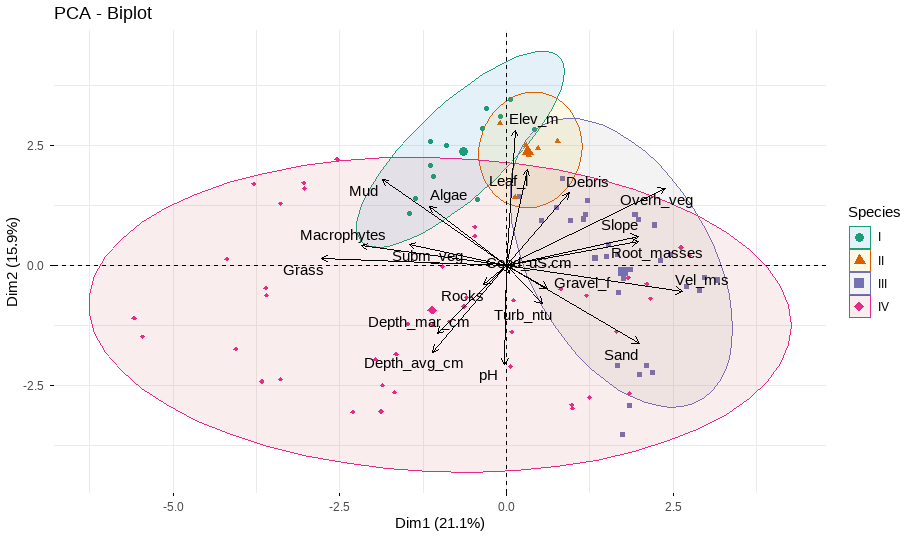
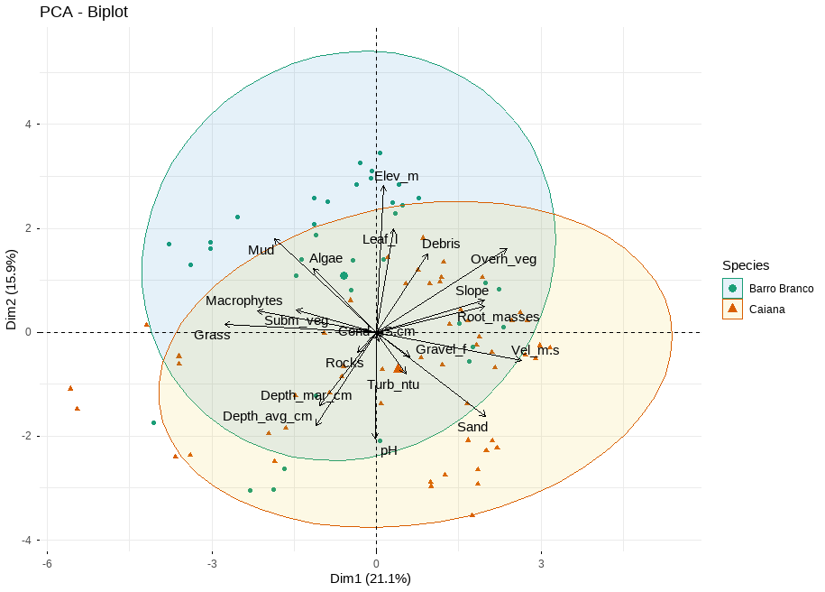
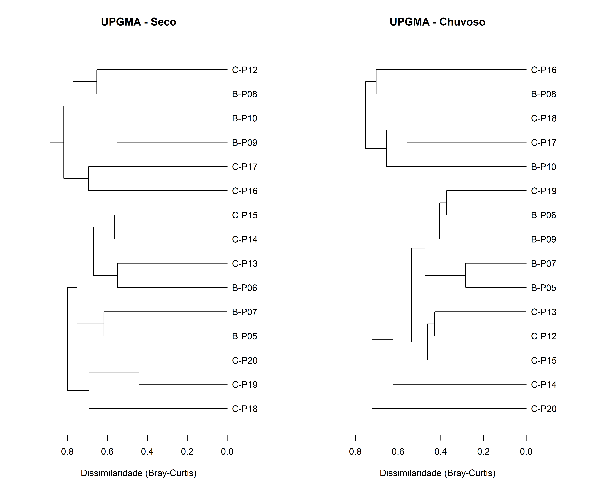
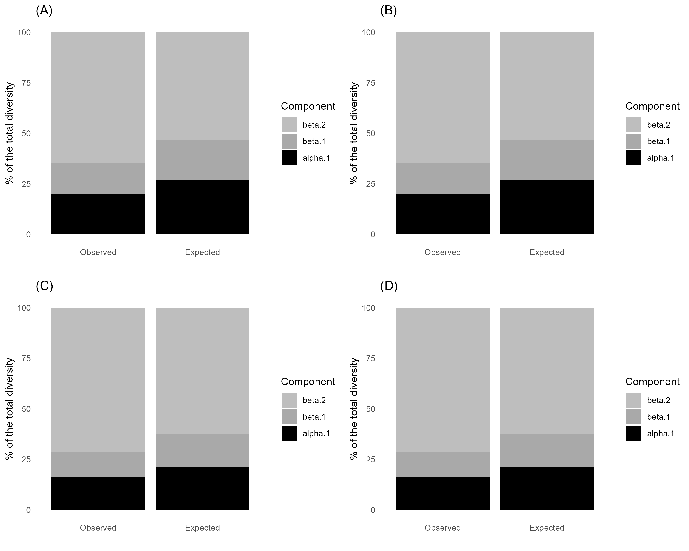

# Introduction

A Floresta Atlântica, reconhecida por sua elevada riqueza de espécies e alto grau de endemismo [@branco2021; @fonseca1985; @tabarelli2012; @taboada2022], é uma das florestas tropicais mais ameaçadas mundialmente devido à intensa pressão antrópica, tornando-a uma região prioritária para a conservação da biodiversidade na América do Sul [@myers2000; @safar2020; @vancine2024]. Originalmente, sua cobertura vegetal estendia-se por mais de 1,6 milhão de km²; no entanto, a ocupação e a exploração humana ao longo dos séculos resultaram na redução e fragmentação de suas paisagens, comprometendo a integridade de seus remanescentes e a manutenção da biodiversidade [@safar2020; @vancine2024].

A perda de habitat devido ao desmatamento está diretamente associada ao processo de fragmentação florestal, que favorece a formação de remanescentes isolados, reduz a conectividade entre os ambientes e pode limitar a dispersão de espécies [@souza2025; @tabarelli2010; @zaú1998]. Esses efeitos não se restringem apenas a ambientes terrestres, como também aos ecossistemas aquáticos associados aos remanescentes florestais, incluindo os riachos. Nesse sentido, a fragmentação e o manejo florestal podem gerar impactos significativos sobre a fauna de riachos inseridos na Floresta Atlântica, uma vez que os organismos presentes são sensíveis às mudanças nas condições naturais da água [@gouveia2017]. De acordo com @maltchik2006, processos em escala de paisagem, como perturbação, fragmentação, dispersão e estrutura de mosaicos, influenciam diretamente as populações locais. Assim, compreender os processos ecológicos que determinam a manutenção das comunidades é essencial para avaliar a saúde ecológica de corpos d’água e para entender como a diversidade se distribui em diferentes escalas espaciais [@ávila2011].

Além das alterações na paisagem, a dinâmica dos riachos é influenciada por fatores sazonais. A Floresta Atlântica apresenta clima predominantemente tropical, com ocorrência de chuvas ao longo do ano [@barboza2024]. Essas variações podem influenciar diretamente os ambientes de água doce presentes em regiões neotropicais, modificando as condições físicas e químicas dos ecossistemas aquáticos [@barboza2024]. A alternância entre os períodos seco e chuvoso pode alterar a disponibilidade de recursos, a estrutura de micro-habitats e as condições para o estabelecimento e a permanência dos organismos, afetando diretamente a composição e a dinâmica das comunidades [@esteves2011; @souza2025; @ward1998].

No período seco, a menor precipitação e a redução da vazão modificam as condições hidrológicas dos riachos, características que podem favorecer a permanência de populações locais. Em contraste, o período chuvoso é caracterizado pelo aumento da precipitação e da vazão, intensificando processos de distúrbio, dispersão e substituição de espécies [@allan2021; @souza2025]. Logo, a sazonalidade atua como um fator importante na organização das comunidades aquáticas, tornando-as úteis como ferramentas para avaliar o estado ecológico dos corpos hídricos.

Entre os seres vivos que compõe essas comunidades, destaca-se o zooplâncton, especialmente os grupos Rotifera, Cladocera e Copepoda. São organismos de tamanhos e formas variáveis, com ciclos de vida e papéis funcionais distintos, e excelentes bioindicadores ecológicos devido à sua sensibilidade às variações ambientais [@bonecker2012; @cardoso2009; @esteves2011]. Além disso, são uma importante fonte de alimento para peixes, aves aquáticas e mamíferos, atuando como elo entre produtores e consumidores a partir da disponibilidade de energia para níveis tróficos superiores [@altindag2025; @balkic2022; @cardoso2009; @majeed2023; @marcelino2025; @souza2025].

Segundo @keppeler2004, a composição e a organização das comunidades zooplanctônicas resultam da interação entre os parâmetros físicos, químicos e biológicos, incluindo as variações sazonais. Portanto, alterações na composição de espécies e a substituição de táxons podem ser reflexo devido às mudanças nas características físicas e químicas do ambiente [@freiry2020; @melo2013].

Nas últimas décadas, pesquisadores têm defendido que a biodiversidade não deve ser resumida a um único índice. @romanelli2022 discutem que a combinação de múltiplas abordagens estatísticas de diversidade, associada à avaliação de diferentes grupos de organismos, permite ampliar a compreensão sobre o estado ecológico dos ambientes e sobre como as espécies respondem às alterações ambientais. Ainda assim, poucas abordagens permitem avaliar a organização da diversidade em diferentes escalas espaciais.

É nesse contexto que se destaca a partição da diversidade. Este método decompõe a diversidade em múltiplas escalas, permitindo testar se a diversidade é maior ou menor que o esperado com base na distribuição dos indivíduos [@flach2009; @lopes2014], fornecendo informações sobre a organização das comunidades e os processos ecológicos que as estruturam.

Entre as diferentes formas de partição, a aditiva é mais comumente utilizada, especialmente em estudos de ambientes aquáticos. @ligeiro2010 citam que sua aplicação nesses ambientes ainda é relativamente escassa, refletindo a falta de estudos sobre a diversidade alfa e beta. Nesse método, a diversidade total, representada pela diversidade gama (γ), é decomposta em componentes alfa (α) e beta (β) [@crist2003], em que a diversidade alfa corresponde à diversidade média, enquanto a diversidade beta representa a variação na composição de espécies entre as unidades amostrais [@ávila2011; @baselga2012; @jost2007; @ligeiro2010; @whittaker1972].

A partição aditiva permite compreender como a diversidade zooplanctônica responde a alterações na paisagem e a variações sazonais. Ao decompor a diversidade total em componentes alfa e beta, é possível avaliar a contribuição da diversidade em diferentes escalas espaciais e se houve substituição de espécies. Dessa forma, o presente estudo produzirá informações sobre o estado ecológico dos riachos estudados e os processos que estruturam as comunidades zooplanctônicas, contribuindo para o desenvolvimento de estratégias de conservação em remanescentes de Floresta Atlântica.

<!--# Essas abordagens são baseadas nos conceitos de turnover and nestedness. Species turnover and nestedness are two distinct components used to break down and understand beta diversity—which measures how much species composition changes between different communities or sites [@baselga2010], where, turnover is the replacement of some species by different species from one site to another, while nestedness is the loss or gain of species where poorer sites contain a strict subset of the species found at richer sites. -->

CITAR: [@ligeiro2010; @crist2003; @ávila2011; @shell2018; @baselga2012; @baselga2010]

## Objectives

Avaliar a partição aditiva da diversidade zooplanctônica em riachos de primeira ordem na REBIO Guaribas, considerando os períodos seco e chuvoso.

## Objetivos específicos

I.  Determinar a riqueza e densidade de espécies na comunidade zooplanctônica nos riachos Barro Branco e Caiana, nos períodos seco e chuvoso.

II. Aplicar a partição aditiva da diversidade em diferentes escalas espaciais.

III. Comparar a diversidade observada e esperada entre os períodos seco e chuvoso.

## Hipóteses

I.  Espera-se maior contribuição da diversidade em escalas espaciais menores, com pouca ou nenhuma influência da sazonalidade sobre a partição da diversidade.

II. Diversidade alfa observada menor que a diversidade esperada, enquanto a diversidade beta observada maior que a esperada, indicando heterogeneidade espacial e substituição de espécies.

LER: [@melo2011; @carvalho2011]

<!--# This study describes the richness and density of zooplankton, comparatively between two small head water streams subject to different levels of environmental pressures. One originates withing a protected area - Biological Reserve, or REBIO, according to @brasil2000 - and its course extends beyond its administrative boundaries [@mma2003], and a second one that flows entirely outside of the protected area. Within this framework, we use hierarchical additive partitioning to evaluate the relative contribution of different spatial and temporal scales to the diversity of zooplankton assemblages. Given the importance of the Atlantic Forest to the biodiversity [@pereira2026] and its fragmented stated north of the São Francisco river basin [@silva2003], we aim with this study, (1) to infer environmental degradation from species turnover [@baselga2010] and (2) to associate beta-diversity to the ecological health of sites inside and surrounding a protected area of Atlantic Forest. Given the expected different levels of environmental pressures in the  area [@gouveia2017], we hypothesize that the diversity is not be homogeneously distributed among the different spatial scales but concentrated at the finer levels and seasonal variation will be limited to species composition, but no spacial variation is expected between dry and wet seasons. Some environmental features (reach morphology, habitat structure, and water quality) are also described to explore possible explaining factors for the observed patterns. -->

# Metodologia

## Área de estudo e delineamento amostral

<!--# # Material and methods -->

<!--# ## Study area and sampling design -->

A Reserva Biológica Guaribas (REBIO) está localizada na Mesorregião da Mata Paraibana e na Microrregião do Litoral Norte, sendo uma unidade de conservação desde 1990 [@brasil1990; @leal2025; @mma2003]. São incluídas três áreas descontínuas, sendo elas SEMA 01 e SEMA 02 localizadas no município de Mamanguape, PB, e SEMA 03 localizada no município de Rio Tinto, PB. De acordo com a classificação de Köppen, o clima é quente e úmido, com estação seca no verão e chuvosa no inverno e temperaturas que variam entre 24°C e 26°C [@mma2003].

Por se tratar de uma unidade de conservação e por compor um dos últimos remanescentes de Floresta Atlântica do Estado da Paraíba, a reserva tornou-se essencial no que diz respeito à conservação de espécies raras, endêmicas e ameaçadas de extinção, além de proteger nascentes de importantes riachos [@mma2003]. Entretanto, ainda é possível observar atividades antrópicas na região, como o plantio de cana-de-açúcar, o cultivo de frutas e hortaliças e a formação de áreas de pastagens.

A área selecionada para o presente estudo, SEMA 02, abriga os riachos Caiana e Barro Branco que drenam no sentido sul-norte e cujos cursos não se estendem por mais de 10 km antes de desaguarem no Rio Camaratuba, o qual, por sua vez, deságua no oceano Atlântico. Ambos os riachos nascem dentro da reserva, entretanto, o Caiana flui sobre uma área de floresta modificada para pastoreio e plantios, enquanto o Barro Branco flui parcialmente por uma área de Floresta Atlântica no interior da unidade (Figura 1)

As coletas ocorreram entre novembro de 2023 a fevereiro de 2024 durante o período seco e de junho a agosto de 2024 no período chuvoso. Foram selecionados 15 pontos de coleta (denominados Unidades Amostrais ou UAs) (Figura 1), localizados dentro e no entorno da Reserva Biológica. Para cada unidade amostral, foram coletadas três subamostras, uma em cada habitat, a fim de realizar uma análise estatística mais rigorosa [@martinelli2004].

<!--# **Study area and sampling design.** This study was conducted in the Guaribas Biological Reserve (REBIO Guaribas), a protected area of Atlantic Forest in northeastern Brazil. This protected area is located in a transitional zone between the Caatinga and Atlantic Forest ecoregions. The land use of the study area is based on the occupation of traditional human populations and an increasing use of land for large scale monocultures, mostly sugar cane [@heinrichs2017]. Other than these, small scale agricultural activities, fishing, and the modification of the natural vegetation for livestock are important anthropogenic pressures that affect the buffer zone of the REBIO [@arruda2013; @mma2026]. Other common uses of the soil in the area are, coconut plantations, orchards and subsistence agriculture. These land uses represent important sources of pollution, either through agrochemicals runoff or direct and indirect domestic effluents (such as septic tanks). These nonpoint source pollutants contaminate underground water and create a spatial gradient of environmental disturbance [@mehla2026]. Therefore, the mainly rural nature of the land use associated with the management of vegetation, will cause direct impact to aquatic systems, by the siltation of streams and contamination of groundwater. The hydrographic network of the study region is composed predominantly of small catchments containing first- and second-order streams (Strahler -@strahler1957 classification) (@fig-mapa). These watercourses are tributaries of the Camaratuba River and are sustained by numerous springs distributed throughout the region. The two main stream systems in the study area are the Barro Branco and Caiana catchemnts. The Barro Branco stream is approximately 8.8 km long and originates within the protected area. Its upper section remains within the boundaries of the REBIO, whereas its middle and lower sections extend into the surrounding landscape. Despite this transition, riparian vegetation is preserved along most of the stream. The Caiana stream is approximately 9.8 km long and also originates within the REBIO, although most of its course lies outside the protection area. -->

<!--# The climate in the region is classified as As' [@peel2007], characterized by a mean annual temperature of approximately 25 °C, with maximum temperatures occurring mainly between February and March, during the dry period, as well as by low annual thermal amplitude. Annual precipitation ranges from 1,400 to 1,800 mm, concentrated between March and July, whereas the lowest rainfall levels occur between September and December. In the study area, rainfall is concentrated between March and July, beginning in autumn and extending into winter. This pattern is attributed to the influence of cold air masses from the South Atlantic ocean that affect the region. The hydrographic network is composed of small headwater streams fed by rain [@gouveia2017]. -->

<!--# ###VOLTAR AQUI COM O DESENHO AMOSTRAL DA BETA-DIV E 3 HABITATS[@farias2020]### Sampling was conducted during the dry (January-February) and rainy (June-July) periods of 2024 in two Atlantic Forest streams. A total of 15 sampling sites were distributed longitudinally across the two streams to capture spatial variation in environmental conditions and habitat characteristics. The Barro Branco stream included sampling sites located within the protected area and sites located outside its boundaries, whereas all sampling sites in the Caiana stream were located outside the protected area. This sampling design allowed the assessment of zooplankton diversity across nested spatial scales and contrasting conditions of environmental protection and human influence (@fig-mapa).-->

<!--# For comparative purposes, sampling sites were assigned *a priori* to one of four environmental categories based on their location relative to the protected area and their expected environmental conditions (@fig-refsites). Type I sites, considered reference sites for this study, were located within the protected area and were expected to represent the best-preserved conditions. These sites were characterized by well-preserved riparian vegetation and the absence of agricultural fields within a 1-km radius. They were also expected to meet the following environmental criteria: mean water temperature ≤ 28 °C, mean dissolved oxygen concentration ≥ 6 mg/L, mean water velocity ≥ 0.025 m/s, and mean turbidity ≤ 15 NTU. Type II sites were also located within the protected area but were expected to show some degree of environmental alteration. This category included sites located close to agricultural areas or sites that failed to meet one or more of the environmental or hydrological criteria established for Type I sites. Type III sites were located outside the protected area but were expected to maintain relatively favorable water-quality conditions, broadly comparable to those observed at reference sites. However, because these sites were situated outside the REBIO, they were not expected to satisfy the criteria related to intact riparian vegetation or a minimum distance of 1 km from agricultural fields. Finally, Type IV sites were located outside the protected area and were characterized by evidence of environmental disturbance. These sites did not meet at least one of the water-quality criteria established for reference sites and showed alterations in habitat characteristics relative to Type I sites. As with Type III sites, the criteria concerning riparian forest integrity and distance from agricultural fields were not met for this category because these sites were intentionally selected outside the REBIO. The classification was subsequently evaluated and confirmed using environmental measurements collected *in situ*.-->

## Coleta de dados ambientais

<!--# ## Environmental data collection -->

Dados físicos, químicos e ambientais foram coletados com a finalidade de caracterizar as condições do habitat em que as espécies foram encontradas. Neste contexto, foram avaliados os seguintes dados: **(1) morfometria**, como profundidade (m), largura (l) e velocidade da corrente de água (m/s); **(2) qualidade da água**, incluindooxigênio dissolvido (mg/L) e temperatura (°C); e **(3) estrutura do habitat,** por meio da avaliação dos tipos de substrato e estruturas subaquáticas e marginais [@medeiros2008].

Dentre as variáveis ambientais, realizou-se a medição das variáveis físicas e químicas, morfometria, qualidade da água e estrutura do habitat com o intuito de fornecer informações acerca do habitat em que as espécies foram encontradas. As variáveis químicas foram estimadas por meio de medidores de pH (TECNOPON MPA-210), condutividade (μS/cm) (TECNOPON MCS-150) e turbidez da água (NTU), utilizando equipamentos de bancada no Laboratório de Ecologia (LABECO) – Campus V. As variáveis temperatura (°C) e oxigênio dissolvido (mg/L) (Lutron DO-5510) e velocidade da água (m/s) foram medidas em campo, sendo está última medida utilizando o método da bóia de @maitland1990.

Para a avaliação morfométrica de cada habitat nas 15 unidades amostrais (UAs), foram estabelecidos transectos nos quais foram medidos a largura e o comprimento com o auxílio de uma trena métrica. A profundidade e largura foram medidas em três seções equidistantes ao longo de cada transecto, também utilizando a trena métrica. A altitude, a forma e a distância entre as unidades amostrais foram determinadas através de dados obtidos por GPS. Esses dados foram empregados para calcular a área superficial, o volume e a distância entre os pontos de coleta.

Com o objetivo de quantificar a estrutura do habitat e classificar os ambientes estudados quanto à disponibilidade de recursos, os seguintes aspectos foram quantificados em cada ambiente: presença de macrófitas, vegetação submersa, vegetação flutuante, algas, vegetação ripária, liteira, raízes e galhos de árvores próximas. Os ambientes também foram classificados quanto ao tipo de substrato, sendo estimadas as proporções de lama, areia, pedras, seixos, entre outros. De acordo com a metodologia proposta por @medeiros2008, estes dados, levantados por meio de análise visual, estimam a contribuição proporcional de cada componente. Considerando que a maioria desses elementos estão concentrados nas margens, as medições foram obtidas a partir de transectos paralelos à margem dos ambientes estudados. Estes dados representam a proporção média (%) de cobertura dos aspectos medidos para cada trecho [@medeiros2008].

<!--# To evaluate whether the a priori classification of sampling sites into Types I–IV was supported by quantitative environmental information, environmental conditions were characterized using four groups of variables: site morphology, water quality, substrate composition, and marginal habitat structure. Morphological characteristics were assessed from three randomly selected transects at each site, where stream width (cm) and water depth (cm) were measured. Bank slope was classified into four categories according to its inclination: 1, ≤ 20°; 2, > 20–30°; 3, > 30–50°; and 4, > 50°. Broader-scale landscape characteristics, including elevation and stream length, were obtained from handheld GPS records and satellite imagery. Water quality was characterized using physical and chemical measurements obtained with portable instruments, including water temperature (°C) and dissolved oxygen concentration (mg/L). Turbidity was subsequently measured in the laboratory with a turbidimeter using water samples collected at each sampling site. Current velocity (m/s) was estimated using the float method, as described by @maitland1990. Substrate composition and the physical structure of marginal habitats were evaluated following procedures adapted by @medeiros2008 from the protocols proposed by @pusey2004 and @mugodo2006. Between 9 and 12 quadrats (1 m²) were distributed along the terrestrial–aquatic interface at each sampling site. Within each quadrat, the proportional cover of different substrate categories was visually estimated, including mud, sand, cobbles, small and large gravel and rocks. The same quadrats were used to characterize littoral and submerged habitat features. Recorded habitat components included macrophytes, marginal grasses, leaf litter, attached and filamentous algae, overhanging and submerged vegetation, small and large woody debris, and root masses. For subsequent analyses and presentation, environmental measurements were summarized as mean values for each sampling site.-->

<!--# Three 250 mL replicate samples of water from each site were taken and refrigerated for concentration analysis (μg L⁻¹) of ammonia, nitrite, nitrate, orthophosphate (soluble reactive phosphorus) and total phosphorus. Nutrient concentrations were obtained based on Standard Methods for the Examination of Water [-@apha1998] and @mackereth1978.-->

<!--# The ecophysiological evaluation of human impact on the forest, was mainly guided by the fish species inventory for the REBIO made by @gouveia2017. This study lists 18 species from five different orders: Characiformes (12 species), Perciformes (3 species), Synbranchiformes (1 species), Siluriformes (1 species) e Cyprinodontiformes (1 species). From those, two are exotic - *Oreochromis niloticus*, second most farmed fish species in the world and tolerant to osmotic variation, and *Poecilia reticulata*, largely used in mosquito control and resistant to stressful environments [@miranda2012]. The predominance of small fish inhabiting small basins is thought to lead to low dispersion and consequent isolation of populations [@gouveia2017], associated with the fact that most species in the study area are phylogenetic close (with the predominance of Characidae) and are widely distributed, offers an appropriate design to access the entire local ichthyofauna using a few species, namely the genuses *Hemigrammus* and *Astyanax*.-->

## Amostragem do zooplâncton

<!--# ## Zooplankton sampling -->

Para a coleta de zooplâncton, foram filtrados 50 litros de água utilizando rede de plâncton com diâmetro de abertura de 30 cm e comprimento de 70 cm, com malha de 68 μm. Os espécimes foram armazenados em frascos plásticos de 80 mL, denominados como Volume de Trabalho (Vt), fixados em solução de formaldeído a 4% e narcotizados por saturação de CO~2~ (adição de água com gás). Posteriormente foi adicionada uma pequena quantidade de sacarose para evitar o desprendimento de ovos, a contração dos indivíduos ou que possam expelir seu conteúdo intestinal, já que após a coleta, é normal que ocorra a rápida degradação estrutural e metabólica [@bicudo2004].

Todas as amostras foram transportadas até o Laboratório de Ecologia (LABECO), localizado no Centro de Ciências Biológicas e Sociais Aplicadas, Campus V – João Pessoa, da Universidade Estadual da Paraíba, para a realização da análise até o menor nível taxonômico possível, utilizando câmara de Sedgewick-Rafter com capacidade para 1 mL, microscópio (OLYMPUS CX31) e chaves de identificação como @koste1987; @shiel1995 e @elmoor-loureiro1997. Além disso, todos os espécimes passaram por confirmação das espécies por uma especialista.

Após a coleta e o registro dos dados, as amostras foram organizadas em lotes e devidamente etiquetadas. Em seguida, realizou-se a confirmação de identificação das espécies por um especialista. Os dados de riqueza (R) e abundância total foram analisados com o objetivo de investigar os padrões de variação na estrutura das comunidades zooplanctônicas das áreas estudadas.

<!--# Zooplankton was sampled at habitats within each sampling site, hereafter referred to as habitat samples. Collections were performed in the main channel of the streams at the surface water. At each sampling habitat, a plankton net (30 cm mouth diameter, 70 cm length, and 60 μm mesh size) was used to filter 50 L of water. The net was rinsed between successive samples to prevent clogging and carryover of organisms. Each sample was concentrated to a final volume of 80 mL for laboratory analyses. Following collection, zooplankton samples were anesthetized with commercial sparkling water and subsequently preserved in 4% formalin. Sucrose was added to the preserved material to reduce the loss of eggs by female cladocerans and minimize deformation of zooplankton carapaces [@haney1973]. In the laboratory, samples had their zooplankton identified and counted using a Sedgewick–Rafter counting chamber. The analyses focused on representatives of Rotifera, Cladocera, and Copepoda. Taxonomic identification was based on specialized literature and confirmed by specialists. To evaluate whether the sampling effort adequately represented the zooplankton assemblage, species accumulation curves were calculated ####VOLTAR AQUI COM O MÉTODO DETALHADO####.-->

<!--# Zooplankton was collected using a plankton net (opening diameter 30 cm, 70 cm long, pore size 60 µm and sample cup of 80 mL). At three different locations, at each site, one sample of fifty liters of water was filtered through the net. Commercial sparkling water was added to the sample to narcotize the zooplankters, which were the preserved in 4% formalin (EPA 2013). Sucrose was added to the preserved sample to prevent female cladocerans from losing eggs and to minimize carapace distortion (Haney e Hall 1973). In the laboratory, three subsample aliquots of 1 mL were taken from each sample and all individuals were identified and counted in a Sedgewick-Rafter counting cell (Koste 1978, Elmoor-Loureiro 1997, Elmoor-Loureiro e Sousa 2021, GBIF.org 2023, NIES 2023, Haney J. F. et al 2024). Only rotifers, cladocerans and copepods were considered in the present study. -->

## Análises estatísticas

<!--# ## Statistical analyses -->

Para que as análises estatísticas fossem realizadas, foi efetuado o cálculo de densidade, considerando o número de indivíduos de espécie por m³, através da fórmula:

$$Dsp = \frac{Nsp}{Vf}$$ {#eq-densidade} onde a densidade em número de indivíduos por m³ de uma espécie (*Dsp*) para um determinado habitat será o número de indivíduos da espécie (*Nsp*), dividido pelo volume total filtrado (*Vf*) [@bowen2017].

Além disso, as fórmulas de partição aditiva e multiplicativa também foram aplicadas:

$$\gamma=\alpha_1+\sum_{i=1}^{m} \beta_i \text{ (*)}$$ {#eq-aditiva}\

$$\beta_i=\gamma/\alpha_i \text{ (**)}$$ {#eq-multiplicativa}

Na **partição aditiva (\*)** [@oksanen2020], γ é expressa como a soma da diversidade alfa do nível amostral (α₁) e das contribuições da diversidade beta (βᵢ) associadas a cada unidade amostral, conforme a equação (@eq-aditiva). A diversidade (βᵢ) foi calculada a partir da razão entre a diversidade total (γ) e a diversidade alfa observada em cada unidade amostral (αᵢ), permitindo avaliar o grau de diferenciação entre as unidades amostrais em relação ao conjunto total de amostras. Valores mais elevados de βᵢ indicam maior heterogeneidade entre as unidades amostrais, enquanto valores menores sugerem maior similaridade entre elas. Em resumo, a diversidade total (γ) é resultado da diversidade média local (α₁) e da soma das diferenças entre as unidades amostrais (βᵢ). A **partição multiplicativa (\*\*)** tem como função encontrar o valor da diversidade beta (β), tendo em vista que a diversidade de espécies muda ao longo de escalas espaciais [@jost2007; @lande1996; @melo2012; @melo2009; @oksanen2020; @whittaker1972].

Os dados foram organizados em formatos de tabelas, gráficos e figuras e analisados por meio de testes estatísticos compatíveis através de técnicas multivariadas utilizando o ambiente de programação R/RStudio [@hair2021; @rcoreteam2017; @rstudioteam2022; @zar1999].

Para a realização das análises estatísticas, foram utilizados pacotes que permitem avaliar a estrutura da comunidade com base na riqueza. A Análise de Componentes Principais (PCA) foi executada para avaliar as variáveis ambientais.

Foram empregados pacotes sobre partição da diversidade para que fosse possível decompor ou particionar a diversidade em componentes alfa (α), beta (β) e gama (γ). A diversidade alfa se refere à diversidade de espécies em uma escala local, ou seja, dentro de manchas homogêneas locais ou unidades amostrais únicas. Diversidade gama, ou diversidade regional, corresponde a escalas espaciais maiores, enquanto que a diversidade beta manifesta-se quando há variação na diversidade entre os ambientes ou escalas espaciais [@chao2012; @farias2020].

Os gráficos e figuras sobre as partições foram realizados no programa estatístico RStudio utilizando os pacotes: eulerr, vegan e VennDiagram que forneceram informações acerca da distribuição da riqueza de espécies com base na diversidade alfa e diversidade gama [@chen2011; @oksanen2020]. Funções como adipart e multipart também foram empregadas. A função adipart foi utilizada para a partição aditiva da diversidade, em que conterá os valores médios da diversidade alfa que serão comparados com a diversidade total em todo o conjunto de dados (γ-diversidade) e multipart para partição multiplicativa da diversidade, que conterá os valores médios da α-diversidade em níveis mais baixos de uma hierarquia e comparados com a diversidade total gama.

Esses pacotes permitiram uma análise detalhada e abrangente da distribuição e diversidade de espécies nos riachos estudados.

<!--# ####AMBIENTAIS#### Environmental variables were screened for multicollinearity and to identify redundant descriptors. Variables representing similar environmental information were also combined when appropriate, thereby reducing redundancy in the dataset [@legendre1998]. -->

```{r ZOOREBIO23_PART-ORG}
#| eval: false
#| message: false
#| warning: false
#| results: false
#| code-fold: true
#| code-overflow: wrap
#| code-summary: "Code: Importing and organizing data"

#ZOOREBIO23_PART - ORGANIZANDO DADOS AMBIENTAIS----
#####....----

dev.off() #apaga os graficos, se houver algum
rm(list=ls(all=TRUE)) #limpa a memória
cat("\014") #limpa o console

##CARREGANDO MATRIZES BRUTAS----

library(openxlsx)
habitat <- read.xlsx("dados/rebio23-habitat.xlsx",
                    rowNames = T,
                    colNames = T,
                    sheet = "ambiente",
                    startRow = 2)
# Identify columns containing only NA values
all.na <- names(habitat)[colSums(!is.na(habitat)) == 0]
all.na <- c(all.na, "w.Temp_C", "w.DO_mg.L")
# Remove those columns by name
m_hab_part <- habitat[, !names(habitat) %in% all.na, drop = FALSE]
# Removendo linhas por nome
rownames(m_hab_part)
del_rows <- c("C-C-P11-H1", "C-C-P11-H2", "C-C-P11-H3",
              "S-C-P11-H1", "S-C-P11-H2", "S-C-P11-H3")
del_rows
m_hab_part <- m_hab_part[!(row.names(m_hab_part) %in% c(del_rows)),]
m_hab_part
# Remove columns with at least one NA
m_hab_part <- m_hab_part[, colSums(is.na(m_hab_part)) == 0, drop = FALSE]

###REMOVENDO COLUNAS ZERADAS DE HABITAT----

sum <- colSums(m_hab_part)
sum
zero_sum <- names(which(colSums(m_hab_part) == 0))
zero_sum #nomes das colunas zeradas
m_part_cols <- m_hab_part[(colSums(m_hab_part) != 0)] #em != a exclamação inverte o sentido
zero_sum2 <- names(which(colSums(m_part_cols) == 0))
zero_sum2 #nomes das colunas zeradas
sum<-colSums(m_part_cols)
sum

t_grps <- read.xlsx("dados/rebio23-habitat.xlsx",
                   rowNames = T,
                   colNames = T,
                   sheet = "grupos",
                   startRow = 2)

###REMOVENDO LINHAS ZERADAS DE GRUPOS----

rownames(t_grps)
del_rows
t_grps <- t_grps[!(row.names(t_grps) %in% c(del_rows)),]
t_grps

###SEPARANDO NUTRIENTES----

nutri <- grep("^n\\.", colnames(habitat), value = TRUE)
nutri
nutrientes <- habitat[, nutri, drop = FALSE]
nutrientes <- nutrientes[, colSums(!is.na(nutrientes)) > 0, drop = FALSE]
nutrientes <- na.omit(nutrientes)

##SALVANDO MATRIZES FINAIS----

write.table(m_part_cols, "res/m_hab_part.csv",
            sep = ";", dec = ".", #"\t",
            row.names = TRUE,
            quote = TRUE,
            append = FALSE)
write.table(nutrientes, "res/t_nutri.csv",
            sep = ";", dec = ".", #"\t",
            row.names = TRUE,
            quote = TRUE,
            append = FALSE)
write.table(t_grps, "res/t_grps.csv",
            sep = ";", dec = ".", #"\t",
            row.names = TRUE,
            quote = TRUE,
            append = FALSE)
t_grps <- read.csv("res/t_grps.csv",
                   sep = ";", dec = ".",
                   row.names = 1,
                   header = TRUE,
                   na.strings = NA)
t_nutri <- read.csv("res/t_nutri.csv",
                  sep = ";", dec = ".",
                  row.names = 1,
                  header = TRUE,
                  na.strings = NA)
m_hab <- read.csv("res/m_hab_part.csv",
                  sep = ";", dec = ".",
                  row.names = 1,
                  header = TRUE,
                  na.strings = NA)

#ZOOREBIO23_PART - ORGANIZANDO DADOS DA COMUNIDADE----
#####....----

dev.off() #apaga os graficos, se houver algum
rm(list=ls(all=TRUE)) #limpa a memória
cat("\014") #limpa o console

library(openxlsx)

##CARREGANDO MATRIZES BRUTAS----

densidade <- read.xlsx("dados/rebio23-zoopl.xlsx",
                   rowNames = T,
                   colNames = T,
                   sheet = "densidade_hab_indL")
densidade[1:5,1:5] #[1:5,1:5] mostra apenas as linhas e colunas de 1 a 5.

##COLUNAS ZERADAS DE DENSIDADE----
sum <- colSums(densidade)
sum
zero_sum <- names(which(colSums(densidade) == 0))
zero_sum #nomes das espécies zeradas
m_part_cols <- densidade[(colSums(densidade) != 0)] #em != a exclamação inverte o sentido
zero_sum2 <- names(which(colSums(m_part_cols) == 0))
zero_sum2 #nomes das espécies zeradas
sum<-colSums(m_part_cols)
sum

###LINHAS ZERADAS DE DENSIDADE----
m_part2 <- as.data.frame(t(m_part_cols))
sum <- colSums(m_part2)
sum
zero_sum <- names(which(colSums(m_part2) == 0))
zero_sum #nomes das espécies zeradas
m_part_rows <- m_part2[(colSums(m_part2) != 0)] #em != a exclamação inverte o sentido
zero_sum2 <- names(which(colSums(m_part_rows) == 0))
zero_sum2 #nomes das espécies zeradas
sum<-colSums(m_part_rows)
sum
m_dens <- as.data.frame((t(m_part_rows)))

##SALVANDO MATRIZES FINAIS REMOVIDAS AS LINHAS/COLUNAS ZERADAS----

write.table(m_dens, "res/m_dens.csv",
            sep = ";", dec = ".", #"\t",
            row.names = TRUE,
            quote = TRUE,
            append = FALSE)
m_dens <- read.csv(res/"m_dens.csv",
                   sep = ";", dec = ".",
                   row.names = 1,
                   header = TRUE,
                   na.strings = NA)

#ZOOREBIO23_PART - MATRIZ DE CONTAGEM----
#####....----

library(openxlsx)
contagem <- read.xlsx("dados/rebio23-zoopl.xlsx",
                      rowNames = T,
                      colNames = T,
                      sheet = "rebio23_80ml",
                      startRow = 2)
contagem[1:5,1:5] #[1:5,1:5] mostra apenas as linhas e colunas de 1 a 5.

###COLUNAS ZERADAS DE CONTAGEM----
sum <- colSums(contagem)
sum
zero_sum <- names(which(colSums(contagem) == 0))
zero_sum #nomes das espécies zeradas
m_part_cols <- contagem[(colSums(contagem) != 0)] #em != a exclamação inverte o sentido
zero_sum2 <- names(which(colSums(m_part_cols) == 0))
zero_sum2 #nomes das espécies zeradas
sum<-colSums(m_part_cols)
sum

###LINHAS ZERADAS DE CONTAGEM----
m_part2 <- as.data.frame(t(m_part_cols))
sum <- colSums(m_part2)
sum
zero_sum <- names(which(colSums(m_part2) == 0))
zero_sum #nomes das espécies zeradas
m_part_rows <- m_part2[(colSums(m_part2) != 0)] #em != a exclamação inverte o sentido
zero_sum2 <- names(which(colSums(m_part_rows) == 0))
zero_sum2 #nomes das espécies zeradas
sum<-colSums(m_part_rows)
sum
m_cont <- (t(m_part_rows))
m_cont
sum(m_cont)
ncol(m_cont)

##SALVANDO MATRIZ FINAL DE CONTAGEM----

write.table(m_cont, "res/m_cont.csv",
            sep = ";", dec = ".", #"\t",
            row.names = TRUE,
            quote = TRUE,
            append = FALSE)
m_cont <- read.csv("res/m_cont.csv",
                   sep = ";", dec = ".",
                   row.names = 1,
                   header = TRUE,
                   na.strings = NA)
m_cont

#ZOOREBIO23_PART - ORGANIZANDO ESCALAS DA COMUNIDADE----
#####....----

dev.off() #apaga os graficos, se houver algum
rm(list=ls(all=TRUE)) #limpa a memória
cat("\014") #limpa o console

library(openxlsx)

##CARREGANDO MATRIZES BRUTAS----

escalas <- read.xlsx("dados/rebio23-zoopl.xlsx",
                   rowNames = T,
                   colNames = T,
                   sheet = "escalas_final",
                   startRow = 2)

rownames(escalas)
del_rows <- c("C-C-P11-H1", "C-C-P11-H2", "C-C-P11-H3", "S-C-P11-H1", "S-C-P11-H2", "S-C-P11-H3")
del_rows
escalas <- escalas[!(row.names(escalas) %in% c(del_rows)),]

write.table(escalas, "res/m_esc.csv",
            sep = ";", dec = ".", #"\t",
            row.names = TRUE,
            quote = TRUE,
            append = FALSE)
m_esc <- read.csv("res/m_esc.csv",
                   sep = ";", dec = ".",
                   row.names = 1,
                   header = TRUE,
                   na.strings = NA)
m_esc
```

```{r ENV-REBIO23_PART-CORR}
#| eval: false
#| message: false
#| warning: false
#| results: false
#| code-fold: true
#| code-overflow: wrap
#| code-summary: "Code: Correlations of environment data" 

#REBIO23-part----

##ORGANIZANDO DADOS----

dev.off()
rm(list=ls(all=TRUE))
cat("\014")

t_grps <- read.csv("res/t_grps.csv",
                   sep = ";", dec = ".",
                   row.names = 1,
                   header = TRUE,
                   na.strings = NA)
m_hab <- read.csv("res/m_hab_part.csv",
                  sep = ";", dec = ".",
                  row.names = 1,
                  header = TRUE,
                  na.strings = NA)

##CORRELOGRAMA E REMOÇÃO DE VARIÁVEIS REDUNDANTES OU DESNECESSÁRIAS----

library(psych)
colnames(m_hab)
png("res/fig-h.hab_pairs.png")
pairs.panels(m_hab[,1:8],
             method = "pearson", # correlation method
             scale = FALSE, lm = FALSE,
             hist.col = "#00AFBB", pch = 19,
             density = TRUE,  # show density plots
             ellipses = TRUE, # show correlation ellipses
             alpha = 0.5)
dev.off()

cor <- cor(m_hab)
cor

library(corrplot)
png("res/fig-hab_corrplot.png")
corrplot(cor, method = "circle")
dev.off()

##DELETANDO COLINEARES OU INDESEJADAS----

sink(file = "res/colineares.txt", append = F, split = T)
colnames(m_hab)
del_cols <- c("", "")
#del_cols <- grep("^n\\.", colnames(m_hab), value = TRUE)
m_hab_part <- m_hab[, !(colnames(m_hab) %in% del_cols)]

##SOMANDO REDUNDANTES----

m_hab_part$h.Algae <- m_hab_part$h.Algae_f + m_hab_part$h.Algae_a
m_hab_part <- m_hab_part[, !(colnames(m_hab_part)
                           %in% c("h.Algae_f", "h.Algae_a"))]
m_hab_part$h.Debris <- m_hab_part$h.Debris_l + m_hab_part$h.Debris_s
m_hab_part <- m_hab_part[, !(colnames(m_hab_part)
                         %in% c("h.Debris_l", "h.Debris_s"))]

colnames(m_hab_part)
m_hab_part
sink()

write.table(m_hab_part, "res/m_hab_part.csv",
            sep = ";", dec = ".", #"\t",
            row.names = TRUE,
            quote = TRUE,
            append = FALSE)
m_hab_part <- read.csv("res/m_hab_part.csv",
                       sep = ";", dec = ".",
                       row.names = 1,
                       header = TRUE,
                       na.strings = NA)


```

```{r ENV-REBIO23_PART-CORR_TEST}
#| eval: false
#| message: false
#| warning: false
#| results: false
#| code-fold: true
#| code-overflow: wrap
#| code-summary: "Code: Correlations tests of environment data" 

colnames(m_hab_part)
library(PerformanceAnalytics)
chart.Correlation(m_hab_part[, c(1:20)], histogram=TRUE)
# ***p<0.001, **p<0.01, *p<0.05, .p<0.10

library(Hmisc)
mat <- as.matrix(m_hab_part[, 1:20])
res <- rcorr(mat, type = "pearson")
cor_mat <- res$r
p_mat   <- res$P

stars <- ifelse(p_mat < 0.001, "***",
         ifelse(p_mat < 0.01,  "**",
         ifelse(p_mat < 0.05,  "*", "")))

cor_star <- ifelse(p_mat < 0.05,
                   paste0(round(cor_mat, 2), stars),
                   NA)

cor_star <- matrix(
  cor_star,
  nrow = nrow(cor_mat),
  dimnames = dimnames(cor_mat)
)

cor_star[upper.tri(cor_star, diag = TRUE)] <- NA
cor_star <- noquote(cor_star)
print(cor_star, na.print = "")
```

<!--# These data were then analyzed using Principal Component Analysis (PCA) to summarize multivariate patterns of environmental variation among sampling sites. Prior to PCA, site morphology and water-quality variables were square-root transformed [@sokal1995]. Variables describing sediment composition and marginal habitat structure, expressed as percentages, were relativized by their column totals and subsequently subjected to the arcsine square-root transformation [@mccune2002]. PCA was conducted in R using the `FactoMineR` package [@lê2008], with all variables centered and standardized to unit variance before analysis. The water quality parameters temperature and dissolved oxygen, and all nutrients were used to characterize differences between streams but were not used in the PCA because they were not measured for both seasons.-->

```{r ENV-PCA-ORG}
#| eval: false
#| message: false
#| warning: false
#| results: false
#| code-fold: true
#| code-overflow: wrap
#| code-summary: "Code: Organizing Environment data PCA"

#PCA fviz package----
#browseURL("https://www.sthda.com/english/articles/31-principal-component-methods-in-r-practical-guide/112-pca-principal-component-analysis-essentials/")

#ORGANIZANDO DADOS----

dev.off()
rm(list=ls(all=TRUE))
cat("\014")

t_grps <- read.csv("res/t_grps.csv",
                   sep = ";", dec = ".",
                   row.names = 1,
                   header = TRUE,
                   na.strings = NA)
m_hab_part <- read.csv("res/m_hab_part.csv",
                       sep = ";", dec = ".",
                       row.names = 1,
                       header = TRUE,
                       na.strings = NA)

colnames(m_hab_part)

###RELATIVIZAÇÕES E TRANSFORMAÇÕES----
library(vegan)
library(tidyverse)

# Selecionando variáveis que começam com "w" ou "m"
m_wm <- m_hab_part[, grep("^(w|m)", colnames(m_hab_part))]

# Selecionando variáveis que começam com "s" ou "h"
m_sh <- m_hab_part[, grep("^(s|h)", colnames(m_hab_part))]

# Removendo os dois primeiros caracteres dos nomes das colunas
colnames(m_wm) <- sub("^..", "", colnames(m_wm))
colnames(m_sh) <- sub("^..", "", colnames(m_sh))

# Transformações
m_wm <- sqrt(m_wm)
m_sh <- asin(sqrt(decostand(m_sh, method = "total", MARGIN = 2)))

# Juntando tudo em uma única tabela
hab_trns <- cbind(m_sh, m_wm)

# Salvado m_hab_trns
write.table(hab_trns, "res/m_hab_trns.csv",
            sep = ";", dec = ".", #"\t",
            row.names = TRUE,
            quote = TRUE,
            append = FALSE)
m_hab_trns <- read.table("res/m_hab_trns.csv",
                         sep = ";", dec = ".",
                         row.names = 1,
                         header = TRUE,
                         na.strings = NA)
```

<!--# ####UNIVARIADAS#### Zooplankton diversity was characterized using species richness (R) and Shannon's density (D) [@magurran2013]. Species richness was calculated as the number of species recorded in each sample, whereas density was expressed as the number of individuals per liter (ind./L) [@bowen2017; @silva2017]. Variation in richness and density was evaluated using factorial analysis of variance (ANOVA) followed by *post hoc* multiple comparisons using Tukey’s HSD test (α=0.05) [@zar2010]. Density was square root transformed to enhance normality and homogeneity of variances [@sokal1995] and species richness was corrected based on rarefied analyses for the average number of individuals from all sites [@chao2014; @oksanen]. -->

<!--# ####REGRESSÃO MÚLTIPLA#### Each observation was classified according to three factors: river reach (three levels), habitat (three levels), and hydrological season (wet and dry). The analysis initially considered the full factorial model. When significant interactions were detected, higher-order interactions were examined first, followed by the corresponding two-way interactions (reach × season, reach × habitat, and season × habitat) and, subsequently, the main effects. Response variables were transformed using log₁₀(x + 1) to improve compliance with assumptions of normality and homogeneity of variances [39]. Differences among factor levels were subsequently investigated using Tukey's HSD test at α = 0.05. -->

<!--# ####CLASSIFICAÇÃO#### Differences in assemblage composition across the spatial hierarchy were explored using hierarchical agglomerative clustering. Bray–Curtis dissimilarities were calculated from the density matrix, and clusters were formed using the flexible beta linkage method (β = −0.25) [@ávila2011]. Prior to the analyses, density data were relativized and square-root transformed to reduce the influence of highly abundant taxa and improve the distributional properties of the dataset (@Rocha2012). The resulting dendrogram was interpreted visually, and the number of groups retained was determined using a cut-off corresponding to 25% or less of the remaining information [@quinn2023]. ####VOLTAR AQUI#### The statistical significance of compositional differences among groups and spatial levels was evaluated using the Multi-Response Permutation Procedure (MRPP) (@Biondini1985; @McCuneGrace2002). In addition to the probability associated with the test, the MRPP agreement statistic (*A*) was used to describe within-group homogeneity relative to that expected under random grouping. Both the hierarchical clustering and MRPP analyses were conducted in PC-ORD version 7.07 (@McCuneMefford2018).-->

<!--# ####PARTIÇÃO#### Additive diversity partitioning was used to quantify the contribution of within- and between-unit diversity to total zooplankton diversity. In this framework, alpha diversity (α) represents diversity occurring within sampling units, whereas beta diversity (β) represents the contribution of differences among units at successive levels of the spatial hierarchy. The hierarchical structure included three spatial scales. The finest scale consisted of habitat samples within each site (n = 3), the intermediate scale corresponded to each site (n = 18, for the Barro Branco stream, and n = 27, for the Caiana stream), whereas the broadest scale represented differences among the upper and lower river sections (n = 36, for the Barro Branco stream, and n = 54, for the Caiana stream). Accordingly, total diversity (γ) was decomposed into within-habitat diversity (α₁) and the successive beta components associated with differences among habitats (β₁), among sites withing river reaches (β₂), and among river reaches (β₃). The contribution of each component was expressed as a percentage of total diversity. To investigate seasonal variation in the hierarchical structure of diversity, additive partitioning was performed independently for the wet and dry seasons and for each stream. -->

<!--# ####INTERPRETAÇÃO#### Additive diversity partitioning was conducted in R using the *adipart* function implemented in the `Vegan` package [@oksanen; @rcoreteam2017]. Significance was evaluated using individual-based randomizations under a Type I null model [@crist2003]. For each hierarchical level, 10,000 randomized communities were generated to produce null distributions for the corresponding α- and β-diversity components. The observed diversity components were then compared with their respective null distributions. The probabilities generated by the randomization procedure were interpreted as measures of departure from random expectations, Values below 0.05 indicated that the observed component was significantly greater than expected under the null model, whereas values above 0.95 indicated that the observed value was significantly lower than expected [@gering2003; @veech2003].-->

# Resultados

## Variáveis ambientais

<!--# # Results -->

<!--# ## Environmental variables and nutrient concentration-->

É importante destacar que as unidades amostrais (UAs) P05 a P10 correspondem ao riacho Barro Branco, sendo as UAs P5, P6 e P7 localizadas no interior da reserva, enquanto que os pontos P08, P09 e P10 estão situados fora da área de preservação. O riacho Caiana, por sua vez, é representado pelas UAs P12 a P20, todas localizadas fora da reserva (ver @fig-mapa).

Os resultados da Análise de Componentes Principais (PCA) evidenciaram uma clara diferenciação das unidades amostrais com base nas características físicas e estruturais do habitat. Ao longo dos riachos e períodos amostrais analisados.

No período seco, observou-se que as UAs P05, P07 e P08, pertencentes ao riacho Barro Branco, apresentaram maior associação a liteira, algas filamentosas e aderidas. Em contraste, a UA P06 do Barro Branco, juntamente com as UAs P16, P17 e P20, do Caiana, esteve associada principalmente às variáveis estruturais, como a presença de pedras, profundidade máxima, mínima e marginal, largura e vegetação submersa. Além disso, P10 do Barro Branco e P18 do Caiana apresentaram associação evidente ao pH, cujos valores variaram de ácido a levemente neutro.

No período chuvoso, a distribuição das unidades amostrais no espaço da biplot indicou alterações nos padrões de associação observados no período seco. As UAs P05 e P06 do Barro Branco, assim como a UA P18 do Caiana, estiveram associadas principalmente à presença de lama, macrófitas, vegetação submersa, folhiço e detritos. Por outro lado, as P08, P10 e P16 apresentaram maior associação com algas filamentosas e aderidas, vegetação marginal e largura média do canal.

De modo geral, os resultados indicaram que ambos os períodos contribuíram de formas distintas para a estruturação do habitat, evidenciando variações espaciais e sazonais nas características físicas e estruturais dos riachos estudados.

<!--# TERMINAR HABITAT -->

<!--# **Environmental variables and nutrient concentration.** Water velocity ranged from 0.022 to 0.293 m/s, with the highest values recorded at site 5. Width varied from 1.2 to 7.2 m, while depth ranged from 13.7 to 44.2 cm. Waters were, on average, well oxygenated (from 5.4 to 8.1 mg/L), and cool, with average temperatures from 25.2 to 27.8 °C. Conductivity was high, between 129.0 and 163.3 μS/cm, and pH, neutral to slightly acidic (from 5.5 to 7.0). Turbidity was generally low, although higher values were observed at sites 5 and 6, reaching 17.5 and 29.6 NTU, respectively. Elevation ranged from 41.5 to 112.8 m a.s.l., while the slope reached 50° for some sites. Mud and sand were the main substrate components across all sampled sites, with average cover ranging from 30 to 100% and from 0 to 70%, respectively. Habitat structure varied along the stream course. The reference site (site 1) was characterized by high contributions of overhanging vegetation (90%) and exclusively muddy substrates. Site 2 exhibited similar characteristics, whereas site 3 showed a more reduced habitat complexity. Sites 4–6 displayed greater variation in habitat composition. Overall, the habitat structures contributing most were overhanging vegetation, debris, and root masses, although these contributions varied among sites. Aquatic macrophytes and littoral grass were particularly abundant at site 4, contributing on average 35.8% and 39.2%, respectively, whereas root masses represented the dominant habitat structure at site 5 (76.7%). Sand cover increased downstream, reaching 70% at site 6, where overhanging vegetation was markedly reduced (@tbl-hab_gttable).-->

```{r GTTABLE_HAB_EXCL}
#| eval: false
#| message: false
#| warning: false
#| results: false
#| code-fold: true
#| code-overflow: wrap
#| code-summary: "Code: Environment data table" 

#TABELA DE HABITAT----

m_hab_part <- read.csv("res/m_hab_part.csv",
                       sep = ";", dec = ".",
                       row.names = 1,
                       header = TRUE,
                       na.strings = NA)
t_grps <- read.csv("res/t_grps.csv",
                   sep = ";", dec = ".",
                   row.names = 1,
                   header = TRUE,
                   na.strings = NA)

library(dplyr)
library(tidyr)
m_trab <- m_hab_part %>%
  rename_with(~ gsub("_", ".", .))
m <- m_trab %>%
  group_by(PontoN = t_grps$PontoN) %>%
  summarise(across(where(is.numeric),
                   list(mean = mean, min = min, max = max)),
            .groups = 'drop') %>%
  pivot_longer(
    cols = -c(PontoN),
    names_to = c("Variable", ".value"),
    names_sep = "_"
  )

m <- as.data.frame(m)
m_wide <- m %>%
  mutate(stat_string = ifelse(Variable == c("m.Vel.m.s"),
                              paste0(round(mean, 3), " (", round(min, 3), "-", round(max, 3), ")"),
                              paste0(round(mean, 1), " (", round(min, 1), "-", round(max, 1), ")"))) %>%
  unite("Location", PontoN, sep = "_") %>%
  select(Variable, Location, stat_string) %>%
  pivot_wider(names_from = Location, values_from = stat_string)

m_wide
m_wide <- as.data.frame(m_wide)
cols <- colnames(m_wide)
col_order <- c(
  "Variable",
  cols[cols != "Variable"][
    order(as.numeric(gsub("Ponto", "", cols[cols != "Variable"])))
  ]
)
m_wide <- m_wide[, c(col_order)] #sequência das colunas
row_order <- c(
  "w.Cond.uS.cm",
  "w.Turb.ntu",
  "w.pH",
  "m.Elev.m",
  "m.Vel.m.s",
  "m.Slope",
  "m.Depth.avg.cm",
  "m.Depth.mar.cm",
  "s.Mud",
  "s.Sand",
  "s.Gravel.f",
  "s.Rocks",
  "h.Macrophytes",
  "h.Algae",
  "h.Subm.veg",
  "h.Overh.veg",
  "h.Grass",
  "h.Leaf.l",
  "h.Root.masses",
  "h.Debris"
)
m_wide <- m_wide[match(row_order, m_wide$Variable), ]
m_wide

# Salvado m_wide
write.table(m_wide, "res/m_wide_hab.txt",
            sep = ";", dec = ".", #"\t",
            row.names = TRUE,
            quote = TRUE,
            append = FALSE)
m_wide_hab <- read.table("res/m_wide_hab.txt",
                  sep = ";", dec = ".",
                  row.names = 1,
                  header = TRUE,
                  na.strings = NA)

# Exportando dados para Excel
library(openxlsx)
#write.xlsx(m_wide, file = "res/tabela de habitat.xlsx", rowNames = FALSE)
wb <- loadWorkbook("res/tabela de habitat.xlsx")
writeData(wb, sheet = "Sheet 1", x = m_wide)
saveWorkbook(wb, "res/tabela de habitat.xlsx", overwrite = TRUE)

# Tabela final ajustada no Excel
library(readxl)
hab_gttable <- read_excel(
  path  = "res/tabela de habitat.xlsx",
  sheet = "tabela_final",
  range = "A1:P21") #ajustar para o tamanho da tabela final 
hab_gttable
library(gt)
hab_gttable <- gt(hab_gttable)
hab_gttable <- sub_missing(hab_gttable,
                      columns = everything(), missing_text = "")
#hab_gttable <- fmt_number(hab_gttable, columns = "F.O.(%)", decimals = 1)
hab_gttable
gtsave(hab_gttable, "res/gt-hab_gttable_xlsx.html")
saveRDS(hab_gttable, "res/gt-hab_gttable_xlsx.rds")
```

```{r ENV-VAR_summ}
#| eval: false
#| message: false
#| warning: false
#| results: false
#| code-fold: true
#| code-overflow: wrap
#| code-summary: "Code: Environment data variable summary"

# Escolher sumário de uma variavel
m
var <- "w.Temp.C"
m[m$Variable == var, "mean"] #cada valor de var
summary(m[m$Variable == var, "mean"]) #sumário dos valores de var

# Escolher sumário de um grupo de variáveis do df m
vars <- unique(grep("^h\\.", m$Variable, value = TRUE))
summaries <- list() #criam uma lista vazia para guardar os sumários
# Loop para cada variável do grupo e guarda em summaries
for (var in vars) {
  summaries[[var]] <- summary(m[m$Variable == var, "mean"])
}
#var is a temporary variable used in the for loop to iterate through
#each variable name that starts with "h."

summaries
summary_table <- do.call(rbind, lapply(summaries, as.data.frame.list))
round(summary_table, 2)
#sink(file = "summary_h.txt", split = TRUE)
round(summary_table[order(summary_table$Mean, decreasing = FALSE), ], 2)
#sink()

# Tabela limpa
#summary_table <- cbind(Variable = rownames(summary_table), summary_table)
#rownames(summary_table) <- NULL
#colnames(summary_table) <- c("Variable", "Min", "Q1", "Median", "Mean", "Q3", "Max")
#summary_table
```

<!--# Principal Component Analysis (PCA) was used to summarize environmental variation among sampling sites and to identify variables contributing to their differences (@fig-hab_PCA_ref-site and @fig-hab_PCA_rio). The first two principal components explained 37% of the total variance, with the first axis accounting for 21.1%. PCA confirmed the expected quality of sites, separating site types (@fig-hab_PCA_ref-site), where site types I and II where associated with higher elevation, the presence of algae and lieaf litter, and where dominated by muddy substrate. Sites type III, tended to have higher water velocity and the presence of gravel and sand as substrate. The presence of root masses and greater inclination on the margins were also important features of these sites. Sites type IV showed a wide range of environmental characteristics, certainly due to their greater number. Nonetheless, these sites may be associated with greater depths, the presence of rocks in the substrate, and higher pH and turbidity. Comparison of the two study streams showed that, the Barro Branco stream tended to have a greater presence of algae, macrophytes, leaf litter and submerged vegetation as major habitat structures, a muddy substrate and an overall higher elevation. The Caiana stream was characterized by sandy substrate, with occasionally gravel and rocks, higher depths, and higher pH, turbidity, and water velocity. Dry and rainy seasons did not show clear segregation in the PCA.-->

```{r ENV-PCA_fviz}
#| eval: false
#| warning: false
#| message: false
#| results: hide
#| code-fold: true
#| code-overflow: wrap
#| code-summary: "Code: Environment data PCA - fviz"

#PCA fviz package----
#browseURL("https://www.sthda.com/english/articles/31-principal-component-methods-in-r-practical-guide/112-pca-principal-component-analysis-essentials/")

#ORGANIZANDO DADOS----

dev.off()
rm(list=ls(all=TRUE))
cat("\014")

t_grps <- read.csv("res/t_grps.csv",
                   sep = ";", dec = ".",
                   row.names = 1,
                   header = TRUE,
                   na.strings = NA)
m_hab_trns <- read.csv("res/m_hab_trns.csv",
                       sep = ";", dec = ".",
                       row.names = 1,
                       header = TRUE,
                       na.strings = NA)

#PCA----

library("FactoMineR")
library("factoextra")

pca <- PCA(m_hab_trns, scale.unit = TRUE, ncp = 5, graph = TRUE)
print(pca)

eig.val <- get_eigenvalue(pca)
eig.val

#sink(file = "res/cor_matrix.txt", append = FALSE)
pca$var$cor
#sink()

fviz_eig(pca, addlabels = TRUE, ylim = c(0,30))

var <- get_pca_var(pca)
var

fviz_pca_var(pca, col.var = "black")

library("corrplot")
corrplot(var$cos2, is.corr=FALSE)

fviz_cos2(pca, choice = "var", axes = 1:2)

fviz_pca_var(pca, col.var = "cos2",
             gradient.cols = c("#00AFBB", "#E7B800", "#FC4E07"),
             repel = TRUE # Avoid text overlapping
)

fviz_pca_var(pca, alpha.var = "cos2")

corrplot(var$contrib, is.corr=FALSE)

fviz_contrib(pca, choice = "var", axes = 1, top = 10)
fviz_contrib(pca, choice = "var", axes = 2, top = 10)
fviz_contrib(pca, choice = "var", axes = 1:2, top = 10)

fviz_pca_var(pca, col.var = "contrib",
             gradient.cols = c("#00AFBB", "#E7B800", "#FC4E07")
)
fviz_pca_var(pca, alpha.var = "contrib")

##GROUPING BY KMEANS----

set.seed(123)
res.km <- kmeans(var$coord, centers = 3, nstart = 25)
grp <- as.factor(res.km$cluster)
# Color variables by groups
fviz_pca_var(pca, col.var = grp,
             palette = c("#0073C2FF", "#EFC000FF", "#868686FF"),
             legend.title = "Cluster")

ind <- get_pca_ind(pca)
ind
ind$contrib

##BIPLOTS----

fviz_pca_ind(pca)

fviz_pca_ind(pca, col.ind = "cos2",
             gradient.cols = c("#00AFBB", "#E7B800", "#FC4E07"),
             repel = TRUE #avoid text overlapping (slow if many points)
)

fviz_pca_ind(pca, pointsize = "cos2",
             pointshape = 21, fill = "#E7B800",
             repel = TRUE #avoid text overlapping (slow if many points)
)

fviz_pca_ind(pca, col.ind = "cos2", pointsize = "cos2",
             gradient.cols = c("#00AFBB", "#E7B800", "#FC4E07"),
             repel = TRUE #avoid text overlapping (slow if many points)
)

fviz_cos2(pca, choice = "ind")

fviz_contrib(pca, choice = "ind", axes = 1:2)

# Create a random continuous variable of length 23,
# Same length as the number of active individuals in the PCA
t_grps <- t_grps[rownames(pca$ind$coord), ]
colnames(t_grps)
set.seed(123)
# Escolhendo variável categorica
my.cont.var <- t_grps$Rio
my.cont.var
# Color individuals by the continuous variable
fviz_pca_ind(
  pca,
  habillage = my.cont.var,
  palette = c("blue", "yellow", "red", "pink"),
  repel = FALSE
)

fviz_pca_ind(pca,
             geom.ind = "point", #show points only (nbut not "text")
             col.ind = as.factor(my.cont.var), #color by groups
             palette = "grey",
             addEllipses = TRUE, #concentration ellipses
             legend.title = "Groups"
)

length(unique(my.cont.var))
fviz_pca_ind(pca,
             geom.ind = "point",
             col.ind = my.cont.var,
             palette = "grey",
             addEllipses = TRUE, ellipse.type = "confidence",
             mean.point = TRUE,
             legend.title = "Groups")

fviz_pca_biplot(pca, repel = TRUE,
                col.var = "#2E9FDF", #variables color
                col.ind = "#696969"  #individuals color
)

fviz_pca_biplot(pca,
                col.ind = my.cont.var, palette = "jco",
                addEllipses = TRUE, ellipse.type = "t", #t-distribution confidence ellipses",
                ellipse.level = 0.95,
                shape.ind = my.cont.var,
                label = "var",
                col.var = "black", repel = TRUE,
                legend.title = "Species") +
  scale_color_manual(values = c(
    "#1B9E77",
    "#D95F02",
    "#7570B3",
    "#E7298A"
  )) +
  scale_shape_manual(values = c(
    16, # circle
    17, # triangle
    15, # square
    18  # diamond
  ))

### FILTRANDO AS VARIÁVEIS
var_coord <- pca$var$coord[,1:2]
keep_vars <- apply(abs(var_coord) > 0.5,1,any)
vars_to_keep <- rownames(var_coord)[keep_vars]
pca_filt <- pca
pca_filt$var$coord    <- pca$var$coord[vars_to_keep,,drop=FALSE]
pca_filt$var$cos2     <- pca$var$cos2[vars_to_keep,,drop=FALSE]
pca_filt$var$contrib  <- pca$var$contrib[vars_to_keep,,drop=FALSE]

### AJUSTE MANUAL DAS COORDENADAS DOS VETORES
var_coords <- as.data.frame(pca_filt$var$coord)
var_coords$Dim.1 <- var_coords$Dim.1*4.2
var_coords$Dim.2 <- var_coords$Dim.2*4.2

## Caso queira editar manualmente
#fix(var_coords) #nomes das colunas
#write.table(var_coords,"coords_var.txt")

var_coords <- read.table("coords_var.txt",
                         header=TRUE,
                         row.names=1)

### AJUSTE MANUAL DOS INDIVÍDUOS
ind_coords <- as.data.frame(pca_filt$ind$coord)

## Caso queira editar manualmente
#fix(ind_coords) #nomes das linhas
#write.table(ind_coords,"coords_ind.txt")

ind_coords <- read.table("coords_ind.txt",
                         header=TRUE,
                         row.names=1)

# GRÁFICO FINAL

library(factoextra)
library(ggplot2)

t_grps$Ref_site <- as.factor(t_grps$Ref_site)

#png("fig-hab_PCA_fviz.png", width=11, height=9, units="in", res=400)

library(ggplot2)

ggplot() +
  
  geom_hline(yintercept = 0, linetype = 2) +
  geom_vline(xintercept = 0, linetype = 2) +
  
  geom_point(
    data = ind_coords,
    aes(Dim.1, Dim.2, shape = t_grps$Ref_site),
    size = 3,
    colour = "black"
  ) +
  
  geom_segment(
    data = var_coords,
    aes(x = 0, y = 0,
        xend = Dim.1,
        yend = Dim.2),
    colour = "red",
    arrow = arrow(length = unit(0.25,"cm"))
  ) +
  
  geom_text(
    data = transform(
      var_coords,
      nudge_y = ifelse(Dim.2 >= 0, 0.25, -0.25)
    ),
    aes(
      x = Dim.1,
      y = Dim.2 + nudge_y,
      label = rownames(var_coords)
    ),
    colour = "red",
    size = 4,
    nudge_x = 0.19
  ) +
  
  scale_shape_manual(values = c(15,16,0,1,2,17)) +
  
  labs(
    x = paste0("Dim1 (", round(pca$eig[1,2],1), "%)"),
    y = paste0("Dim2 (", round(pca$eig[2,2],1), "%)"),
    shape = "Sites"
  ) +
  
  coord_equal() +
  theme_minimal()

#dev.off()
```

```{r ENV-PCA_PERMANOVA}
#| eval: false
#| warning: false
#| message: false
#| results: hide
#| code-fold: true
#| code-overflow: wrap
#| code-summary: "Code: Environment data PCA - PERMANOVA"


#ORGANIZANDO DADOS----

dev.off()
rm(list=ls(all=TRUE))
cat("\014")

t_grps <- read.csv("res/t_grps.csv",
                   sep = ";", dec = ".",
                   row.names = 1,
                   header = TRUE,
                   na.strings = NA)
m_hab_trns <- read.csv("res/m_hab_trns.csv",
                       sep = ";", dec = ".",
                       row.names = 1,
                       header = TRUE,
                       na.strings = NA)

colnames(t_grps)
m_trab <- m_hab_trns
library(vegan)

#MRPP---- 

#TRABALHANDO COM MULTIPLAS VARIAVEIS----

# Run MRPP for multiple variables
fatores <- c("Periodo", "Rio", "Ref_site")
set.seed(123)
mrpp_results <- lapply(fatores, function(v) {
  grp <- as.factor(t_grps[[v]])
  mrpp(
    dat = m_trab,
    grouping = grp,
    distance = "bray"
  )
})
names(mrpp_results) <- fatores
mrpp_results
# Print one result
mrpp_results$Ref_site
# Loop through summaries
sink(file = "res/mrpp.txt", split = TRUE)#, append = TRUE)
for (v in names(mrpp_results)) {
  cat("\n============================\n")
  cat("MRPP for:", v, "\n")
  print(mrpp_results[[v]])
}
sink()
# Extract key statistics into a table
mrpp_summary <- data.frame(
  Variable = fatores,
  Delta = sapply(mrpp_results, function(x) x$delta),
  Expected_Delta = sapply(mrpp_results, function(x) x$E.delta),
  A = sapply(mrpp_results, function(x) x$A),
  P_value = sapply(mrpp_results, function(x) x$Pvalue)
)
sink("res/mrpp.txt", append = TRUE)
mrpp_summary
sink()

##TRABALHANDO COM UMA UNICA VARIAVEL----

# Run MRPP for a single variable
grp <- as.factor(t_grps$Ref_site) #UA, mes, estacao, area, ambiente
set.seed(123)
mrpp <- mrpp(dat = m_trab, grouping = grp, distance = "bray")
mrpp
summary(mrpp)

# Teste de hipótese para uma unica variavel
str(mrpp)
p_value <- mrpp$Pvalue
print(sprintf("p-value: %.10f", p_value))
# Conditional statement to check the p-value and print the appropriate message
if (p_value < 0.05) {
  print(sprintf("Existe diferença significativa porquê o valor de p é %.10f, sendo menor que o nível de significância de 0.05.", p_value))
} else {
  print(sprintf("Não existe diferença significativa porquê o valor de p é %.10f, sendo maior ou igual ao nível de significância de 0.05.", p_value))
}

##TESTES PAREADOS----

# Todos os pares de níveis do fator
pairs <- combn(levels(as.factor(grp)), 2, simplify = FALSE)
pairs
# Aplicar mrpp para cada par
res_list <- lapply(pairs, function(p) {
  sel <- grp %in% p
  mrpp(dat = m_trab[sel, ], grouping = droplevels(grp[sel]), distance = "bray")
})
# Dar nomes aos resultados
names(res_list) <- sapply(pairs, function(p) paste(p, collapse = "_vs_"))
# visualizar
res_list
# Resumo
summary_tab <- data.frame(
  Comparison = names(res_list),
  A = sapply(res_list, function(x) x$A),
  Delta = sapply(res_list, function(x) x$delta),
  Pvalue = sapply(res_list, function(x) x$Pvalue)
)
sink("res/mrpp.txt", append = TRUE)
summary_tab
sink()

###MATRIX-STYLE TABLE----
library(dplyr)
library(tidyr)
library(knitr)
library(kableExtra)
# Extract unique group names from the comparisons
groups1 <- sort(unique(unlist(strsplit(summary_tab$Comparison, "_vs_"))))
# Initialize empty matrix
pval_matrix <- matrix(NA, nrow = length(groups1), ncol = length(groups1),
                      dimnames = list(groups1, groups1))
# Fill matrix with Pvalues
for (i in 1:nrow(summary_tab)) {
  comp <- unlist(strsplit(summary_tab$Comparison[i], "_vs_"))
  g1 <- comp[1]
  g2 <- comp[2]
  p <- summary_tab$Pvalue[i]

  pval_matrix[g1, g2] <- p
  pval_matrix[g2, g1] <- p  #make symmetric
}

# Format p-values: red if <0.05
pval_colored <- ifelse(is.na(pval_matrix), "",
                       ifelse(pval_matrix < 0.05,
                              paste0("<span style='color:red;'>", sprintf("%.3f", pval_matrix), "</span>"),
                              sprintf("%.3f", pval_matrix)))

# Convert to data.frame for kable
pval_df <- as.data.frame(pval_colored)
pval_df <- tibble::rownames_to_column(pval_df, "Group")
# Render HTML table
matrixstyle <- pval_df %>%
  kable("html", escape = FALSE) %>%
  kable_styling(full_width = FALSE)
matrixstyle
save_kable(matrixstyle, "res/kb-mrpp_matrixstyle.html")

##GRÁFICO DA MRPP----

png("res/fig-mrpp.png", width = 15, height = 10, units = "in", res = 300)
def.par <- par(no.readonly = TRUE)
layout(matrix(1:2,nr=1))
plot(ord <- metaMDS(m_trab, distance="bray"), type="text", display="sites")
with(t_grps, ordihull(ord, grp))
with(mrpp, {
  fig.dist <- hist(boot.deltas, xlim=range(c(delta,boot.deltas)),
                   main="Test of Differences Among Groups")
  abline(v=delta);
  text(delta, 2*mean(fig.dist$counts), adj = -0.5,
       expression(bold(delta)), cex=1.5 )  }
)
par(def.par)
dev.off()

###AVALIANDO AS DISTÂNCIAS MÉDIAS----
md <- with(t_grps, meandist(vegdist(m_trab), grp))
md
summary(md)
par(mfrow=c(1,2))
plot(md)
plot(md, kind="histogram")
par(mfrow=c(1,1))

#PerMANOVA----

#browseURL("https://riffomonas.org/code_club/2021-03-18-vegan")
#browseURL("https://riffomonas.org/code_club/2021-03-22-reproducibility")

library(tidyverse)
library(ggtext)
library(ggplot2)
library(vegan)

adonis2(m_trab ~ Periodo, data = t_grps, method = "bray")
set.seed(123)
perm <- 999

all_test <- adonis2(m_trab ~ Periodo, data = t_grps, method = "bray", permutations = perm)
all_test

adonis2(m_trab ~ Periodo*Rio, data = t_grps)
adonis2(m_trab ~ Periodo*Rio, data = t_grps, by = "terms") #ou by=NULL remove as interações

all_p <- all_test$`Pr(>F)`[1]
all_p

count(t_grps, Periodo)
colnames(t_grps)

# Pairwise comparisons
#browseURL("https://doi.org/10.1007/s10641-018-0751-1")
#Lanés, L.E.K., Reichard, M., de Moura, R.G. et al. 2018.
#Environmental predictors for annual fish assemblages in subtropical
#grasslands of South America: the role of landscape and habitat
#characteristics. Environ Biol Fish 101, 963–977.

library(dplyr)
#library(combninat) # or base R combn()

set.seed(123)

# Get unique levels of UA
groups <- unique(t_grps$Ref_site)
groups
# All pairwise combinations
pairs <- combn(groups, 2, simplify = FALSE)
pairs
# Store results
pairwise_results <- lapply(pairs, function(g) {
  # Subset data
  sub_data <- t_grps %>% filter(Ref_site %in% g)
  sub_dist <- m_trab[rownames(sub_data), ]

  # Run adonis2
  test <- adonis2(sub_dist ~ Ref_site, data = sub_data,
                  method = "bray", permutations = perm)

  tibble(
    group1 = g[1],
    group2 = g[2],
    F_value = test$F[1],
    R2 = test$R2[1],
    p_value = test$`Pr(>F)`[1]
  )
})
# Bind all results
pairwise_results <- bind_rows(pairwise_results)
pairwise_results
pairwise_p <- numeric()
pairwise_p <- pairwise_results$p_value
pairwise_p
adj_p_values <- p.adjust(pairwise_p, method="bonferroni") #c("holm", "hochberg", "hommel", "bonferroni", "BH", "BY", "fdr", "none")
adj_p_values
pairwise_results$adj_p_values <- adj_p_values
pairwise_results
# Get unique group names
groups2 <- sort(unique(c(pairwise_results$group1, pairwise_results$group2)))
# Initialize empty matrix
pval_matrix <- matrix(NA, nrow = length(groups2), ncol = length(groups2),
                      dimnames = list(groups2, groups2))
# Fill in p-values
for (i in 1:nrow(pairwise_results)) {
  g1 <- pairwise_results$group1[i]
  g2 <- pairwise_results$group2[i]
  p <- pairwise_results$p_value[i]

  pval_matrix[g1, g2] <- p
  pval_matrix[g2, g1] <- p  #make symmetric
}
pval_matrix

library(knitr)
library(kableExtra)

# Make a copy of the matrix
pval_colored <- pval_matrix
# Replace numeric values with formatted HTML strings
pval_colored[] <- ifelse(is.na(pval_matrix), "",
                         ifelse(pval_matrix < 0.05,
                                paste0("<span style='color:red;'>", sprintf("%.3f", pval_matrix), "</span>"),
                                sprintf("%.3f", pval_matrix)))
# Convert to data frame with rownames
pval_df <- as.data.frame(pval_colored)
pval_df <- tibble::rownames_to_column(pval_df, "Group")
# Render table
pval_df %>%
  kable("html", escape = FALSE) %>%
  kable_styling(full_width = FALSE)
save_kable(matrixstyle, "res/kb-perma_matrixstyle.html")

## AVALIANDO INTERAÇÕES-----

adonis2(m_trab ~ Periodo, data = t_grps, method = "bray")
adonis2(m_trab ~ Periodo*Rio, data = t_grps,
        method = "bray") #+ no lugar de * tira os residuos
adonis2(m_trab ~ Periodo*Rio, data = t_grps,
        method = "bray", by = "terms", strata = NULL)

```

<!--# Among the averaged nutrient concentrations (@tbl-nutri_gttable), ammonia ranged from 49.2 to 243.7 µg L⁻¹. The Caiana stream tended to have greater values, overall no clear trend can be observed  when comparing both streams. Nitrite and nitrate, on the other hand, show greater concentrations at the Caiana stream, the latter varying from 166.4 to 2003.0 µg L⁻¹, compared with the maximum of 18.8 µg L⁻¹ at the Barro Branco stream. Nitrite was too low to be detectable at the Barro Branco stream. The same pattern was observed for orthophosphate concentrations, being barely detectable at Barro Branco stream, and varying from 4.0 to 13.0 µg L⁻¹ at the Caiana stream. Total phosphorus, however, tended to have higher concentrations at Barro Branco stream, reaching 50.1 µg L⁻¹ at Site 3, but with highly variable values (from non detectable to 38.7 µg L⁻¹, as the second highest value).-->

```{r GTTABLE_NUTRI_EXCLl}
#| eval: false
#| warning: false
#| message: false
#| results: false
#| code-fold: true
#| code-overflow: wrap
#| code-summary: "Code: Nutrient data table" 

#TABELA DE NUTRIENTES----

##ORGANIZANDO DADOS----

dev.off()
rm(list=ls(all=TRUE))
cat("\014")

t_nutri <- read.csv("res/t_nutri.csv",
                   sep = ";", dec = ".",
                   row.names = 1,
                   header = TRUE,
                   na.strings = NA)

t_grps <- read.csv("res/t_grps.csv",
                   sep = ";", dec = ".",
                   row.names = 1,
                   header = TRUE,
                   na.strings = NA)

nutri <- t_nutri

library(dplyr)
library(tidyr)
t_grps <- t_grps[seq_len(nrow(nutri)), , drop = FALSE]
m_trab <- nutri %>%
  rename_with(~ gsub("_", ".", .))
m <- m_trab %>%
  group_by(PontoN = t_grps$PontoN) %>%
  summarise(across(where(is.numeric),
                   list(mean = mean, min = min, max = max)),
            .groups = 'drop') %>%
  pivot_longer(
    cols = -c(PontoN),
    names_to = c("Variable", ".value"),
    names_sep = "_"
  )

m <- as.data.frame(m)
colnames(m_trab)
m_wide <- m %>%
  mutate(stat_string = ifelse(Variable == c("Ammonia.NH3.ug.L"),
                              paste0(round(mean, 1), " (", round(min, 1), "-", round(max, 1), ")"),
                              paste0(round(mean, 1), " (", round(min, 1), "-", round(max, 1), ")"))) %>%
  unite("Location", PontoN, sep = "_") %>%
  select(Variable, Location, stat_string) %>%
  pivot_wider(names_from = Location, values_from = stat_string)

m_wide
m_wide <- as.data.frame(m_wide)
cols <- colnames(m_wide)
col_order <- c(
  "Variable",
  cols[cols != "Variable"][
    order(as.numeric(gsub("Ponto", "", cols[cols != "Variable"])))
  ]
)
m_wide <- m_wide[, c(col_order)] #sequência das colunas
m_wide

# Salvado m_wide
write.table(m_wide, "res/m_wide_nutri.txt",
            sep = ";", dec = ".", #"\t",
            row.names = TRUE,
            quote = TRUE,
            append = FALSE)
m_wide_nutri <- read.table("res/m_wide_nutri.txt",
                  sep = ";", dec = ".",
                  row.names = 1,
                  header = TRUE,
                  na.strings = NA)

# Exportando dados para Excel
library(openxlsx)
#write.xlsx(m_wide, file = "res/tabela de nutrientes.xlsx", rowNames = FALSE)
wb <- loadWorkbook("res/tabela de nutrientes.xlsx")
writeData(wb, sheet = "Sheet 1", x = m_wide_nutri)
saveWorkbook(wb, "res/tabela de nutrientes.xlsx", overwrite = TRUE)

# Tabela final ajustada no Excel
library(readxl)
nutri_gttable <- read_excel(
  path  = "res/tabela de nutrientes.xlsx",
  sheet = "tabela_final",
  range = "A1:P6") #ajustar para o tamanho da tabela final 
nutri_gttable
library(gt)
nutri_gttable <- gt(nutri_gttable)
nutri_gttable <- sub_missing(nutri_gttable,
                      columns = everything(), missing_text = "")
nutri_gttable
gtsave(nutri_gttable, "res/gt-nutri_gttable_xlsx.html")
saveRDS(nutri_gttable, "res/gt-nutri_gttable_xlsx.rds")
```

## Estrutura da comunidade

<!--# ## Community structure-->

Foram registrados táxons pertencentes aos grupos Rotifera, Cladocera e Copepoda, distribuídos entre os riachos Barro Branco e Caiana, durante os períodos seco e chuvoso (Tabela 1). No total, foram contabilizadas 15 espécies de Rotifera, 12 de Cladocera e 6 de Copepoda, incluindo estágios juvenis, como náuplios e copepoditos.

A comunidade zooplanctônica esteve distribuída em 15 famílias, sendo Lecanidae a mais representativa em ambos os períodos amostrais, com 15 espécies registradas, seguida por Lepadellidae (4 espécies) e Brachionidae (3 espécies).

No período seco, foram registrados 58 táxons, com predominância de Rotifera, seguidos por Cladocera e Copepoda. No período chuvoso, observou-se o mesmo padrão de composição, contudo, com redução no número total de táxons, sendo registrados 40 táxons.

Entre os Rotifera, a família Lecanidae foi a mais representativa em ambos os períodos, com espécies do gênero Lecane ocorrendo de forma recorrente nos dois riachos. Espécies como *Lecane bulla* (Gosse, 1851), *L. cornuta* (Müller, 1786), *L. crepida* (Harring, 1914), *L. curvicornis* (Murray, 1913), *L. leontina* (Turner, 1892), *L. lunaris* (Ehrenberg, 1832) e *L. luna* (Müller, 1776) ocorreram em ambos os períodos e foram compartilhadas entre os riachos Barro Branco e Caiana.

O Caiana apresentou maior número de táxons exclusivos, especialmente entre Rotifera e Cladocera, tanto no período seco quanto no chuvoso, enquanto no Barro Branco apresentou composição mais reduzida.

Quando se discute sobre espécies exclusivas, se refere a espécies que ocorrem unicamente no riacho amostrado, logo:

No período seco foram registradas 12 espécies de Rotifera exclusivas no riacho Caiana, incluindo *Dicranophoroides* sp., *Dissotrocha aculeata* (Ehrenberg, 1832), *Testudinella mucronata* (Gosse, 1886), *Lepadella patella* (Müller, 1773), *Lepadella* sp.1, *Lepadella* sp.2, *Euchlanis dilatata* (Ehrenberg, 1832), *Polyarthra bicerca* (Wulfert, 1956), *P. dolichoptera* (Idelson, 1925), *Mytilina crassipes* (Lucks, 1912), *M. bisulcata* (Lucks, 1912) e *Trichotria tetractis* (Ehrenberg, 1830). Ainda neste período, no Barro Branco foram registradas 9 espécies de Rotifera exclusivas, sendo elas *Lecane aculeata* (Jakubski, 1912), *L. furcata* (Murray, 1913), *L. quadridentata* (Ehrenberg, 1830), *Lecane* sp.3, *Brachionus patulus* (Müller, 1786), *Polyarthra dolichoptera* (Idelson, 1925), *Polyarthra* sp., *Mytilina bisulcata* (Lucks, 1912) e *Trichocerca* sp.

No período chuvoso, o riacho Caiana manteve o maior número de espécies exclusivas (5 espécies), sendo elas *Testudinella mucronata* (Gosse, 1886), *Filinia longiseta* (Ehrenberg, 1834), *Lecane aculeata* (Jakubski, 1912), *L. papuana* (Murray, 1913) e *Colurella* sp. No riacho Barro Branco, foram registradas 4 espécies exclusivas: *Cephalodella* sp., *Macrochaetus* sp., *Lepadella* *ovalis* (Müller, 1786) e *L. patella* (Müller, 1773).

Entre os Cladocera, foram registradas 5 famílias e 12 espécies. A família Chydoridae apresentou ampla distribuição, com *Alonella dadayi* (Birge, 1910) ocorrendo em ambos os riachos e períodos. No período seco, foram registradas sete espécies exclusivas no riacho Caiana, enquanto no riacho Barro Branco foi registrada apenas *Chydorus* sp. No período chuvoso, o número de espécies exclusivas reduziu-se para uma em cada riacho, sendo *Leydigia* sp. no Caiana e *Macrothrix* sp. no Barro Branco.

Os Copepoda estiveram representados pelas famílias Cyclopidae (*Macrocyclops* sp., *Mesocyclops* sp. e *Paracyclops* sp., com exceção da ocorrência da primeira espécie no Caiana durante o período chuvoso) e Diaptomidae (*Notodiaptomus* sp., ocorrendo apenas no Caiana no período seco e chuvoso). Estágios juvenis de náuplios e copepoditos ocorreram em ambos os riachos durante os dois períodos.

```{r COMM-STR}
#| eval: false
#| warning: false
#| message: false
#| results: false
#| code-fold: true
#| code-overflow: wrap
#| code-summary: "Code: Community structure data table" 

#ZOOREBIO_part - ESTR. DA COMUNIDADE----
#####....----

##ORGANIZANDO DADOS----

dev.off() #apaga os graficos, se houver algum
rm(list=ls(all=TRUE)) #limpa a memória
cat("\014") #limpa o console

t_grps <- read.csv("res/t_grps.csv",
                   sep = ";", dec = ".",
                   row.names = 1,
                   header = TRUE,
                   na.strings = NA)
m_dens <- read.csv("res/m_dens.csv",
                   sep = ";", dec = ".",
                   row.names = 1,
                   header = TRUE,
                   na.strings = NA)
m_hab_part <- read.csv("res/m_hab_part.csv",
                  sep = ";", dec = ".",
                  row.names = 1,
                  header = TRUE,
                  na.strings = NA)
m_cont <- read.csv("res/m_cont.csv",
                   sep = ";", dec = ".",
                   row.names = 1,
                   header = TRUE,
                   na.strings = NA)

library(tibble)
library(tidyverse)
library(forcats)
library(openxlsx)
library(Rcpp)

m_dens
str(m_dens)
m_trab <- m_dens

m_trab <- (m_dens) #SITES
m_trab <- t(m_dens) #SPP

##TAMANHO DA MATRIZ----

range(m_trab) #menor e maior valores
length(m_trab) #no. de colunas
ncol(m_trab) #no. de N colunas
nrow(m_trab) #no. de M linhas
sum(lengths(m_trab)) #soma os nos. de colunas
length(as.matrix(m_trab)) #tamanho da matriz m x n
sum(m_trab == 0) #número de observações igual a zero
sum(m_trab > 0) #número de observações maiores que zero
#calculando a proporção de zeros na matriz
zeros <- (sum(m_trab == 0)/length(as.matrix(m_trab)))*100
zeros

##ESTRUTURA DA COMUNIDADE----

Sum <- rowSums(m_trab)
#ou
Sum <- apply(m_trab,1,sum)
Sum
# Abundância relativa (%)
RA <- (Sum / sum(Sum)) * 100 # percentage
# Media
Mean <- rowMeans(m_trab)
Mean
# Ou
Mean <- apply(m_trab,1,mean)
Mean
# Desvio padrão
DP <- apply(m_trab,1,sd)
DP
# Máximo
Max <- apply(m_trab,1,max)
Max
# Mínimo
Min <- apply(m_trab,1,min)
Min
# Mínimo não-zero
MinZ <- apply(m_trab, 1, function(row) {
  non_zero_values <- row[row > 0]  # Filter out zero values
  if (length(non_zero_values) == 0) {
    return(0)  # If all values are zero, return 0
  } else {
    return(min(non_zero_values))  # Return the minimum of non-zero values
  }
})
MinZ

m_pa <- m_trab
m_pa[m_pa != 0] <- 1
rowSums(m_pa)
library(vegan)
bin <- decostand(m_trab,"pa")
bin[1:10, 1:10]
S <- apply(bin,1,sum)
S
#OU
Riqueza <- specnumber(m_trab)
Riqueza
Riqueza_total <- specnumber(colSums(m_trab))
Riqueza_total

FO <- rowSums(m_trab > 0) / ncol(m_trab) * 100
FO

H <- diversity(m_trab, index = "shannon")
H
D <- diversity(m_trab, "simpson")
D
D[is.na(D)] <- 0 #substitui NA ou NaN por 0
D
E <- H/log(specnumber(m_trab))
E
E[is.na(E)] <- 0 #substitui NA ou NaN por 0
E

###DESCRITORES----
Descritores1 <- cbind(Sum, RA, Mean, DP, Max, Min, MinZ, FO, S, E, H, D)
Descritores1 <- as.data.frame(Descritores1)
Descritores1
Descritores1 <- Descritores1[order(-Descritores1$Mean), ] #ordena do maio para o menor "-"
#Descritores1 <- Descritores1 %>% rownames_to_column(var="Espécies") #da nome a primeira coluna
SomaTotalD <- apply(Descritores1,2,sum)
SomaTotalD
MediaTotalD <- apply(Descritores1,2,mean)
MediaTotalD
DPTotalD <- apply(Descritores1,2,sd)
DPTotalD
Descritores2 <- cbind(SomaTotalD, MediaTotalD, DPTotalD)
Descritores2 <- as.data.frame(Descritores2)
Descritores2 <- t(Descritores2)
Descritores2
DescritoresFinal <- rbind(Descritores1, Descritores2)
DescritoresFinal
DescritoresFinal <- round (DescritoresFinal, 2)
DescritoresFinal

# Salvando DescritoresFinal
write.table(data.frame("SPP"=rownames(DescritoresFinal),
                       DescritoresFinal),
            "res/DescritoresSPP.txt",
            row.names=FALSE,
            sep="\t")

###TABELA FINAL DESCRITORES----
library(gt)
df <- DescritoresFinal
ncol(df); nrow(df) #no. de N colunas x M linhas
df <- cbind(SPP = rownames(df), df)
gt <- gt(df, rowname_col = "SPP",
   caption = "Descritores da diversidade por espécie (colunas). Sum, soma; RA, abundância relativa (%); mean, média; DP, desvio padrão da média; Max, maior valor; Min, menor valor; MinZ, menor valor não zero; FO, frequência de ocorrência (%); S, riqueza (ou no. de ocorrências, da matriz transposta); E, índice de equitabilidade de Pielou; H, índice de diversidade de Shannon; D, índice de diversidade de Simpson.")
gt
gtsave(gt, "res/DescritoresSPP.html")
gtsave(gt, "res/DescritoresSPP.png")

###NORMALIDADE----
library(moments)
Assimetria <- apply(m_trab,1,skewness)
Assimetria
Curtose <- apply(m_trab,1,kurtosis)
Curtose
Normalidade1 <- cbind(Assimetria, Curtose)
Normalidade1 <- as.data.frame(Normalidade1)
Normalidade1
SomaTotalN <- apply(Normalidade1,2,sum)
SomaTotalN
MediaTotalN <- apply(Normalidade1,2,mean)
MediaTotalN
DPTotalN <- apply(Normalidade1,2,sd)
DPTotalN
Normalidade2<-cbind(SomaTotalN, MediaTotalN, DPTotalN)
Normalidade2<-as.data.frame(Normalidade2)
Normalidade2 <- t(Normalidade2) #"t" transpoe a matriz
Normalidade2
NormalidadeFinal <- rbind(Normalidade1, Normalidade2)
NormalidadeFinal
NormalidadeFinal <- round(NormalidadeFinal, 2)
NormalidadeFinal

# Salvando NormalidadeFinal
write.table(data.frame("SPP"=rownames(NormalidadeFinal),
                       NormalidadeFinal),
            "res/NormalidadeSPP.txt",
            row.names=FALSE,
            sep="\t")

###TABELA FINAL NORMALIDADE----
nf <- NormalidadeFinal
ncol(nf); nrow(nf) #no. de N colunas x M linhas
nf <- cbind(SPP = rownames(nf), nf)
gt <- gt(nf, rowname_col = "SPP", caption = "Descritores da normalidade por SPP (COLUNA)")
gt
gtsave(gt, "res/NormalidadeSPP.html")

#DIVERSIDADE EM DENSIDADE MATRIZ NÃO-TRANSPOSTA----

m_trab <- (m_dens) #HILL

# Números de Hill
Hill <- renyi(m_trab,
              scales = c(0:5),
              hill = TRUE)
Hill
library(ggplot2)
library(tidyr)
library(tidyverse)
grafico1 <- Hill %>%
  rownames_to_column() %>%
  pivot_longer(-rowname) %>%
  mutate(name = factor(name, name[1:length(Hill)])) %>%
  ggplot(aes(x = name, y = value, group = rowname,
             col = rowname)) +
  geom_point(size = 2) +
  geom_line(size = 1) +
  xlab("Parâmetro de ordem de diversidade (q)") +
  ylab("Diversidade") +
  labs(col = "Locais") +
  theme_bw() +
  theme(text = element_text(size = 10)) #ajustar a fonte caso nao caiba no output html
grafico1
ggsave(grafico1, dpi = 300, filename = "res/fig-hill.png")

# Gráfico de abunância
abund <- colSums(m_trab)
#abund <- m_trab[1, ] #escolhe a primeira linha para a distribuição de abundância
df <- data.frame(sp = colnames(m_trab),
                 abun = abund)
grafico2 <- ggplot(df, aes(fct_reorder(sp, -abun),
                           abun, group = 1)) +
  geom_col() +
  geom_line(col = "red", linetype = "dashed") +
  geom_point(col = "red") +
  xlab("Espécies") +
  ylab("Abundância") +
  theme_bw() +
  theme(axis.text.x = element_text(
    angle = 45,
    hjust = 1,
    face = "italic",
    size = 10),
    axis.text.y = element_text(size = 10),
    axis.title.x = element_text(size = 12),
    axis.title.y = element_text(size = 12))
grafico2
ggsave(grafico2, dpi = 300, filename = "res/fig-abun.png")

# Curvas de rarefação
m_trab_r <- mutate(as.data.frame(m_trab), across(everything(), ceiling)) #arredonda a matriz original para números inteiros
colSums(t(m_trab_r))
colnames(t(m_trab_r))
#rarefa <- t(m_trab_r[c("S-R-CT2","S-R-CP2","S-A-TA2","B-A-MU2"),]) #curva de rarefação para os sítios especificados
class(m_trab)

# Curva de rarefação para todos os sítios
rarefa <- t(m_trab_r)
## Curva de rarefação para as 8 UA's com maior soma
#m_trab_r <- as.data.frame(t(m_trab_r)) #transpõe a matriz
#col_sums <- colSums(m_trab_r)
#largest_columns <- names(sort(col_sums, decreasing = TRUE)[1:8])
#rarefa <- m_trab_r[largest_columns] #curva de rarefação para as 8 UA's com maior soma
library(iNEXT)
out <- iNEXT(rarefa, q = 0,
             datatype = "abundance",
             size = NULL,
             endpoint = 2000, #define o comprimento de eixo x
             knots = 40,
             se = TRUE,
             conf = 0.95,
             nboot = 50)
grafico3 <- ggiNEXT(out, type = 1, facet.var="None") +
  theme_bw() +
  labs(fill = "Áreas") +
  xlab("Número de indivíduos") +
  ylab("Riqueza de espécies") +
  theme(legend.title=element_blank()) #ver como fica com facet.var="Assemblage"
#grafico3
#ggsave(grafico3, dpi = 300, filename = "fig-rare1.png")

# Curvas de acumulação de espéces
acumula <- specaccum(m_trab,
                     method = "random")
acumula
plot(acumula)
plot_data <- data.frame("UAs" = c(0, acumula$sites),
                        "Riqueza" = c(0, acumula$richness),
                        "lower" = c(0, acumula$richness - acumula$sd),
                        "upper" = c(0, acumula$richness + acumula$sd))
gLocais <- ggplot(plot_data, aes(x = UAs, y = Riqueza)) +
  geom_point(color = "blue", size = 4) +
  geom_line(color = "blue", lwd = 2) +
  geom_ribbon(aes(ymin = lower, ymax = upper),
              linetype=2, alpha=0.3, fill = "yellow") +
  ylab("Riqueza acumulada") +
  theme_classic() +
  theme(text = element_text(size = 16))
gLocais
ggsave(gLocais, dpi = 300, filename = "res/fig-acum.png")

plot_data <- data.frame("Individuos" = c(0, acumula$individuals),
                        "Riqueza" = c(0, acumula$richness),
                        "lower" = c(0, acumula$richness - acumula$sd),
                        "upper" = c(0, acumula$richness + acumula$sd))
gInd <- ggplot(plot_data, aes(x = Individuos, y = Riqueza)) +
  geom_point(color = "blue", size = 4) +
  geom_line(color = "blue", lwd = 2) +
  geom_ribbon(aes(ymin = lower, ymax = upper),
              linetype=2, alpha=0.3, fill = "yellow") +
  ylab("Riqueza acumulada") +
  theme_classic() +
  theme(text = element_text(size = 16))
gInd

#RIQUEZA RAREFACIONADA----

# Rarefação baseada na matriz de contagem
library(vegan)
data <- m_cont #raremax precisa de numeros inteiros
S <- specnumber(data) #observed number of species
S
#raremax <- min(rowSums(data))
raremax <- round(mean(rowSums(data)))
#raremax <- 1000
raremax
Srare <- rarefy(data, raremax)
Srare
plot(S, Srare, xlab = "Observed No. of Species", ylab = "Rarefied No. of Species")
abline(0, 1)

#png("res/fig-rarecurve.png")
rarecurve(data, step = 20,
          sample = raremax, #linhas de rarefação
          col = "blue", cex = 0.6,
          xlab = "Sample size", ylab = "Taxa", xlim = c()) #c(0,5000)
#dev.off()

##TABELA DA COMUNIDADE----

library(dplyr)
library(tidyr)
m_trab <- m_dens %>%
  rename_with(~ gsub("_", ".", .))
m <- m_trab %>%
  group_by(Rio = t_grps$Rio,
           Periodo = t_grps$Periodo,
           Ponto = t_grps$PontoN) %>%
  summarise(across(where(is.numeric),
                   list(mean = mean, sd = sd)),
            .groups = 'drop') %>%
  pivot_longer(
    cols = -c(Rio, Periodo, Ponto),
    names_to = c("Variable", ".value"),
    names_sep = "_"
  )
m
m <- as.data.frame(m)
m_wide <- m %>%
  mutate(stat_string = ifelse(
    Variable == "nome_da_variavel",  #escolhe uma variável pra ter 3 casas decimais
    paste0(round(mean, 3), " (", round(sd, 3), ")"),
    paste0(round(mean, 1), " (", round(sd, 1), ")")
  )) %>%
  unite("Location", Rio, Periodo, Ponto, sep = "_") %>%
  dplyr::select(Variable, Location, stat_string) %>% #dplyr dá conflito com MASS
  pivot_wider(names_from = Location, values_from = stat_string)

m_wide
m_wide <- as.data.frame(m_wide)
m_wide

# Salvado m_wide
write.table(m_wide, "res/m_wide_spp.txt",
            sep = ";", dec = ".", #"\t",
            row.names = TRUE,
            quote = TRUE,
            append = FALSE)
m_wide_spp <- read.table("res/m_wide_spp.txt",
                  sep = ";", dec = ".",
                  row.names = 1,
                  header = TRUE,
                  na.strings = NA)

# Exportando dados para Excel
library(openxlsx)
#write.xlsx(m_wide_spp, file = "res/tabela da comunidade.xlsx", rowNames = FALSE)
wb <- loadWorkbook("res/tabela da comunidade.xlsx")
writeData(wb, sheet = "Sheet 1", x = m_wide_spp)
saveWorkbook(wb, "res/tabela da comunidade.xlsx", overwrite = TRUE)

# Tabela final ajustada no Excel
library(readxl)
spp_gttable <- read_excel(
  path  = "res/tabela da comunidade.xlsx",
  sheet = "tabela_final",
  col_names = T,
  range = "A1:AE61") #ajustar para o tamanho da tabela final
spp_gttable
library(gt)
spp_gttable <- gt(spp_gttable)
spp_gttable <- sub_missing(spp_gttable,
                      columns = everything(), missing_text = "")
#spp_gttable <- fmt_number(spp_gttable,
#                          columns = "F.O.(%)", decimals = 1)
spp_gttable
gtsave(spp_gttable, "res/gt-spp_gttable_xlsx.html")
saveRDS(spp_gttable, "res/gt-spp_gttable_xlsx.rds")
```

```{r, COMM-VAR_summ}
#| eval: false
#| warning: false
#| message: false
#| results: false
#| code-fold: true
#| code-overflow: wrap
#| code-summary: "Code: Community structure variable summary"

# Escolher sumário de uma variavel
m
var <- "h.roots"
m[m$Variable == var, "mean"] #cada valor de var
summary(m[m$Variable == var, "mean"]) #sumário dos valores de var

# Escolher sumário de um grupo de variáveis do df m
vars <- unique(grep("^h\\.", m$Variable, value = TRUE))
summaries <- list() #criam uma lista vazia para guardar os sumários
# Loop para cada variável do grupo e guarda em summaries
for (var in vars) {
  summaries[[var]] <- summary(m[m$Variable == var, "mean"])
}
#var is a temporary variable used in the for loop to iterate through
#each variable name that starts with "h."

summaries
summary_table <- do.call(rbind, lapply(summaries, as.data.frame.list))
round(summary_table, 2)
#sink(file = "summary_h.txt", split = TRUE)
round(summary_table[order(summary_table$Mean, decreasing = FALSE), ], 2)
#sink()

# Tabela limpa
#summary_table <- cbind(Variable = rownames(summary_table), summary_table)
#rownames(summary_table) <- NULL
#colnames(summary_table) <- c("Variable", "Min", "Q1", "Median", "Mean", "Q3", "Max")
#summary_table
```

```{r, COMM-UPGMA}
#| eval: false
#| warning: false
#| message: false
#| results: false
#| code-fold: true
#| code-overflow: wrap
#| code-summary: Community data Classification UPGMA

#ZOOREBIO_part - UPGMA----
#####....----

##ORGANIZANDO DADOS----

dev.off() #apaga os graficos, se houver algum
rm(list=ls(all=TRUE)) #limpa a memória
cat("\014") #limpa o console

t_grps <- read.csv("res/t_grps.csv",
                   sep = ";", dec = ".",
                   row.names = 1,
                   header = TRUE,
                   na.strings = NA)
m_dens <- read.csv("res/m_dens.csv",
                   sep = ";", dec = ".",
                   row.names = 1,
                   header = TRUE,
                   na.strings = NA)
m_hab_part <- read.csv("res/m_hab_part.csv",
                       sep = ";", dec = ".",
                       row.names = 1,
                       header = TRUE,
                       na.strings = NA)
m_cont <- read.csv("res/m_cont.csv",
                   sep = ";", dec = ".",
                   row.names = 1,
                   header = TRUE,
                   na.strings = NA)

m_dens
str(m_dens)

#SEPARANDO OS PERÍODOS

library(vegan)
# Fazendo a média por ponto
ponto_id <- sub("-H[0-9]+$", "", rownames(m_dens))
m_dens_media <- aggregate(m_dens, by = list(Ponto = ponto_id), FUN = mean)
rownames(m_dens_media) <- m_dens_media$Ponto
m_dens_media$Ponto <- NULL
# Separar por período
seco_med <- m_dens_media[startsWith(rownames(m_dens_media), "S-"), ]
chuv_med <- m_dens_media[startsWith(rownames(m_dens_media), "C-"), ]
# Filtrar COLUNAS zeradas (espécies ausentes no período)
seco_med <- seco_med[, colSums(seco_med) > 0]
chuv_med <- chuv_med[, colSums(chuv_med) > 0]
# Filtrar LINHAS zeradas (pontos sem organismos)
seco_med <- seco_med[rowSums(seco_med) > 0, ]
chuv_med <- chuv_med[rowSums(chuv_med) > 0, ]
# Transformação
seco_trns <- asin(sqrt(decostand(seco_med,
                              method="total", MARGIN = 2)))
chuv_trns <- asin(sqrt(decostand(chuv_med,
                              method="total", MARGIN = 2)))
# Distâncias de Bray-Curtis e UPGMA
dist_seco <- vegdist(seco_trns, method = "bray")
dist_chuv <- vegdist(chuv_trns, method = "bray")
upgma_seco <- hclust(dist_seco, method = "average")
upgma_chuv <- hclust(dist_chuv, method = "average")

# Plot dos dendrogramas agrupados por ponto
upgma_seco$labels <- sub("^[A-Z]-", "", upgma_seco$labels)
upgma_chuv$labels <- sub("^[A-Z]-", "", upgma_chuv$labels)
dend_seco <- as.dendrogram(hclust(dist_seco, method = "average"))
dend_chuv <- as.dendrogram(hclust(dist_chuv, method = "average"))

#png("res/fig-upgma.png", width=11, height=9, units="in", res=400)
par(mfrow = c(1, 2), mar = c(5, 4, 4, 6))
plot(as.dendrogram(upgma_seco), 
     horiz = TRUE, 
     main = "UPGMA - Seco", 
     xlab = "Dissimilaridade (Bray-Curtis)",
     xlim = c(max(attr(dend_seco, "height")), 0))
plot(as.dendrogram(upgma_chuv), 
     horiz = TRUE, 
     main = "UPGMA - Chuvoso", 
     xlab = "Dissimilaridade (Bray-Curtis)",
     xlim = c(max(attr(dend_chuv, "height")), 0))
par(mfrow = c(1, 1))
#dev.off()

# Gerar a matriz de distância cofenética a partir da árvore UPGMA
cofe_seco <- cophenetic(upgma_seco)
cofe_chuv <- cophenetic(upgma_chuv)
# Calcular a correlação com a matriz de distância original (Bray-Curtis)
cor_seco <- cor(dist_seco, cofe_seco)
cor_chuv <- cor(dist_chuv, cofe_chuv)
# Visualizar os resultados
cat("Correlação Cofenética (Seco):", round(cor_seco, 3), "\n")
cat("Correlação Cofenética (Chuvoso):", round(cor_chuv, 3), "\n")
```

## Partição da diversidade

<!--# ## Diversity Partitioning-->

A análise dos dados, conduzida por meio de diagramas de Venn, revelou a distribuição da riqueza de espécies nos riachos Barro Branco e Caiana durante os períodos seco e chuvoso, destacando como diferentes espécies são compartilhadas e exclusivas entre estes ambientes.

No período seco, foram registradas 27 espécies compartilhadas entre os riachos. O Caiana apresentou alfa (α) diversidade de 46 espécies, destas, 19 eram espécies exclusivas, enquanto o Barro Branco apresentou α-diversidade de 39 espécies, com 12 espécies exclusivas. Considerando ambos os riachos, o patrimônio regional (γ) foi de 58 espécies.

No período chuvoso, o número de espécies compartilhadas permaneceu inalterado, com 27 espécies. Entretanto, observou-se uma redução na α-diversidade e no número de espécies exclusivas, bem como na diversidade gama. No Caiana, a α-diversidade foi de 34 espécies, com 7 espécies ocorrendo apenas neste riacho. No Barro Branco, registrou-se α-diversidade de 33 espécies, com 6 espécies exclusivas. A γ-diversidade total foi de 40 espécies.

De modo geral, os resultados indicam que o número de espécies exclusivas variou entre os períodos hidrológicos, embora grande parte da riqueza tenha sido compartilhada entre os riachos.

## Additive partition

Os valores observados representam a proporção percentual da diversidade zooplanctônica registrada no presente estudo, enquanto os valores esperados correspondem à proporção estimada a partir de amostras aleatórias contendo maior riqueza de espécies do que a amostra observada. Utilizou-se o método de partição aditiva, com base nas médias do componente alfa (α), para realização das comparações entre habitats, pontos de amostragem e riachos (Tabela 2 e Figura 5 e 6). Assim, a variação total da diversidade zooplanctônica (diversidade gama) foi decomposta em diversidade alfa (α) e beta (β). A diversidade total (γ) foi assumida como constante e igual a 1,00 em todas as comparações.

A tabela e figuras (Figuras 5A,5B e 5C e Figuras 6A, 6B e 6C) abordam duas escalas espaciais: uma maior, englobando ambos os riachos Caiana e Barro Branco, e uma menor, que se refere a apenas um dos riachos, seja Barro Branco ou Caiana separadamente.

**Período seco**

Em uma escala mais ampla, considerando ambos os riachos, a diversidade alfa (α) observada entre os riachos Barro Branco e Caiana foi significativamente menor e diferente (0,12%) do que o esperado (0,19%; P\<0,999).

A diversidade observada entre os habitats (β1) foi de 0,10%, tendo um valor menor do que o esperado (0,15%; P\<0,999). Contudo, a respeito da diversidade entre todos os pontos (β2), a riqueza observada (0,51%) é ligeiramente similar à esperada (0,50%), com um valor de significância P=0,477. Entre os riachos Barro Branco e Caiana (β3), o valor observado (0,27%) foi maior do que o esperado (0,16%), com valor de significância P=0,001.

A α-diversidade observada no riacho Barro Branco foi significativamente menor e diferente (0,20%) do esperado (0,27%; P\<0,999). O mesmo acontece na diversidade entre os habitats (β1), com 0,15% de diversidade observada (P\<0,999). Entretanto, a diversidade entre os pontos (β2) foi significativamente maior (0,65%) que o esperado (0,53%; P=0,001).

No Caiana, a diversidade estimada no componente alfa foi menor do que o esperado (0,22%), com apenas 0,15% observada (P\<0,999). Em β1, foi observado 0,12%, sendo significativamente inferior ao esperado (0,16%; P\<0,999), tendo em vista que o valor esperado era de 0,16% (P\<0,999). Em β2, o observado foi de 0,73%, maior do que o valor esperado de 0,61% (P=0,001).

**Período chuvoso**

No período chuvoso, considerando ambos os riachos, a diversidade α apresentou valor observado de 0,24%, inferior ao esperado (0,52%; P\<0,999). A diversidade β1 apresentou valor observado de 0,12%, inferior ao valor esperado (0,18%; P\<0,999).

A diversidade β2 observada (0,48%) foi superior ao esperado (0,27%), com nível de significância P=0,001. Foi observada em β3 uma diversidade acima (0,16%) do esperado (0,04%; P=0,001).

No Barro Branco, a α-diversidade observada foi de 0,24%, abaixo do esperado (0,44%; P\<0,999). Sua diversidade entre habitats apresentou valor observado de 0,13%, inferior ao esperado (0,18%; P=0,003). Entre os pontos, o valor observado (0,63%) foi superior ao esperado (0,38%; P=0,001).

O Caiana também demonstrou α-diversidade observada (0,31%) abaixo do esperado (0,62%; P\<0,999). Entre habitats, a diversidade observada era de 0,15%, quando o esperado era de 0,18% (P=0,007). Contudo, seu β2 foi acima do esperado (P=0,001), com valor observado (0,55%) superior ao esperado (0,21%).

Diversidades com significância P menor que 0,999 indicam que a diversidade observada é relativamente comum ou não é rara se comparada ao que seria esperado. Vale ressaltar que em todas as comparações, o valor da diversidade gama (γ) não muda, sendo assim, é assumido o valor de 1,00.

## Multiplicative partition

Assim como na aplicação da partição aditiva, os valores obtidos representam a proporção percentual da diversidade zooplanctônica registrada no presente estudo, enquanto os valores esperados correspondem à proporção estimada a partir de amostras aleatórias contendo maior riqueza de espécies do que a amostra observada.

A tabela 3 aborda duas escalas espaciais: uma maior, englobando ambos os riachos Caiana e Barro Branco, e uma menor, que se refere a apenas um dos riachos separadamente, seja Barro Branco ou Caiana.

**Período seco**

Considerando ambos os riachos (Tabela 3) a unidade de amostragem, apresentou valor observado (2,94%) inferior ao esperado (4,84%; P≤0,999). Em contraste, os componentes β-diversidade apresentaram valores observados superiores ao esperado (P=0,001). A diversidade entre habitats (β~1~) foi de 2,05%, quando o esperado era de 1,24%. Entre pontos (β~2~), a diversidade observada foi de 1,92%, quando o esperado era de 1,11%, entre riachos (β~3~), foi observado 1,18%, superior ao esperado (1,00%). A contribuição para a diversidade total (γ) foi de 6,04%

Em relação ao riacho Barro Branco (Tabela 3), o alfa observado (2,75%) foi inferior ao que era esperado (3,56%; P\<0,999). Seus betas observados foram maiores que o esperado (P=0,001), em que o componente β~1~ obteve o valor de 1,50% e o componente β~2~ atingiu 1,39%. Sua diversidade gama foi de 4,13%.

A α-diversidade observada no Caiana (Tabela 3) foi de 3,08%, quando o esperado era que fosse 4,89% (P\<0,999). Assim como no Barro Branco, as β-diversidades observadas foram maiores que o esperado (P=0,001), tendo em vista que β~1~ foi de 1,97% e β~2~ apresentou valores de 1,85%. O patrimônio regional de espécies atingiu o valor de 6,08%.

**Período chuvoso**

A α-diversidade observada em ambos os riachos (Tabela 3) foi de 3,56%, sendo inferior significativamente ao esperado (9,29%; P\<0,999). Mesmo no período chuvoso, suas β-diversidades atingiram valores acima do esperado. β~1~ apresentou 2,96% do esperado (1,13%; P=0,001), β~2~ obteve um valor observado de 2,52%, acima do esperado (1,04%; P=0,001), já em β~3~, foi observada uma diversidade de 1,11% acima do esperado (1,00%; P=0,001). A γ-diversidade total foi de 10,55.

No Barro Branco (Tabela 3), a α-diversidade observada (2,64%) foi inferior ao esperado (6,65%; P\<0,999). β~1~ obteve diversidade observada de 2,68% (P=0,001). A diversidade observada em β~2~ foi de 2,18% (P=0,001). γ-diversidade obteve valor de 7,23%.

O Caiana (Tabela 3) apresentou α-diversidade observada (4,14%) superior ao esperado (10,25%; P\<0,999). A diversidade observada em β~1~ foi de 2,80%, valor superior ao esperado (1,13%; P=0,001). β~2~ apresentou 2,44% superior ao esperado (1,04%; P=0,001). A contribuição de γ-diversidade foi de 11,62%.

<!--# CHUVOSO E SECO POR RIO, 4 GRÁFICOS-->

```{r, ADDPART}
#| eval: false
#| warning: false
#| message: false
#| results: false
#| code-fold: true
#| code-overflow: wrap
#| code-summary: Diversity partition

#ZOOREBIO_part - ADDPART----
#####....----

##ORGANIZANDO DADOS----

dev.off() #apaga os graficos, se houver algum
rm(list=ls(all=TRUE)) #limpa a memória
cat("\014") #limpa o console

m_esc <- read.csv("res/m_esc.csv",
                   sep = ";", dec = ".",
                   row.names = 1,
                   header = TRUE,
                   na.strings = NA)
m_dens <- read.csv("res/m_dens.csv",
                   sep = ";", dec = ".",
                   row.names = 1,
                   header = TRUE,
                   na.strings = NA)
m_cont <- read.csv("res/m_cont.csv",
                   sep = ";", dec = ".",
                   row.names = 1,
                   header = TRUE,
                   na.strings = NA)

#BUSCANDO AS ESCALAS

# Partição total
colnames(m_esc)
pt.total <- m_esc[, c("pt.rio", "pt.periodo", "pt.rebio")]
head(pt.total)
dim(pt.total)

# Partição seco
pt.seco <- m_esc[, c("s.habitat", "s.ponto", "s.rio", "s.rebio")]
pt.seco <- pt.seco[grep("^S-", rownames(pt.seco)), ]
head(pt.seco)
dim(pt.seco)
m_cont_s <- m_cont[grep("^S-", rownames(m_cont)), ]

# Partição chuvoso
pt.chuva <- m_esc[, c("c.habitat", "c.ponto", "c.rio", "c.rebio")]
pt.chuva <- pt.chuva[grep("^C-", rownames(pt.chuva)), ]
head(pt.chuva)
dim(pt.chuva)
m_cont_c <- m_cont[grep("^C-", rownames(m_cont)), ]

# Partição bb.seco (A)
bb.seco <- m_esc[, c("bb.habitat", "bb.ponto", "bb.rio")]
bb.seco <- bb.seco[grep("S-B-", rownames(bb.seco)), ]
head(bb.seco)
dim(bb.seco)
m_cont_bb.seco <- m_cont[grep("S-B-", rownames(m_cont)), ]

# Partição bb.chuva (B)
bb.chuva <- m_esc[, c("bb.habitat", "bb.ponto", "bb.rio")]
bb.chuva <- bb.chuva[grep("C-B-", rownames(bb.chuva)), ]
head(bb.chuva)
dim(bb.chuva)
m_cont_bb.chuva <- m_cont[grep("C-B-", rownames(bb.chuva)), ]

# Partição ca.seco (C)
ca.seco <- m_esc[, c("ca.habitat", "ca.ponto", "ca.rio")]
ca.seco <- ca.seco[grep("S-C-", rownames(ca.seco)), ]
head(ca.seco)
dim(ca.seco)
m_cont_ca.seco <- m_cont[grep("S-C-", rownames(ca.seco)), ]

# Partição ca.chuva (D)
ca.chuva <- m_esc[, c("ca.habitat", "ca.ponto", "ca.rio")]
ca.chuva <- ca.chuva[grep("C-C-", rownames(ca.chuva)), ]
head(ca.chuva)
dim(ca.chuva)
m_cont_ca.chuva <- m_cont[grep("C-C-", rownames(ca.chuva)), ]

#PARTIÇÃO

#pt.seco (m_cont_s), pt.chuva (m_cont_c)
#bb.seco(A) (m_cont_bb.seco), bb.chuva(B) (m_cont_bb.chuva)
#ca.seco(C) (m_cont_ca.seco), ca.chuva(D) (m_cont_ca.chuva)

part1 <- ca.chuva
cont <- m_cont_ca.chuva

library(vegan)

sink(file = "res/part-ca.chuva.txt")
#VALORES ABSOLUTOS
part.a <- adipart(y = cont, x = part1, index = "richness", relative = FALSE,
                    weights = "unif", nsimul = 999)
part.a

#EM PORCENTAGEM
part.p <- adipart(y = cont, x = part1, index = "richness", relative = TRUE,
                    weights = "unif", nsimul = 999)
part.p

#str(part.p)

# Extrair valores do objeto part.p

part2 <- part.p
  
statistic <- part2$statistic
SES <- part2$oecosimu$z
mean <- part2$oecosimu$means
lower_2.5 <- apply(part2$oecosimu$simulated, 1, quantile, probs = 0.025)
median_50 <- apply(part2$oecosimu$simulated, 1, quantile, probs = 0.50)
upper_97.5 <- apply(part2$oecosimu$simulated, 1, quantile, probs = 0.975)
Pr_sim <- part2$oecosimu$pval

# Definir função para adicionar significância
get_significance <- function(p) {
  if (p <= 0.001) {
    return("***")
  } else if (p <= 0.01) {
    return("**")
  } else if (p <= 0.05) {
    return("*")
  } else if (p <= 0.1) {
    return(".")
  } else {
    return(" ")
  }
}
significance <- sapply(Pr_sim, get_significance)

# Criar dataframe com todas as informações

diversity_data <- data.frame(
  Component = names(statistic),
  Observed = round(statistic, 2),
  SES = round(SES, 2),
  Mean = round(mean, 2),
  Lower_2.5 = round(lower_2.5, 2),
  Median_50 = round(median_50, 2),
  Upper_97.5 = round(upper_97.5, 2),
  Pr_sim = Pr_sim,
  Sign = significance
)

# Exibir a tabela
library(gt)
print(diversity_data)
#str(part2)
gt(diversity_data)

# Criar dataframe com valores observados e esperados
observed_values <- part2$statistic
observed_values
expected_values <- part2$oecosimu$means
expected_values

# Combine observed and expected values into a dataframe
df <- data.frame(
  Component = rep(names(observed_values), 2), # Use names from observed_values
  Type = rep(c("Observed", "Expected"), each = length(observed_values)),
  Value = c(observed_values, expected_values) # Observado primeiro, Esperado depois
)

df$Type <- factor(df$Type, levels = c("Observed", "Expected"))
df
df_filtered <- df[!df$Component %in% c("alpha.2", "alpha.3", "gamma"), ]
df_filtered$Component <- factor(df_filtered$Component, levels = c("beta.3", "beta.2", "beta.1", "alpha.1"))
df_filtered

diversity_data <- df_filtered
diversity_data

# Calcular porcentagens para cada componente
diversity_data <- diversity_data %>%
  group_by(Type) %>%
  mutate(Percentage = Value / sum(Value) * 100)

hier <- hiersimu(y = cont, x = part1, FUN = diversity)
hier
sink()

#GRÁFICOS

library(ggplot2)
library(dplyr)

# Partição total

ggplot_pt.total <- ggplot(diversity_data, aes(fill = Component, y = Percentage, x = Type)) +
  geom_bar(position = "stack", stat = "identity") +
  labs(title = "Total",
       y = "% of the total diversity",
       x = "") +
  scale_fill_manual(values = c("alpha.1" = "black",
                               "beta.1" = "darkgray",
                               "beta.2" = "gray",
                               "beta.3" = "lightgray")) +
  theme_minimal() +
  theme(
    axis.text.x = element_text(angle = 0, hjust = 0.5),
    panel.grid = element_blank(),
  )
ggplot_pt.total
ggsave(ggplot_pt.total, dpi = 300, filename = "res/fig-part_total.png")

# Partição seco

ggplot_pt.seco <- ggplot(diversity_data, aes(fill = Component, y = Percentage, x = Type)) +
  geom_bar(position = "stack", stat = "identity") +
  labs(title = "Seco",
       y = "% of the total diversity",
       x = "") +
  scale_fill_manual(values = c("alpha.1" = "black",
                               "beta.1" = "darkgray",
                               "beta.2" = "gray",
                               "beta.3" = "lightgray")) +
  theme_minimal() +
  theme(
    axis.text.x = element_text(angle = 0, hjust = 0.5),
    panel.grid = element_blank(),
  )
ggplot_pt.seco
ggsave(ggplot_pt.total, dpi = 300, filename = "res/fig-part_seco.png")

# Partição chuvoso

ggplot_pt.chuva <- ggplot(diversity_data, aes(fill = Component, y = Percentage, x = Type)) +
  geom_bar(position = "stack", stat = "identity") +
  labs(title = "Chuvoso",
       y = "% of the total diversity",
       x = "") +
  scale_fill_manual(values = c("alpha.1" = "black",
                               "beta.1" = "darkgray",
                               "beta.2" = "gray",
                               "beta.3" = "lightgray")) +
  theme_minimal() +
  theme(
    axis.text.x = element_text(angle = 0, hjust = 0.5),
    panel.grid = element_blank(),
  )
ggplot_pt.chuva
ggsave(ggplot_pt.total, dpi = 300, filename = "res/fig-part_chuva.png")

# bb.seco (A)

ggplot_bb.seco <- ggplot(diversity_data, aes(fill = Component, y = Percentage, x = Type)) +
  geom_bar(position = "stack", stat = "identity") +
  labs(title = "(A)",
       y = "% of the total diversity",
       x = "") +
  scale_fill_manual(values = c("alpha.1" = "black",
                               "beta.1" = "darkgray",
                               "beta.2" = "gray",
                               "beta.3" = "lightgray")) +
  theme_minimal() +
  theme(
    axis.text.x = element_text(angle = 0, hjust = 0.5),
    panel.grid = element_blank(),
  )
ggplot_bb.seco
ggsave(ggplot_bb.seco, dpi = 300, filename = "res/fig-bb.seco.png")

# bb.chuva (B)

ggplot_bb.chuva <- ggplot(diversity_data, aes(fill = Component, y = Percentage, x = Type)) +
  geom_bar(position = "stack", stat = "identity") +
  labs(title = "(B)",
       y = "% of the total diversity",
       x = "") +
  scale_fill_manual(values = c("alpha.1" = "black",
                               "beta.1" = "darkgray",
                               "beta.2" = "gray",
                               "beta.3" = "lightgray")) +
  theme_minimal() +
  theme(
    axis.text.x = element_text(angle = 0, hjust = 0.5),
    panel.grid = element_blank(),
  )
ggplot_bb.chuva
ggsave(ggplot_bb.chuva, dpi = 300, filename = "res/fig-bb.chuva.png")

# ca.seco (C)

ggplot_ca.seco <- ggplot(diversity_data, aes(fill = Component, y = Percentage, x = Type)) +
  geom_bar(position = "stack", stat = "identity") +
  labs(title = "(C)",
       y = "% of the total diversity",
       x = "") +
  scale_fill_manual(values = c("alpha.1" = "black",
                               "beta.1" = "darkgray",
                               "beta.2" = "gray",
                               "beta.3" = "lightgray")) +
  theme_minimal() +
  theme(
    axis.text.x = element_text(angle = 0, hjust = 0.5),
    panel.grid = element_blank(),
  )
ggplot_ca.seco
ggsave(ggplot_ca.seco, dpi = 300, filename = "res/fig-ca.seco.png")

# ca.chuva (D)

ggplot_ca.chuva <- ggplot(diversity_data, aes(fill = Component, y = Percentage, x = Type)) +
  geom_bar(position = "stack", stat = "identity") +
  labs(title = "(D)",
       y = "% of the total diversity",
       x = "") +
  scale_fill_manual(values = c("alpha.1" = "black",
                               "beta.1" = "darkgray",
                               "beta.2" = "gray",
                               "beta.3" = "lightgray")) +
  theme_minimal() +
  theme(
    axis.text.x = element_text(angle = 0, hjust = 0.5),
    panel.grid = element_blank(),
  )
ggplot_ca.chuva
ggsave(ggplot_ca.chuva, dpi = 300, filename = "res/fig-ca.chuva.png")

# PAINEL DE GRÁFICOS

library(gridExtra)

# 1. Organizar os gráficos em 2 linhas e 2 colunas

painel_completo <- grid.arrange(
  ggplot_bb.seco, ggplot_bb.chuva, 
  ggplot_ca.seco, ggplot_ca.chuva, 
  ncol = 2, nrow = 2
)

# 2. Salvar o painel em alta resolução (300 DPI)
ggsave(
  filename = "res/fig-painel_partição.png",
  plot = painel_completo,
  width = 10,
  height = 8,
  dpi = 300
)
```

# Discussion

Os habitats de ambientes de água doce estão entre os ecossistemas mais modificados do planeta, seja em função de atividades antrópicas, como o despejo inadequado de efluentes, a destruição e a degradação de habitat, ou pela introdução de espécies exóticas [@altindag2025; @marcelino2025; @pinto2006; @silva2020]. Neste contexto, torna-se essencial compreender e avaliar como a estrutura do habitat influencia a diversidade e composição da fauna de organismos aquáticos, como o zooplâncton, grupo conhecido como bioindicador de processos de poluição e eutrofização, uma vez que são essenciais para os serviços ecossistêmicos de ambientes de água doce [@marcelino2025; @santos2025].

Segundo @cottenie2005 e @gomes2020, fatores ambientais e espaciais desempenham um papel central na estruturação das comunidades biológicas, especialmente em ecossistemas aquáticos. Em sistemas hidrológicos abertos, como riachos, córregos e grandes rios, o fluxo contínuo de água, desde a nascente até a foz, provoca turbulência e movimentação de partículas em suspensão [@schäfer1985; @wetzel2000], influenciando na composição e distribuição das comunidades biológicas. Variáveis como temperatura da água, oxigênio dissolvido, pH, transparência, condutividade, profundidade e largura, além de outras características associadas à complexidade do habitat, são apontadas como de grande importância para a estrutura da comunidade zooplanctônica [@silva2009; @sousa2008; @vieira2009; @wetzel2001].

Os resultados obtidos através da PCA evidenciaram uma clara diferenciação entre as UAs. O padrão apresentado pelo Barro Branco no período seco, especialmente aqueles localizados no interior da reserva (P05 e P07), apresentou maior associação com estruturas como liteira e algas filamentosas e aderidas. Este padrão pode estar relacionado à menor variabilidade hidrológica característica desse período, favorecendo a estabilidade de estruturas [@allan2007; @allan2021]. Além disso, a baixa vazão permite que estruturas subaquáticas e marginais favorecem tanto a captura de alimentos quanto o fornecimento de refúgio para os organismos, auxiliando na permanência em determinadas áreas da coluna d’água [@esteves2011]. A vegetação ciliar adiciona diversidade de estruturas subaquáticas e marginais, criando micro-habitats que podem ser colonizados por diversas espécies de zooplâncton [@cyr1988; @margalef1983; @medeiros2008].

Ainda no período seco, algumas unidades, tanto do Barro Branco quanto do Caiana, estiveram associadas a variáveis como profundidade e largura, presença de pedras e vegetação submersa. Estas características, além do fluxo da água, são fatores determinantes para a caracterização de ambientes lóticos [@allan2007; @bonecker1998; @fulone2008]. Observou-se que os dados de profundidade e largura de ambos os riachos apresentaram variações reduzidas, como o esperado para riachos de primeira ordem, de acordo com a classificação de @strahler1952.

A associação de algumas UAs ao pH, que variou entre ácido à levemente neutro, também merece destaque. Segundo [@duré2021], o pH é um fator que pode influenciar a comunidade zooplanctônica, uma vez que algumas espécies são mais sensíveis às suas variações, impactando a composição e o funcionamento da comunidade.

No período chuvoso, a PCA revelou o rearranjo das UAs, o que evidenciou a influência da precipitação sobre a estrutura do habitat. Unidades do Barro Branco e do Caiana apresentaram associação à presença de lama, macrófitas, vegetação submersa, folhiço e detritos, indicando um aumento na entrada e no transporte de material alóctone. A precipitação pode influenciar diretamente o transporte e a introdução de materiais alóctones em ecossistemas aquáticos [@granjeiro2024], promovendo a heterogeneidade ambiental e criando condições favoráveis à ocorrência de organismos como o zooplâncton.

A influência da vegetação ripária foi evidente no Barro Branco, especialmente nas UAs localizadas no interior da reserva. @beltrão2009 e @medeiros2008 apontam que elementos relacionados à vegetação ripária podem influenciar na estrutura do habitat, visto que favorece as comunidades aquáticas presentes nesses ecossistemas. É a vegetação ripária a responsável por adicionar diversidade de estruturas subaquáticas e marginais, criando micro-habitats que podem ser colonizados por diversas espécies de zooplâncton [@cyr1988; @margalef1983; @medeiros2008]. Sua remoção pode intensificar a erosão e a sedimentação, além de reduzir a disponibilidade de sombra ao longo do curso d’água.

As estruturas submersas e marginais desempenham papel fundamental na captura de alimento e no fornecimento de refúgio, auxiliando na permanência dos organismos em áreas específicas da coluna d’água [@esteves2011]. Dessa forma, é visto que as variações hidrológicas influenciaram a estrutura do habitat e disponibilidade de recursos.

O grupo de maior representatividade taxonômica em todas as unidades amostrais foi Rotifera, o que está de acordo com estudos realizados em ambientes de água doce, nos quais este grupo se destaca por sua abundância e diversidade [@almeida2009; @barbosa2018; @cabral2020; @larson2007; @majeed2023]. Os Rotifera são frequentemente associados à alta fecundidade, reprodução partenogênica e rápidas taxas de crescimento, aspectos que contribuem para seu caráter cosmopolitas [@pourriot1997]. A alimentação desses organismos é baseada em pequenas partículas, como detritos orgânicos, algas e bactérias. Estas características os tornam organismos r-estrategistas (oportunistas), com capacidade de sobreviverem a ambientes instáveis [@allan1976; @araújo2017; @dantas-silva2013; @fernández2024].

Neste estudo, a família de maior representatividade em relação ao número total de espécies foi Lecanidae, corroborando com diversos estudos sobre a composição da comunidade zooplanctônica em ambientes de água doce [@fernández2024; @joko2008]. Além disso, diversas pesquisas apontam essa família como a mais representativa em ambientes lóticos e lênticos [@aggio2015; @melo2011; @oliveira2009; @vieira2009]. De acordo com @almeida2006, os representantes dessa família estão associados principalmente ao bento e perifíton, especialmente em locais ricos em vegetação, ocorrendo no plâncton apenas como migrantes ocasionais.

A ocorrência de Bdelloidea em todas as UAs é consistente com a literatura, que destaca a adaptabilidade desses organismos a diferentes condições ambientais, bem como ao seu hábito bentônico [@esteves1998; @ricci2001]. A ampla ocorrência da espécie Lecane bulla também está de acordo com os estudos de @davidson2012, que destacam sua capacidade de se adaptar a variações na qualidade da água e na estrutura do habitat.

Em relação aos Cladocera, a família Chydoridae apresentou a maior riqueza de espécies, padrão observado em trabalhos realizados por @costa2018; @miranda2018 e @santos-wisniewski2002. Este táxon é composto por organismos associados à vegetação ciliar e a regiões mais profundas de corpos d'água. Sua alimentação ocorre por meio da raspagem ou filtração de partículas de alimentos [@fryer1968; @fryer1974; @santos-wisniewski2002; @smirnov1998]. Segundo @soares2011, sua presença está frequentemente associada a bancos de macrófitas.

Entre os Copepoda, a única espécie de Calanoida detectada neste estudo foi *Notodiaptomus* sp., presente exclusivamente no Caiana. Estudos realizados por @costa2018; @lima2022 e @melo2011 corroboram com este padrão, uma vez que encontraram apenas um exemplar da família Diaptomidae. Estágios juvenis de náuplios e copepoditos estiveram presentes em ambos os riachos. Segundo @czerniawski2013; @czerniawski2010 e @lair2005, estágios juvenis são frequentemente encontrados em rios e riachos.

Em resumo, os resultados sobre ausência e presença deixam claro como o fator de seca e chuva corroboram para a composição e manutenção de espécies da comunidade zooplanctônica, uma vez que ocorre a substituição das mesmas ao longo das unidades amostrais de ambos os riachos.

A utilização da partição da diversidade é uma ferramenta fundamental para compreender como a diversidade se distribui em diferentes escalas espaciais, permitindo avaliar a variabilidade de espécies [@magurran2021]. De acordo com @crist2003, os padrões de diversidade de espécies podem variar em escalas espaciais e temporais, refletindo os processos ecológicos que atuam sobre as comunidades. Nesse sentido, a sazonalidade hidrológica atua como um dos principais fatores temporais capazes de influenciar a estrutura das comunidades aquáticas de ecossistemas lóticos.

A partição da diversidade está diretamente associada à β-diversidade, que expressa o grau de similaridade entre comunidades e permite estimar a diversidade total de espécies em uma região maior através de amostras menores [@lande1996; @oksanen2020]. A diversidade beta pode refletir dois fenômenos: aninhamento (*nestedness*) e a substituição de espécies (*turnover*) [@baselga2010; @freiry2019]. O aninhamento ocorre quando a composição de espécies em locais com menor riqueza tende a ser um subconjunto de locais mais ricos, resultando na perda de espécies não aleatórias. Por outro lado, o turnover consiste na troca da composição de espécies por outras ao longo de gradientes espaciais e temporais [@baselga2010; @baselga2012; @fleishman2017]. É importante ressaltar que uma comunidade pode ser estruturada por ambos os processos, que variam entre diferentes grupos taxonômicos [@baselga2012]. Contudo, tais fenômenos não foram estimados através de estatísticas específicas no presente estudo.

Os padrões espaciais e temporais influenciam a diversidade de espécies e têm sido classificados como capazes de atuar em escalas locais ou regionais [@lopes2008]. Logo, os diagramas de Venn permitiram avaliar indiretamente a influência da sazonalidade sobre a distribuição de espécies nos riachos Barro Branco e Caiana. No período seco, registrou-se maior riqueza total, com 58 espécies, além de um número elevado de espécies exclusivas, especialmente no Caiana. Em contrapartida, no período chuvoso houve uma redução na γ-diversidade e no número de espécies exclusivas, embora o número de espécies compartilhadas tenha se mantido constante.

A redução na α-diversidade e γ-diversidade no período chuvoso pode estar atrelada às alterações na sazonalidade climática, como o aumento da vazão, maior instabilidade no habitat e transporte de organismo ao longo dos riachos.

De acordo com @lande1996, a partição aditiva da diversidade propõe uma medida natural de similaridade entre várias comunidades, ou seja, a proporção da diversidade total encontrada dentro das comunidades. Em uma escala espacial mais ampla, considerando os riachos como um conjunto, a diversidade alfa (α) observada variou significativamente, sendo visivelmente inferior à diversidade esperada nos períodos seco e chuvoso. Embora o Caiana tenha apresentado maior riqueza local de espécies quando se comparado ao Barro Branco, a partição aditiva revelou que a proporção local foi menor do que o esperado. Logo, valores reduzidos de α indicam menor contribuição para a diversidade regional do que seria o esperado. Segundo @heino2011, em ambientes de água doce, a diversidade local é frequentemente limitada por fatores regionais, como dispersão e conectividade entre habitats, que podem reduzir o peso do componente α.

A diversidade beta entre habitats (β~1~) também apresentou valores observados inferiores aos esperados em ambos os períodos, indicando que os habitats compartilham uma parte significativa da sua composição zooplanctônica. Isto pode estar ligado à homogeneidade estrutural dos habitats ou à capacidade de dispersão do zooplâncton [@grönroos2013].

Em contrapartida, a diversidade entre os pontos de amostragem (β~2~) apresentou valores observados semelhantes ou superiores aos esperados, especialmente no período chuvoso. Este resultado indica que, em uma escala local, há contribuição significativa entre os pontos para a diversidade total. @melo2009 e @fleishman2017 citam que a β-diversidade em escalas locais tem associação à heterogeneidade ambiental, à variação de micro-habitats e às diferenças nas condições físico e químicas da água.

Já a diversidade entre os riachos (β~3~) apresentou valores observados significativamente acima do esperado nos períodos seco e chuvoso. Este padrão sugere que processos regionais, como limitações de dispersão, diferenças ambientais e perturbação, possuem um importante papel na estruturação das comunidades [@poorter2023].

Quando os riachos foram analisados separadamente, tanto o Barro Branco quanto o Caiana obtiveram baixa α-diversidade observada. Entretanto, a diversidade entre pontos (β~2~) no Barro Branco foi superior à esperada. Este padrão pode estar associado à heterogeneidade ambiental ao longo do riacho, dispersão, escala espacial e características que os organismos apresentam ao ambiente em que estão inseridos, fatores reconhecidos como determinantes da β-diversidade em ambientes lóticos [@heino2015; @heino2013]. O Caiana apresentou alta contribuição de β~2~ nos dois períodos, contudo, β~3~ no período chuvoso também apresentou alto valor observado, sugerindo que a γ-diversidade é sustentada, em especial, pela substituição de espécies. Logo, mesmo em riachos que tenham alta riqueza, sua diversidade pode estar associada a processos espaciais e variação ambiental local [@súarez2009].

A utilização da partição aditiva permitiu diferenciar a influência causada pelos períodos seco e chuvoso sobre a comunidade zooplanctônica. Sendo assim, é possível afirmar que o período chuvoso intensifica a heterogeneidade ambiental espacial e promove diferenciação entre os pontos amostrais e riachos devido ao aumento do nível da água, levando à velocidade da corrente, alterando as características físicas e químicas da água e facilitando o transporte de organismos ao longo dos corpos d’água [@boyero2009; @heino2011].

Em riachos tropicais, a variabilidade hidrológica é reconhecida como um dos fatores capazes de atuar sobre a estrutura das comunidades aquáticas, pois ela influencia a disponibilidade de recursos e os processos ecológicos [@boyero2009; @golec-fialek2021; @picapedra2021].

A partição multiplicativa carece de estudos mais aprofundados, tornando-a pouco utilizada devido a sua complexidade de interpretação e, por isto, a partição aditiva se torna mais usual em estudos sobre a influência de processos locais e regionais em comunidades. Ainda assim, esta abordagem permite avaliar os padrões de diversidade no que se refere à contribuição dos componentes alfa e beta para a diversidade regional, tornando-se útil para analisar a estrutura de comunidades em múltiplas escalas espaciais [@jost2007; @tuomisto2010].

De acordo com @shurin2000, a diversidade de zooplâncton é influenciada por processos locais e regionais, com a limitação pela dispersão sendo mais evidente em escalas geográficas maiores. Neste contexto, os resultados obtidos através da aplicação da partição multiplicativa indicaram que em ambos os períodos, a α-diversidade observada foi consistentemente inferior à esperada em ambas as áreas de estudo, sejam elas em conjunto ou separadamente. Em contraste, todos os componentes β-diversidade (β~1~, β~2~ e β~3~) entre os riachos e somente no Caiana e Barro Branco apresentaram valores superiores ao esperado nos períodos seco e chuvoso, indicando que há uma significativa variação na composição de espécies entre habitats (β~1~), pontos (β~2~) e, em uma escala maior, entre riachos (β~3~).

Tendo em vista que α-diversidade (diversidade local ou dentro de um habitat) e β-diversidade (diversidade entre habitats ou comunidades) devem ser livres para variar independentemente, um valor alto do componente alfa não deve, por si só, tornar o valor do componente beta alto (ou baixo) e vice-versa. Sendo assim, uma alta diversidade beta pode ocorrer mesmo se cada habitat refletir uma baixa α-diversidade [@jost2007; @medeiros2021].

De modo geral, os resultados indicam que a diversidade zooplanctônica dos riachos Barro Branco e Caiana é influenciada por processos espaciais que atuam em escalas intermediárias e regionais, tendo sido evidenciado pelos valores elevados de β-diversidade. Esses padrões reforçam a importância de um ambiente heterogêneo e a influência da sazonalidade como fatores determinantes para a manutenção da diversidade regional.

# Conclusions {.unnumbered}

O presente estudou revelou que a diversidade zooplanctônica nos riachos Barro Branco e Caiana é estruturada principalmente por processos locais e regionais, estes que variam de acordo com a escala espacial e sazonalidade climática. A aplicação conjunta dos métodos de partição aditiva e multiplicativa permitiu a compreensão da organização da diversidade, demonstrando que valores baixos de α-diversidade contribuem para as diversidades beta e gama.

De modo geral, mesmo sob a influência das condições ambientais e de conservação, os riachos sustentam um patrimônio regional de espécies, evidenciando a importância da heterogeneidade ambiental para a conservação de processos biológicos essenciais para a biodiversidade zooplanctônica. Estes resultados contribuem para o entendimento dos padrões de diversidade em riachos tropicais, evidenciando o zooplâncton como organismo sensível às variações espaciais e temporais e, ainda, a necessidade de conservação de riachos de Floresta Atlântica para a manutenção da biodiversidade.

# Acknowledgements {.unnumbered}

We are greatly indebted to the staff of the REBIO Guaribas for field work assistance. LCA is grateful to Programa de Pós-Graduação em Ecologia e Conservação (PPGEC-UEPB) and CAPES for scholarship granted. EGS, MMSM and MVBS are grateful to Programa de Iniciação Científica (PIBIC-UEPB) and CNPq for scholarship granted.

# Authorship contribution statement {.unnumbered}

Authorship of this paper is based on @credit2026.

Ellen Gomes da Silva: Data curation, Formal analysis, Investigation, Software, Visualization, Writing – original draft, Writing – review & editing.

Mayara Mirelly da Silva Monteiro: Data curation, Formal analysis, Software.

Marcela Vitória Bernardo da Silva: Writing – original draft, Writing – review & editing.

Ludmilla Cavalcanti Antunes Lucena: Writing – review & editing.

Thais Xavier de Melo: Supervision.

Elvio Sergio Figueredo Medeiros: Conceptualization, Data curation, Formal analysis, Funding Acquisition, Methodology, Project Administration, Resources, Supervision, Validation.

# Ethical approval {.unnumbered}

<!--# Activities inside the REBIO Guaribas were authorized by the Instituto Chico Mendes de Conservação da Biodiversidade (license no. SISBIO-89415-1, SISBIO-89429-2 and SISBIO-89415-2).-->

O presente trabalho teve duração de um ano e foi desenvolvido no laboratório de Ecologia (LABECO) do Campus V da UEPB. A coleta dos organismos foi realizada na Reserva Biológica Guaribas (REBIO Guaribas) de acordo com as licenças de coleta MMA/ICMBIO/SISBIO Número: 89415-1 e Número: 89429-2 (com datas de emissão de 04/07/2023 e 04/08/2023, respectivamente) e aprovação no 048/2023 da Comissão de Ética no Uso de Animais (CEUA) da UEPB (com data de emissão de 06/02/2023).

# Declaração sobre o uso de inteligência artificial generativa e tecnologias assistidas por IA no processo de preparação do manuscrito  {.unnumbered}

<!--# # Declaration of generative AI and AI-assisted technologies in the manuscript preparation process  {.unnumbered}-->

Durante a preparação deste manuscrito, os autores utilizaram o ChatGPT (OpenAI) para auxiliar na revisão do idioma inglês e no aprimoramento da clareza e da fluência da redação. Nenhuma ferramenta de IA foi utilizada para análise ou interpretação dos dados, nem para a elaboração de conclusões científicas. Os autores revisaram e avaliaram cuidadosamente todas as sugestões geradas por IA e assumem total responsabilidade pela precisão e pelo conteúdo da versão final do manuscrito [@cnpq2026].

<!--# During the preparation of this manuscript, the authors used ChatGPT (OpenAI) to assist with English language editing and improve the clarity and fluency of the writing. No AI was used for data analysis, interpretation, or generation of scientific conclusions. The authors carefully reviewed and revised all AI-generated suggestions and take full responsibility for the accuracy and content of the final manuscript [@cnpq2026].-->

# References {.unnumbered}

::: {#refs}
:::

\pagebreak
\newpage

# Figures and Tables {.unnumbered}

@fig-mapa: Mapa da área de influência da REBIO Guaribas localizada no município de Mamanguape. <!--# Location of sampling sites along the Barro Branco Stream (Mamanguape, PB) (Site 1 06°43'06"S and 35°10'54"W; Site 2 06°42'38"S and 35°10'38"W; Site 3 06°43'06"S and 35°10'54"W; Site 4 06°41'46"S and 35°10'36"W; Site 5 06°40'56"S and 35°10'27"; Site 6 06°40'18"S and 35°10'34"W).-->

@fig-hab_PCA_ref-site: Biplot da Análise de Componentes Principais (PCA) das unidades amostrais (UAs) e das variáveis ambientais nos riachos Barro Branco e Caiana durante o período de estudo, categorizados por tipo de site. Os pontos representam as UAs, enquanto os vetores indicam as variáveis ambientais associadas à estrutura do habitat. As elipses representam regiões de confiança de 95% para a distribuição dos grupos de pontos, calculadas com base na distribuição *t*. <!--# Principal Component Analysis (PCA) biplot of the sampling units (SUs) and environmental variables in the Barro Branco and Caiana streams during the study period, categorized by site type. Points represent the SUs, whereas vectors represent the environmental variables associated with habitat structure. Ellipses represent 95% confidence regions for the distribution of the groups of points, calculated based on the t-distribution.-->

@fig-hab_PCA_rio: Biplot da Análise de Componentes Principais (PCA) das unidades amostrais (UAs) e das variáveis ambientais nos riachos Barro Branco e Caiana durante o período de estudo, categorizados por rio. Os pontos representam as UAs, enquanto os vetores indicam as variáveis ambientais associadas à estrutura do habitat. As elipses representam regiões de confiança de 95% para a distribuição dos grupos de pontos, calculadas com base na distribuição *t*. <!--# Principal Component Analysis (PCA) biplot of the sampling units (SUs) and environmental variables in the Barro Branco and Caiana streams during the study period, categorized by stream. Points represent the SUs, whereas vectors represent the environmental variables associated with habitat structure. Ellipses represent 95% confidence regions for the distribution of the groups of points, calculated based on the t-distribution.-->

@fig-upgma: <!--# Classification analysis (UPGMA using Bray-Curtis dissimilarity) of wetland macroinvertebrate samples obtained in a. permanent and b. intermitent wetlands. The first number of the sample label indicates the  wetland. The second number indicates the habitat type (1=hydrophytes; 2=reed-like emergent plants; and 3=leafy emergent plants). The third number indicates the individual sweeps realized in each habitat (1–3)UPGMA Hierarchical flexible beta clustering (β = −0.25) based on Bray-Curtis distance of (a) macroinvertebrates and (b) Chironomidae in the Paraíba River during the 2015 wet season. Tag codes indicate different sections of the river: U = upper segment, M = middle segment, and T = Taperoá River segment. R = reaches (1–3), S = sites (1–3), and Hab = habitat types (1–3). Percent chaining <4%.-->

@fig-particao: <!--# Observed and expected diversity, partitioned into one alpha and three beta components, expressed as percent of total species richness. Numbers indicate the proportion of randomized samples containing more species than the observed sample for each partition. α1: subsample species richness, β1: beta diversity among sub-samples; β2: beta diversity among pools or habitats within pool, and β3: beta diversity among river reaches.-->

@tbl-hab_gttable: <!--# Environmental variables averaged for sampling sites (minimum-maximum) for the Barro Branco stream (Mamanguape, PB).-->

@tbl-nutri_gttable: <!--# Nutrient concentration (μg L⁻¹) averaged for sampling sites (minimum-maximum) for the Barro Branco stream (Mamanguape, PB).-->

@tbl-spp_gttable: <!--# Density (ind/m2) and frequency of occurence (FO%) of zooplankton collected during the 2024 hydrological cycle.-->

## Figures {.unnumbered}

<details>

<summary>Fig.: Localização das Unidades Amostrais</summary>

{#fig-mapa}

</details>

<details>

<summary>Fig.: Análise de Componentes Principais das variáveis ambientais por site</summary>

{#fig-hab_PCA_ref-site}

</details>

<details>

<summary>Fig.: Análise de Componentes Principais das variáveis ambientais por rio</summary>

{#fig-hab_PCA_rio}

</details>


<details>

<summary>Fig.: Análise de Classificação</summary>

{#fig-upgma}

</details>

<details>

<summary>Fig.: Partição da diversidade</summary>

{#fig-particao}

</details>

## Tables {.unnumbered}

<details>

<summary>Tab.: Environmental data table</summary>

```{r tbl-hab_gttable}
#| echo: false
#| tbl-cap: "Environment data GT table."
readRDS("res/gt-hab_gttable_xlsx.rds")
```

</details>

<details>

<summary>Tab.: Nutrient data table</summary>

```{r tbl-nutri_gttable}
#| echo: false
#| tbl-cap: "Nutrient concentrations at the sampling sites."
readRDS("res/gt-nutri_gttable_xlsx.rds")
```

</details>

<details>

<summary>Tab.: Density of taxa GT table</summary>

```{r, tbl-spp_gttable}
#| echo: false
#| tbl-cap: "Density (ind/m^2^) taxa GT table."
readRDS("res/gt-spp_gttable_xlsx.rds")
```

</details>

\pagebreak
\newpage

# Apendices {.unnumbered}

# Non-used figures and tables {.unnumbered}

::: callout-warning
# Non-used codes

```{r}
#| label: non-used code
#| eval: false
#| warning: false
#| message: false
#| results: false
#| code-fold: true
#| code-overflow: wrap
#| code-summary: "non-used code" 

table(1:10)
```
:::
